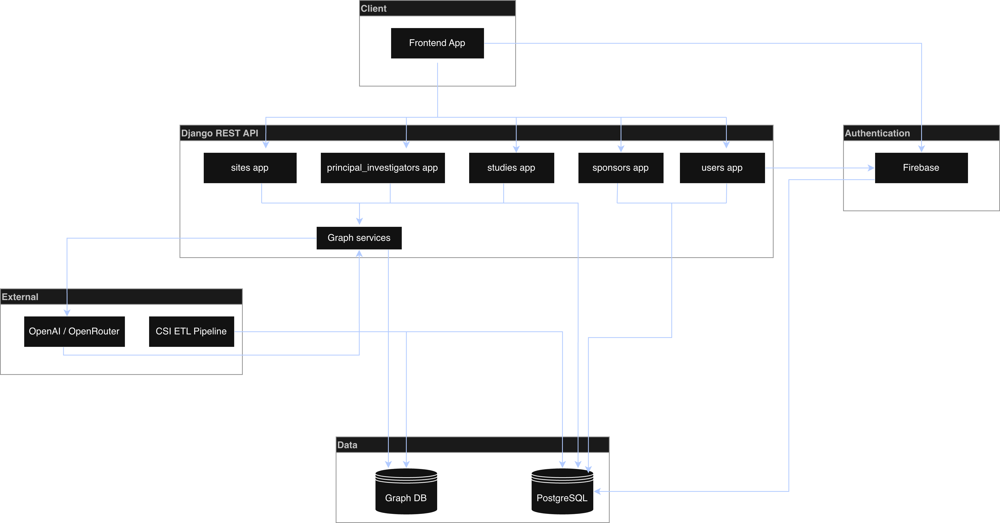
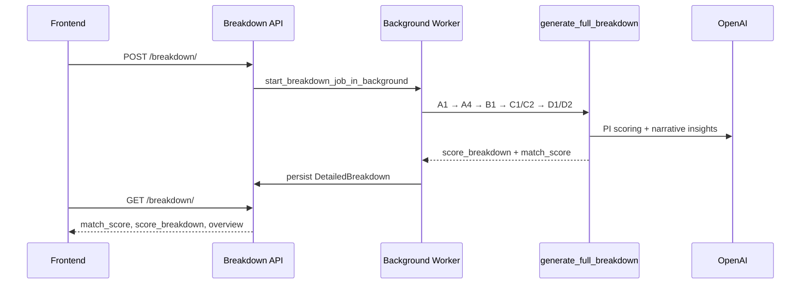

# Sites Intelligence — Documentation

Sites Intelligence is a clinical trial site selection platform. It helps sponsors and study teams evaluate how well a research site fits a specific study, discover candidate sites with AI-assisted search, and make data-driven feasibility decisions before site activation.

The backend (`sites-intelligence-be`) is a Django REST API that combines structured trial data, graph/relational queries, ETL-fed reference catalogs, and LLM-assisted analysis.

---

## What the Platform Does

| Capability | Description |
|------------|-------------|
| **Study creation** | Define protocol requirements: phase, therapeutic area, MeSH conditions, capabilities, enrollment targets, and documents. |
| **Site discovery** | Search and filter sites using structured filters, natural-language queries, and AI-suggested site matching. |
| **Study–site breakdown** | Generate a weighted, multi-section feasibility report for any study–site pair with an overall match score. |
| **PI evaluation** | Rank principal investigators at a site using trial history, publications, and AI relevance scoring. |
| **Overrides & flexibility** | Apply site/PI overrides and match-flexibility modes when real-world constraints differ from strict protocol fit. |

---

## Main Features

- **Weighted breakdown scoring** — Four category groups (A–D) with eleven scored sub-sections produce a 0–100 match score.
- **Background report generation** — Breakdown jobs run asynchronously with progress tracking and versioning.
- **LLM narrative insights** — Strengths, risks, and recommended next steps are generated from the full breakdown context.
- **MeSH hierarchy drill-down** — A1 exposes therapeutic-area trial experience as a navigable MeSH tree.
- **Competing trials analysis** — A4 quantifies enrollment competition and site capacity load.
- **Dual data backends** — PostgreSQL/Django ORM for transactional data; Neo4j and Google Spanner for graph/search workloads (feature-flagged per endpoint).
- **ETL reference data** — Countries, institution types, MeSH hierarchy, and site master data are refreshed from CSI ETL pipelines.

---

## Architecture Overview

### Key API surfaces

| Area | Base path | Purpose |
|------|-----------|---------|
| Studies | `/api/v1/studies/` | Study CRUD, breakdown, history |
| Sites | `/api/v1/sites/` | Site listing, search, overrides |
| Breakdown | `/api/v1/studies/<study_id>/sites/<site_id>/breakdown/` | Generate and retrieve feasibility reports |
| Breakdown jobs | `/api/v1/studies/breakdown-jobs/<job_id>/` | Poll async job status |
|users |`/api/v1/users` | User identity, authentication, roles, and access control for platform features|

### Breakdown pipeline (high level)

Implementation code lives under `studies/breakdown/`.

---

## Documentation

### Available now

- [Breakdown Documentation](./breakdown/README.md) — Study–site feasibility scoring system (categories A–D).
- [Study Creation Documentation](./study-creation/README.md) — Manual and AI-assisted study creation, file uploads, and summarization.
- [Natural Search Documentation](./natural-search/README.md) — Natural-language search for sites and principal investigators.
- [Flexibility Modes & AI Suggestions](./flexibility-modes/README.md) — Graph-based site matching, flexibility modes, and study site selection.
- [AI Features](./ai-features/README.md) — Entity chats, study creation AI, PI scoring, and breakdown LLM capabilities.
- [Override Panel](./override-panel/README.md) — Admin data overrides for sites, PIs, and study history.

---

## Repository Layout

| Path | Role |
|------|------|
| `studies/` | Study models, breakdown generators, study APIs |
| `sites/` | Site models, search/matching services, overrides |
| `principal_investigators/` | PI and publication models |
| `csi/` | Shared services — OpenAI, Neo4j, Spanner, ETL |
| `docs/` | Product and technical documentation (this tree) |
| `dev-docs/` | Internal engineering notes and migration guides |
|`/users` |User authentication, profile management, role assignment (site user, admin), and access control across studies, sites, and breakdown operations |

---

## Related Resources

- Breakdown API overview card fields: see `dev-docs/STUDY_SITE_BREAKDOWN_OVERVIEW.md`
- A1 MeSH hierarchy deep dive: see `dev-docs/A1_BREAKDOWN_MESH_HIERARCHY_README.md`
