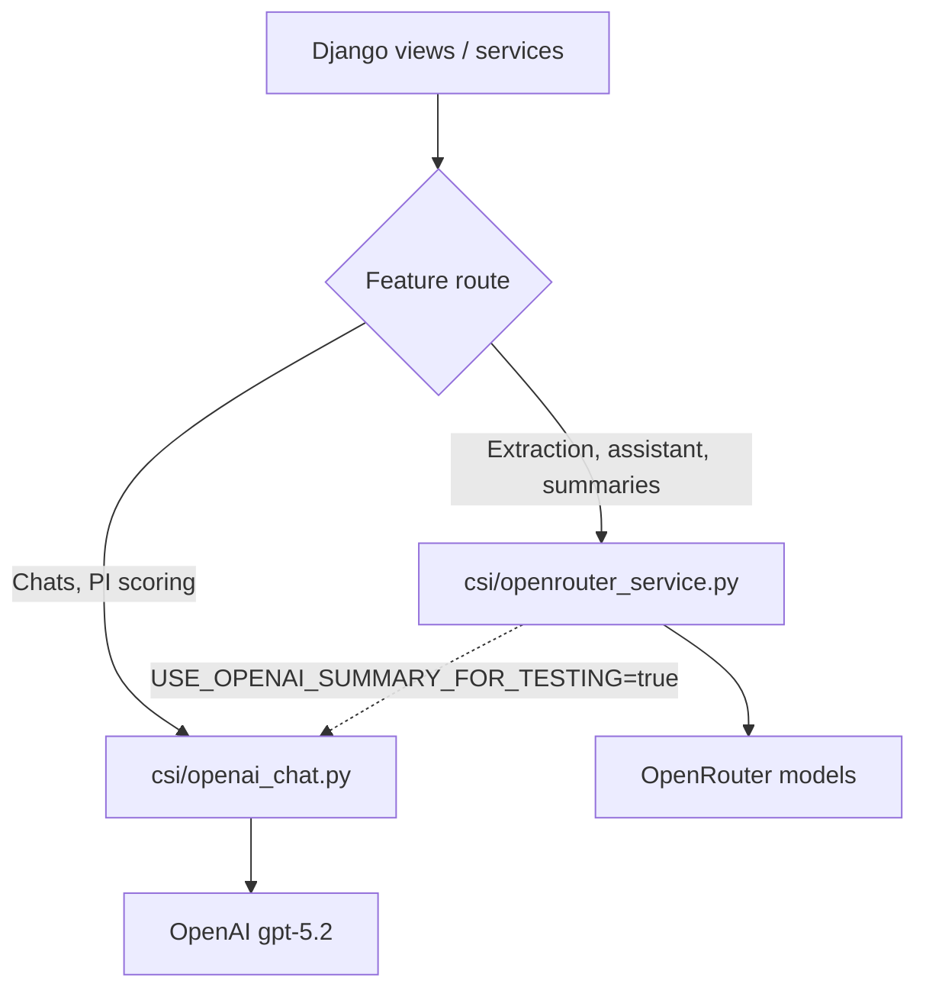

# AI Features

Central reference for **LLM-powered capabilities** in Sites Intelligence. These features use OpenAI and/or OpenRouter to generate text, extract structured data, score entities, or answer questions grounded in platform data.

---

## Feature inventory

| Feature | Type | Endpoint / trigger | Model route |
|---------|------|-------------------|-------------|
| [Site chat](./entity-chats.md#site-chat) | Q&A | `POST /api/v1/sites/{id}/chat/` | OpenAI `gpt-5.2` |
| [Sponsor chat](./entity-chats.md#sponsor-chat) | Q&A | `POST /api/v1/sponsors/{id}/chat/` | OpenAI `gpt-5.2` |
| [Sponsor insights chat](./entity-chats.md#sponsor-insights-chat) | Q&A | `POST /api/v1/sponsors/{id}/insights/chat/` | OpenAI `gpt-5.2` |
| [Chat helpful feedback](./entity-chats.md#helpful-feedback) | UX metadata | `PATCH /api/v1/users/chat/{conversation_id}/message/{message_id}/` | N/A |
| [Assisted study creation](./study-creation-ai.md#protocol-extraction) | Structured extraction | `POST /api/v1/studies/?mode=assisted` | OpenRouter (default) |
| [Study assistant](./study-creation-ai.md#hybrid-assistant) | Chat + field updates + clarifications | `POST /api/v1/studies/{id}/assistant/` | OpenRouter (default) |
| [Document summarization](./study-creation-ai.md#document-summarization) | Background summary | On `POST /studies/{id}/documents/` attach | OpenRouter (default) |
| [PI relevance scoring](./pi-and-breakdown-ai.md#pi-relevance-scoring) | Scoring | Breakdown generation (C1) | OpenAI `gpt-5.2` |
| [Breakdown LLM insights](./pi-and-breakdown-ai.md#llm-insights) | Narrative | Breakdown generation | OpenAI `gpt-4o-mini` |
| [Breakdown section summaries](./pi-and-breakdown-ai.md#section-summaries) | Summarization | Breakdown generation | OpenRouter `gpt-4o-mini` |

**Study AI:** The study workspace has **one** AI endpoint — `POST /api/v1/studies/{id}/assistant/` (hybrid chat, field updates, clarification handling). There is no separate study Q&A chat.

**PI Q&A chat:** There is no `POST /principal_investigators/{id}/chat/` endpoint. PI-related AI is **relevance scoring** during breakdown (see [PI & breakdown AI](./pi-and-breakdown-ai.md)).

---

## Shared infrastructure

| Module | Role |
|--------|------|
| `csi/openai_chat.py` | `get_openai_client()`, `get_chat_response()` — chats and PI scoring |
| `csi/openrouter_service.py` | `call_ai()` — extraction, assistant, summarization, breakdown summaries |
| `users.models.AIChatConversation` | Shared conversation store for entity chats |
| `studies.models.StudyAssistantSession` | Study creation / workspace assistant sessions |

### Environment variables

| Variable | Required for |
|----------|--------------|
| `OPENAI_API_KEY` | Site/sponsor chats, PI scoring, breakdown LLM insights |
| `OPENROUTER_API_KEY` | Protocol extraction, study assistant, document summarization, breakdown section summaries |

If `OPENAI_API_KEY` is missing, site/sponsor chat endpoints return **503**. OpenRouter failures return structured errors or fallbacks depending on the feature.

### Common entity chat pattern

Site and sponsor chat endpoints follow the same flow:

1. Load entity context → serialize to JSON (appended to system prompt).
2. Resolve or create `AIChatConversation` for the authenticated user.
3. Load prior messages as `chat_history`.
4. Call `get_chat_response(system_prompt, user_message, chat_history, content)`.
5. Persist user + assistant messages; return `answer`, `chat_id`, `answer_id`.

Temperature: **0.3** for chats. System prompts enforce **grounded answers only** — no external knowledge, no invented fields.

---

## AI processing flows (summary)

### Read-only entity chats (site, sponsor)

User question + entity JSON context + optional history → single assistant reply. **No side effects** on site or sponsor records.

### Study assistant

Single study AI surface at `POST /api/v1/studies/{id}/assistant/` — conversational Q&A, field updates, and clarification handling in one endpoint.

User input + study context + documents + pending questions → JSON intent (`CHAT`, `FIELD_UPDATE`, `QUESTION`, `MULTI`) → validated field writes + session message persistence.

### Assisted protocol extraction

Protocol text (≤60k chars) → JSON with `fields`, `sections`, `clarification_questions` → study row creation.

### Background summarization

Document text (≤20k chars) → single paragraph summary → `StudyDocument.ai_summary` (async thread).

### Breakdown AI

Weighted scores computed deterministically first; LLM adds PI scores, narrative insights, and human-readable section summaries.

---

## Cross-references

| Topic | Document |
|-------|----------|
| Study creation AI detail | [Study Creation — AI Modes](../study-creation/ai-modes.md) |
| Document summarization detail | [Study Creation — File Summarization](../study-creation/file-summarization.md) |
| Breakdown scoring (non-AI) | [Breakdown Documentation](../breakdown/README.md) |
| Natural language search | [Natural Search](../natural-search/README.md) *(graph — separate)* |
| AI suggested sites | [Flexibility Modes](../flexibility-modes/README.md) *(graph — separate)* |

---

## Further reading

- [Entity chats](./entity-chats.md) — Site and sponsor Q&A
- [Study creation AI](./study-creation-ai.md) — Extraction, assistant, summarization
- [PI & breakdown AI](./pi-and-breakdown-ai.md) — PI scoring, insights, summaries
- [Limitations](./limitations.md) — Accuracy, errors, constraints

← [Back to Documentation](../README.md)
