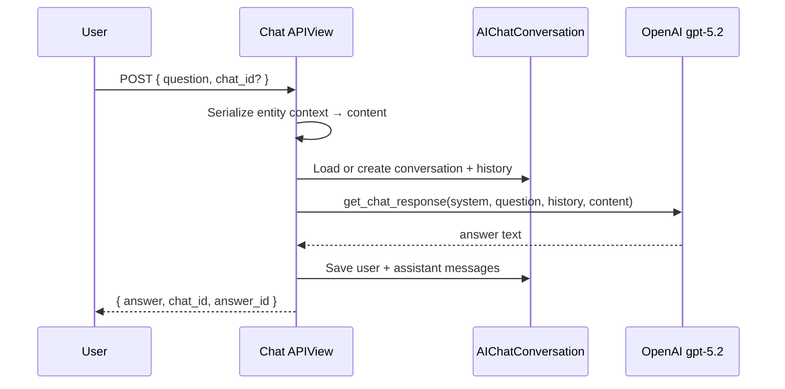

# Entity AI Chats

Read-only conversational Q&A for **sites** and **sponsors**. Each chat grounds answers in serialized entity context and optional conversation history. Answers are **not** used to modify records.

> **Studies** do not use entity chat. Study AI is only `POST /api/v1/studies/{id}/assistant/` — see [Study creation AI](./study-creation-ai.md#hybrid-assistant).

← [Back to AI Features](./README.md)

---

## Shared behavior



### Request (all entity chats)

```json
{
  "question": "What therapeutic areas does this site specialize in?",
  "chat_id": 42
}
```

| Field | Required | Description |
|-------|----------|-------------|
| `question` | Yes | User message |
| `chat_id` | No | Existing conversation ID; omit to start new |

### Response (all entity chats)

```json
{
  "data": {
    "answer": "The site specializes in Oncology and Cardiology.",
    "chat_id": 42,
    "answer_id": 108
  },
  "code": 200,
  "message": "Chat response generated"
}
```

### Error handling

| Condition | HTTP | Response |
|-----------|------|----------|
| `OPENAI_API_KEY` not configured | 503 | `{ "detail": "OPENAI_API_KEY is not configured" }` |
| OpenAI API failure | 500 | Uncaught exception (logged server-side) |
| Invalid serializer input | 400 | Validation errors |

Chats do **not** fail-soft to empty answers — missing AI configuration surfaces as 503.

---

## Site chat

**Endpoint:** `POST /api/v1/sites/{id}/chat/`

**Code:** `sites/views.py` → `SiteChatAPIView`

### Context loaded

`SiteOverviewSerializer` output for the site, including override context when active. Covers site attributes, performance metrics, and characteristics present in the serializer.

### System prompt rules

- Answer only from provided site object data.
- Do not assume or invent missing details.
- Short, factual sentences.

### Example

```http
POST /api/v1/sites/a1b2c3d4-e5f6-7890-abcd-ef1234567890/chat/
Authorization: Bearer <token>
Content-Type: application/json

{
  "question": "How many active recruiting studies does this site have?"
}
```

**Expected output:** Answer citing `active_studies` or equivalent field from context. If the field is absent, the assistant states that the information is not available.

### Data dependencies

- Site record must exist and be visible (deactivated overrides excluded).
- Serializer fields populated from Postgres + related models.

---

## Sponsor chat

**Endpoint:** `POST /api/v1/sponsors/{id}/chat/`

**Code:** `sponsors/views.py` → `SponsorChatAPIView`

### Context loaded

Composite JSON payload:

| Section | Source |
|---------|--------|
| `sponsor.details` | `SponsorDetailSerializer` |
| `history` | Sponsor-linked `StudyHistory` records |
| `collaboration_summary` | Total studies, completed count, success rate |
| `events` | `EventAndActivity` |
| `highlights` | `Highlights` |
| `sponsor_intelligence` | `SponsorIntelligence` |
| `sponsor_lesson_learned` | `LessonLearned` |
| Related studies | Study metadata linked to sponsor |

### Example

```http
POST /api/v1/sponsors/7/chat/

{
  "question": "What is the collaboration success rate with this sponsor?"
}
```

**Expected output:** Answer derived from `collaboration_summary.success_rate` and related history counts.

---

## Sponsor insights chat

**Endpoint:** `POST /api/v1/sponsors/{id}/insights/chat/`

**Code:** `sponsors/views.py` → `SponsorInsightsChatAPIView`

Narrower scope than general sponsor chat — focuses on intelligence and lessons learned only.

### Context loaded

```json
{
  "sponsor": { "id": 7, "name": "..." },
  "sponsor_intelligence": [ ... ],
  "sponsor_lesson_learned": [ ... ]
}
```

### When to use

| Chat | Best for |
|------|----------|
| Sponsor chat | Full sponsor profile, history, events, collaboration metrics |
| Insights chat | Intelligence records and lessons learned only |

Same request/response shape as other entity chats.

---

## Helpful feedback

**Endpoint:** `PATCH /api/v1/users/chat/{conversation_id}/message/{message_id}/`

Allows users to mark an assistant reply as helpful or not (`is_helpful` boolean). Used for UX analytics — does not affect future AI responses.

```json
{ "is_helpful": true }
```

Requires authentication; conversation must belong to the requesting user.

---

## Performance considerations

| Factor | Impact |
|--------|--------|
| Context size | Large sponsor payloads increase latency and cost |
| History length | Full conversation history sent each turn (no summarization trim) |
| Model | `gpt-5.2` — higher capability, higher latency than mini models |
| Caching | None — each question is a live API call |

## Accuracy considerations

- Answers quality depends entirely on completeness of serialized context.
- System prompts prohibit hallucination but cannot guarantee correctness if source data is wrong or stale.

← [Back to AI Features](./README.md)
