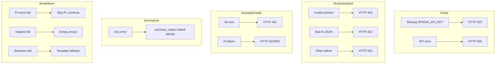

# AI Limitations

Known constraints, failure modes, and accuracy considerations for all LLM-powered platform features.

← [Back to AI Features](./README.md)

---

## Platform-wide limitations

| Limitation | Detail |
|------------|--------|
| **No real-time web access** | All features use only data provided in the prompt context |
| **Hallucination risk** | System prompts forbid invention; models may still infer beyond source data |
| **API key dependency** | Missing `OPENAI_API_KEY` or `OPENROUTER_API_KEY` disables respective features |
| **No response caching** | Chats and scoring repeat full model calls each request |
| **English-primary** | Prompts and extraction optimized for English protocol text |
| **Cost scales with usage** | Large contexts, many PIs, and long chats increase token spend |

---

## Entity chats

| Constraint | Detail |
|------------|--------|
| Read-only | Site and sponsor chats never modify entity records |
| Context completeness | Answers limited to serialized fields; missing DB data → "not available" |
| History unbounded | Full conversation replayed each turn — very long chats increase latency |
| No study entity chat | Study AI is only `POST /api/v1/studies/{id}/assistant/` (see study creation AI) |
| No PI chat endpoint | PI Q&A is not implemented; use breakdown PI scoring instead |
| 503 on missing key | No graceful degraded answer when OpenAI is unavailable |

---

## Study creation AI

| Constraint | Detail |
|------------|--------|
| PDF text only | No OCR — scanned/image PDFs fail extraction |
| 60k char extraction cap | Very long protocols truncated before AI |
| JSON fragility | Invalid model JSON triggers retry; may still fail on complex protocols |
| Allowlist enforcement | Assistant cannot update blocked or unknown fields even if AI proposes them |
| Silent skip | Invalid field coercions dropped without user-visible error per field |
| Async summarization | Summary may not exist immediately after document attach |
| Dual provider | Default OpenRouter; testing flag switches subset to OpenAI |

---

## PI & breakdown AI

| Constraint | Detail |
|------------|--------|
| PI scoring subjectivity | Relevance scores are model judgments, not clinical certification |
| Per-PI cost | Sites with hundreds of PIs generate hundreds of API calls |
| Partial failure | Failed PI scores omitted; breakdown completes with remaining PIs |
| Insights optional | Empty strengths/risks when OpenAI unavailable — numeric breakdown still valid |
| Summary fallbacks | Template text used when OpenRouter fails — less specific than AI summaries |
| Retracted pubs | Excluded from output but may still influence PI score signal |

---

## Error handling summary

---

## Data dependency requirements

| Feature | Minimum data |
|---------|--------------|
| Site chat | Valid site + serializer-populated relations |
| Study assistant | Active session, study record, optional protocol documents |
| Sponsor chat | Sponsor + related history/intelligence records |
| Protocol extraction | Text-based PDF with extractable content |
| Assistant updates | Active session, authenticated owner, reference catalogs for FK fields |
| PI scoring | At least one `SitePI`; publications improve scoring quality |
| Breakdown insights | Completed deterministic `score_breakdown` |

---

## Performance expectations

| Feature | Typical latency | Notes |
|---------|-----------------|-------|
| Entity chat | 2–15+ seconds | Depends on context size |
| Assistant turn | 5–30+ seconds | Large doc context |
| Protocol extraction | 10–60+ seconds | Synchronous at create |
| Document summary | 5–30 seconds | Background; not user-blocking |
| Full breakdown | Minutes | Dominated by PI count × scoring calls |

---

## Accuracy expectations

| Feature | Trust level | Recommendation |
|---------|-------------|----------------|
| Entity chats | Informational | Verify critical facts against source records |
| Protocol extraction | Draft bootstrap | Human review required before relying on fields |
| Assistant field updates | Semi-automated | Review applied changes in study workspace |
| PI relevance scores | Ranking aid | Use breakdown holistically, not score alone |
| LLM insights | Narrative summary | Supplement to numeric breakdown, not replacement |
| Section summaries | Executive preview | Fallback templates are generic |

---

## Explicitly excluded (graph AI)

The following use OpenAI for **query generation** against graph databases — documented separately, not as LLM recommendation features:

- Site natural language search
- PI natural language search
- AI suggested sites / study graph matching

See [Natural Search](../natural-search/README.md) and [Flexibility Modes](../flexibility-modes/README.md).

← [Back to AI Features](./README.md)
