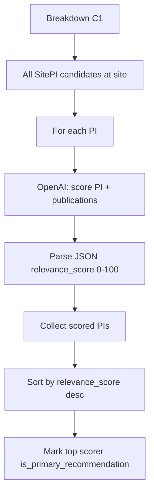

# PI & Breakdown AI

AI capabilities used during **study–site breakdown** generation: PI relevance scoring, narrative insights, and executive section summaries. These run as part of the background breakdown job — not as standalone chat endpoints.

← [Back to AI Features](./README.md)

Deterministic scoring formulas (non-AI) are documented in [Breakdown Documentation](../breakdown/README.md).

---

## PI relevance scoring

**Trigger:** Breakdown section **C1** during `generate_full_breakdown()`.

**Code:** `studies/breakdown/c_sections.py` → `get_study_site_pi_recommendations()`, `_score_single_pi()`

> **Note:** There is no PI Q&A chat API (`POST /principal_investigators/{id}/chat/`) in the backend. PI AI today means **LLM-based relevance scoring** of every PI at the site for the given study.

### Input (per PI)

JSON payload sent to OpenAI:

```json
{
  "study": {
    "phase": "Phase 3",
    "therapeutic_area": "Oncology"
  },
  "pi": {
    "pi_id": "uuid",
    "name": "Dr. Jane Smith",
    "years_experience": 15,
    "phase_i_trials": 2,
    "phase_ii_trials": 5,
    "phase_iii_trials": 12,
    "phase_iv_trials": 1,
    "total_trials": 20,
    "article_count": 45,
    "publications": [
      {
        "article_id": "uuid",
        "abstract": "...",
        "citation_count": 12,
        "publication_date": "2021-03-15",
        "venue": "Journal of Clinical Oncology",
        "is_retracted": false
      }
    ]
  }
}
```

All PIs linked to the site are scored — **no count limit**. Publications include full list per PI.

### Processing flow



### Expected output (per PI)

```json
{
  "pi_id": "uuid",
  "relevance_score": 82,
  "publications": [
    { "article_id": "uuid", "relevance_score": 90 },
    { "article_id": "uuid", "relevance_score": 71 }
  ]
}
```

| Score range | Interpretation (prompt guidance) |
|-------------|----------------------------------|
| 0–39 | Poor fit |
| 40–59 | Marginal fit |
| 60–79 | Good fit |
| 80–100 | Excellent fit |

Retracted publications are penalized and excluded from the returned publication list.

### Error handling

| Failure | Behavior |
|---------|----------|
| OpenAI call fails for one PI | PI skipped; counted in `failed`; others continue |
| Invalid JSON response | PI skipped |
| `OPENAI_API_KEY` missing | Scoring calls fail; PI omitted from results |

Breakdown job continues even if some PI scores fail — partial results returned.

### Example scenario

Phase 3 oncology study at a large academic site with 25 PIs → all 25 scored → top PI marked primary recommendation → breakdown C1 card shows ranked list with publication relevance.

---

## LLM insights

**Trigger:** End of breakdown generation.

**Code:** `studies/breakdown/full_breakdown.py` → `generate_llm_insights()`

### Input

- Study metadata (title, TA, phase, enrollment, duration).
- Site metadata (name, location, avg monthly enrollment).
- Text summary of weighted breakdown scores (`extract_breakdown_summary()`).

### Expected output

```json
{
  "strengths": [
    "Strong phase 3 oncology trial experience at site",
    "Above-average enrollment rate vs study target"
  ],
  "risks": [
    "Limited MRI capability may affect imaging endpoints"
  ]
}
```

Model: OpenAI **`gpt-4o-mini`**, temperature **0.7**, JSON response format.

### Error / fallback

| Condition | Result |
|-----------|--------|
| No `OPENAI_API_KEY` | Empty `strengths` and `risks` arrays |
| API or parse failure | Empty arrays; logged server-side |

Insights are **narrative interpretation** of already-computed scores — not a substitute for the numeric breakdown.

---

## Section summaries

**Trigger:** During breakdown generation for each sub-section and main category.

**Code:** `studies/breakdown/full_breakdown.py` → `generate_sub_section_summary()`, `generate_main_section_summary()`

### Input

- Sub-section code, title, score percentage, and section JSON data (truncated to ~4000 chars).
- Category-level: combined sub-section summary sentences.

### Expected output

- Single sentence, max **200 characters**, factual executive summary.
- Model: OpenRouter **`openai/gpt-4o-mini`**, temperature **0.3**.

### Fallback behavior

On OpenRouter failure, predefined template summaries are used (`_get_sub_section_fallback()`). Breakdown always completes with human-readable text even when AI fails.

### Example

**Input:** A1 MeSH hierarchy score 78% with trial count data.

**Output:** *"Site demonstrates strong NSCLC trial experience with 12 matching studies in the therapeutic hierarchy."* (≤200 chars)

---

## Data dependencies

| Feature | Requires |
|---------|----------|
| PI scoring | `SitePI` links, PI profile fields, `PIArticle` publications, study phase/TA |
| LLM insights | Completed `score_breakdown` from deterministic generators |
| Section summaries | Sub-section generator output JSON |

All depend on `OPENAI_API_KEY` (PI scoring, insights) and/or `OPENROUTER_API_KEY` (summaries).

---

## Performance considerations

| Feature | Cost driver |
|---------|-------------|
| PI scoring | **One OpenAI call per PI** — large sites with many PIs multiply latency and token cost |
| LLM insights | Single call per breakdown |
| Section summaries | One call per sub-section + one per main category (~13+ calls per breakdown) |

Breakdown runs in a **background job** — AI latency does not block the initial POST response.

## Accuracy considerations

- PI scores are LLM judgments — useful for ranking and narrative, not regulatory decisions.
- Identical PI data may produce slightly different scores across runs (temperature > 0 for insights).
- Publication scoring depends on abstract quality; empty abstracts reduce accuracy.
- Section summaries must not invent metrics — prompts forbid fabrication; fallback templates are generic.

← [Back to AI Features](./README.md)
