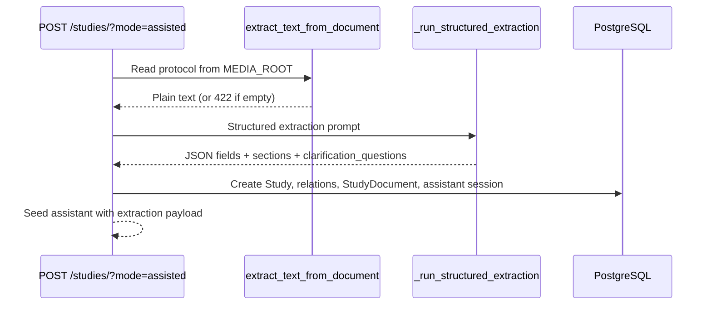
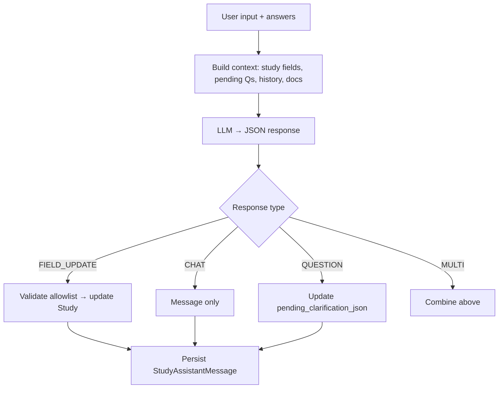

# Study Creation AI

AI capabilities during and after study creation: protocol extraction, the hybrid workspace assistant, and background document summarization.

← [Back to AI Features](./README.md)

Detailed workflow docs: [Study Creation — AI Modes](../study-creation/ai-modes.md), [File Summarization](../study-creation/file-summarization.md).

---

## Protocol extraction (assisted create)

**Trigger:** `POST /api/v1/studies/?project={id}&mode=assisted`

**Code:** `studies/services.py` → `create_study_from_document_assisted()` → `_run_structured_extraction()`

### Input

| Input | Requirement |
|-------|-------------|
| Protocol file | PDF, ≤5 MB, text-based (not scanned/image-only) |
| `file_hash` | Must exist on server from prior upload |
| Extracted text | Up to **60,000** characters sent to the model |

### Processing flow



### Expected output

```json
{
  "data": {
    "id": 102,
    "fields": {
      "title": "Phase III NSCLC Study",
      "phase": "PHASE3",
      "therapeutic_area": "Oncology",
      "mesh_terms": ["Carcinoma, Non-Small-Cell Lung"]
    },
    "pending_questions": [
      {
        "id": "q_0",
        "question": "Which comparator arm applies?",
        "answers": [
          { "id": "q_0_a_0", "label": "Placebo" },
          { "id": "q_0_a_1", "label": "Active comparator" }
        ]
      }
    ],
    "assistant_session_id": "uuid"
  }
}
```

### AI model route

- **Default:** OpenRouter via `call_ai()` (temperature **0.1**, up to 6000 tokens; retry at 10000 on invalid JSON).
- **Testing flag:** `USE_OPENAI_SUMMARY_FOR_TESTING = True` routes through `get_chat_response()` instead.

### Error handling

| Failure | HTTP | Behavior |
|---------|------|----------|
| No extractable text | 422 | Assisted create rejected |
| AI returns invalid JSON after retry | 422/500 | Create fails |
| OpenRouter unavailable | 500 | Create fails |

### Example use case

User uploads a searchable protocol PDF → assisted create populates phase, TA, MeSH terms, endpoints, and custom sections → unresolved ambiguities appear as selectable clarification questions in the workspace.

---

## Hybrid assistant

**Endpoint:** `POST /api/v1/studies/{id}/assistant/`

**Code:** `studies/services.py` → `process_study_assistant_interaction()`

Supports natural-language chat, validated field updates, and clarification question lifecycle — for both manual and assisted studies after creation.

### Input

```json
{
  "assistant_session_id": "uuid",
  "user_input": "Set target enrollment to 200",
  "answers": [
    { "id": "q_0", "question": "Comparator arm?", "answer": "Placebo" }
  ]
}
```

| Field | Required | Description |
|-------|----------|-------------|
| `assistant_session_id` | Yes | Active session owned by user |
| `user_input` | No | Free text (may be empty when submitting `answers` only) |
| `answers` | No | Clarification responses (array or legacy dict) |

### Processing flow



### Context loaded

| Source | Limit |
|--------|-------|
| Study scalar + relation snapshot | Full updatable allowlist |
| Pending clarification questions | Current `pending_clarification_json` |
| Saved clarification answers | `clarification_answers_json` |
| Session history | Last **20** messages |
| Protocol documents | Up to **50,000** chars aggregated text (falls back to `ai_summary` if doc too large) |

### Expected output

```json
{
  "data": {
    "type": "FIELD_UPDATE",
    "fields": { "target_enrollment": 200 },
    "pending_questions": [],
    "message": "Updated target enrollment to 200.",
    "assistant_session_id": "uuid"
  },
  "code": 200,
  "message": "Assistant response generated"
}
```

| `type` | Meaning |
|--------|---------|
| `CHAT` | Conversational reply only |
| `FIELD_UPDATE` | Study fields updated (see `fields` in response) |
| `QUESTION` | New clarification questions added |
| `MULTI` | Combined chat + updates + questions |

### Field update safety

- Strict allowlist — blocked fields include `id`, `project`, `status`, `create_mode`.
- Invalid coercions silently skipped (not applied).
- Relation fields (`phase`, `therapeutic_area`, `mesh_terms`, etc.) resolved via shared mapping logic.
- Dates must be `DD-MM-YYYY`; quarter-only strings rejected.

### Error handling

| Condition | HTTP |
|-----------|------|
| Missing `assistant_session_id` | 400 |
| Study not found | 404 |
| Invalid / foreign session | 403 |
| AI processing / JSON failure | 422 |
| Unexpected failure | 503 |

### Related session APIs

| Method | Endpoint |
|--------|----------|
| `GET` | `/api/v1/studies/{id}/assistant/sessions/` |
| `GET` | `/api/v1/studies/{id}/assistant/sessions/{session_id}/messages/` |

### Example use cases

1. **Answer clarification** — User selects "Placebo" for comparator question → assistant applies related fields and removes resolved question.
2. **Natural field edit** — *"Change study duration to 24 months"* → validated update to `study_duration_months`.
3. **Informational chat** — *"What inclusion criteria did we extract?"* → `CHAT` reply from study context without DB writes.

---

## Document summarization

**Trigger:** Background thread after `POST /api/v1/studies/{id}/documents/` attaches a file.

**Code:** `studies/services.py` → `summarize_study_documents()` → `summarize()`

### Input

- Document text from `extract_text_from_document()` (max **20,000** chars sent to model).

### Expected output

Stored on `StudyDocument`:

| Field | Value |
|-------|-------|
| `ai_summary` | Single factual paragraph, max ~1000 chars |
| `summary_status` | `pending` → `completed` or `failed` |
| `summary_updated_at` | Timestamp |

### Processing flow

Fire-and-forget daemon thread — **never blocks** the attach API response. Failures are logged and marked `summary_status=failed` silently.

### Error / fallback behavior

| Condition | Result |
|-----------|--------|
| No extractable text | `ai_summary` = diagnostic message; `failed` |
| OpenRouter failure | `ai_summary` = error message; `failed` |
| `USE_OPENAI_SUMMARY_FOR_TESTING` | Tries OpenAI first, falls back to OpenRouter on exception |

Summaries supplement assistant context when full document text exceeds caps.

### Example

User attaches a 40-page protocol appendix → attach returns immediately → within seconds/minutes `GET /studies/{id}/documents/` shows `summary_status: completed` and a one-paragraph preview.

---

## Data dependencies

| Feature | Depends on |
|---------|------------|
| Protocol extraction | Uploaded file, PyMuPDF text extraction, ETL catalogs for relation mapping |
| Assistant field updates | Study row, reference data (phases, TAs, countries, MeSH) for FK resolution |
| Summarization | `StudyDocument` + linked `Document` file on disk |

---

## Performance & accuracy

| Consideration | Detail |
|---------------|--------|
| Extraction latency | Single large OpenRouter call; retry doubles cost on JSON failure |
| Assistant latency | Up to 6000–10000 tokens; includes full context payload |
| Summarization | Async — no user-visible wait on attach |
| Accuracy | Extraction quality depends on protocol clarity and text layer quality |
| Hallucination risk | Assistant instructed not to invent facts; allowlist prevents invalid writes |
| OCR gap | Scanned PDFs fail extraction — no AI recovery path |

← [Back to AI Features](./README.md)
