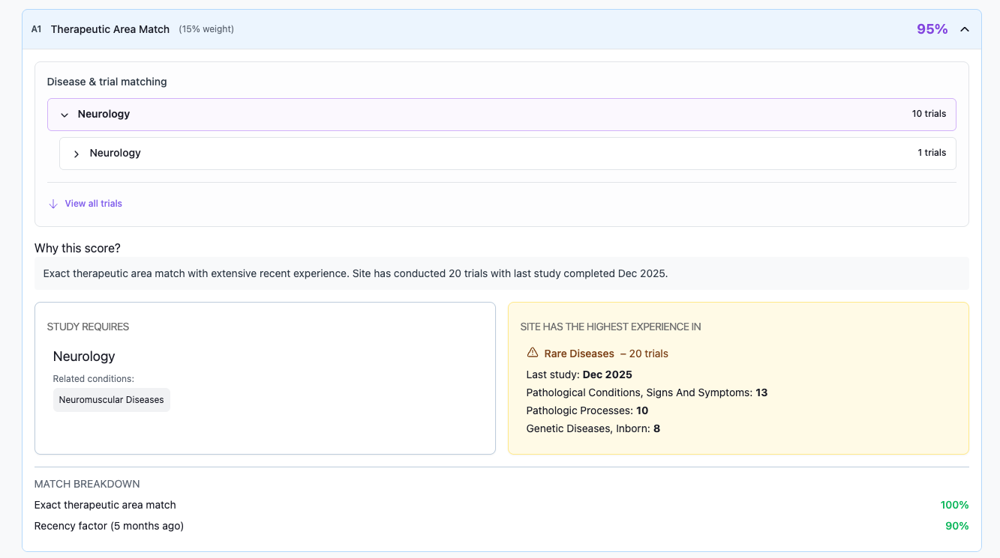
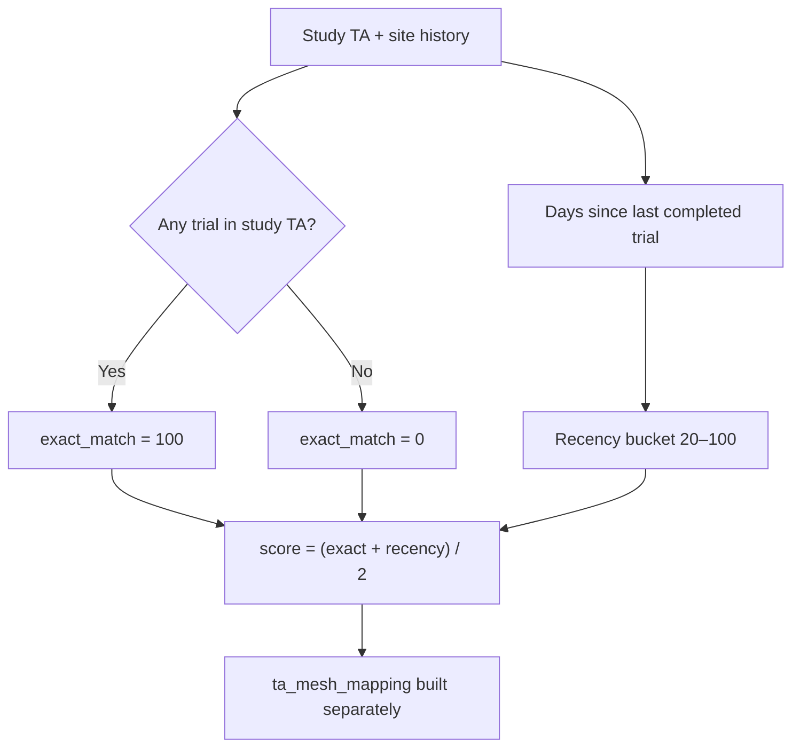
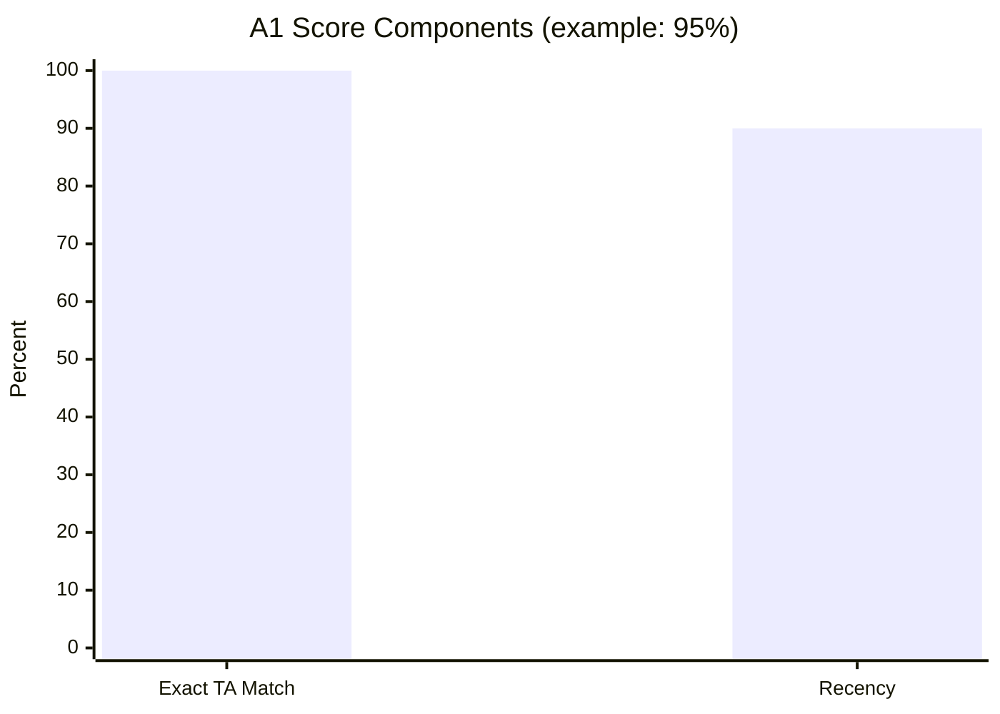

← [Back to Category A](./README.md)

# A1 — Therapeutic Area Match

| Property | Value |
|----------|-------|
| **Category** | A — Site Capabilities & Match |
| **Weight** | 15% of total match score (30% within category A) |
| **Generator** | `generate_a1_breakdown()` in `studies/breakdown/a_sections.py` |
| **API path** | `score_breakdown[A].sub_items[A1].details` |

---



## Purpose

Measures whether the site has conducted trials in the study's therapeutic area (TA) and how recently. Also exposes a MeSH hierarchy tree (`ta_mesh_mapping`) for drill-down UI — **the tree does not affect the score**.

---

## Data Sources

| Source | Fields used |
|--------|-------------|
| `Study.therapeutic_area` | Required TA |
| `StudyCondition` | Study-selected MeSH terms |
| `TherapeuticAreaCondition` | Full TA MeSH catalog |
| `StudyHistorySite` + `StudyHistory` | Site trial history, `end_date` |
| `StudyHistoryCondition` | MeSH tags on past trials |
| `MeshHierarchy` | ETL disease tree (`resolved_level`) |
| `Condition` | MeSH display labels |

---

## Calculation Logic

A1 combines two metrics averaged 50/50.

### Step 1 — Exact TA match

```text
has_study_ta_history = EXISTS StudyHistoryCondition at site
                       WHERE condition_id IN TherapeuticAreaCondition(study.TA)

exact_match_percent = 100 if has_study_ta_history else 0
```

> Note: `comparison.site_has.matched` compares dominant site TA (most histories) to study TA — informational only, not used in scoring.

### Step 2 — Recency

Find last **completed** trial (`end_date < today`) at site in study TA; fallback to any TA if none found.

| Days since last trial | `recency_percent` |
|-----------------------|-------------------|
| ≤ 90 | 100 |
| ≤ 180 | 90 |
| ≤ 365 | 80 |
| ≤ 730 | 60 |
| ≤ 1095 | 40 |
| > 1095 | 20 |

If no completed trial found, `recency_percent = 0`.

### Step 3 — Final A1 score

```text
score_percent = (exact_match_percent + recency_percent) / 2
```



### Worked example

| Input | Value |
|-------|-------|
| Study TA | Oncology |
| Site has Oncology trials | Yes → exact = 100 |
| Last completed trial | 200 days ago → recency = 90 |
| **A1 score** | **(100 + 90) / 2 = 95** |

### MeSH hierarchy (`ta_mesh_mapping`)

Built by `build_a1_ta_mesh_mapping()`. Key rules:

- Terminals = study `StudyCondition` MeSH only
- `trial_count` on TA-scoped ancestors = full TA catalog count (`ta_total`)
- Terminal `trial_count` = site trials for that study MeSH only
- Split: `mesh_hierarchy` (terminal count > 0) vs `mesh_hierarchy_zero` (count = 0)

Full spec: `dev-docs/A1_BREAKDOWN_MESH_HIERARCHY_README.md`

---

## API Response Structure

### Sub-item envelope

| Field | Type | Description |
|-------|------|-------------|
| `item_code` | `"A1"` | Section identifier |
| `item_title` | string | `"Therapeutic Area Match"` |
| `weight_percent` | int | `15` |
| `score_percent` | number | 0–100 |
| `section_summary` | string | LLM-generated summary |
| `details` | object | See below |

### `details` fields

| Field | Description |
|-------|-------------|
| `summary` | Narrative combining match + recency |
| `comparison.study_requires` | `{ therapeutic_area, related_conditions[] }` |
| `comparison.site_has` | `{ therapeutic_area, total_trials, last_study_date, top_mesh_terms[], matched }` |
| `match_breakdown[]` | `{ metric, percent }` — exact match + recency rows |
| `ta_mesh_mapping` | MeSH tree envelope (see below) |

### `ta_mesh_mapping` envelope

| Field | Type | Description |
|-------|------|-------------|
| `therapeutic_area` | object | `{ id, name, trial_count }` |
| `total_trial_count` | int | Distinct site trials in full TA |
| `ta_mesh_ids` | string[] | TA condition IDs with ≥1 site trial |
| `mesh_hierarchy` | array | Branches with terminal `trial_count > 0` |
| `mesh_hierarchy_zero` | array | Study MeSH with zero site trials |
| `unmapped_mesh_terms` | array | Always `[]` |

### Hierarchy node shape

| `level` | Has `mesh_ids`? | `trial_count` source |
|---------|-----------------|----------------------|
| `chapter`, `block`, `category` | Yes (ancestors) | TA-scoped or path rollup |
| `mesh` (terminal) | No | Study MeSH trials only |

---

## Frontend Usage

| UI element | Data binding |
|------------|--------------|
| Score badge | `score_percent` |
| Two-metric bars | `details.match_breakdown` |
| Study vs site TA card | `details.comparison` |
| MeSH tree | `ta_mesh_mapping.mesh_hierarchy` |
| Zero-trial MeSH | `ta_mesh_mapping.mesh_hierarchy_zero` |
| Open trials browse | `ta_mesh_ids` or ancestor `mesh_ids` |



---

## Dependencies

- MeSH hierarchy ETL (`csi/etl/entities/mesh_hierarchy.py`)
- `_study_dedup_key()` shared with A4
- `generate_sub_section_summary()` for narrative

---

## Limitations

- MeSH tree requires ETL; missing rows use synthetic fallback paths
- Recency needs `end_date` on completed trials
- Dominant TA in `site_has` ≠ scoring TA check
- Cached reports need regenerate after ETL updates

---

## Related Documentation

- [← Back to Category A](./README.md)
- [A2 — Phase Experience Match](./A2.md)
- [A4 — Competing Trials Analysis](./A4.md)
