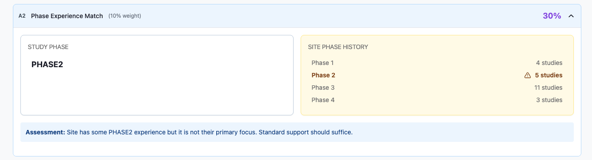
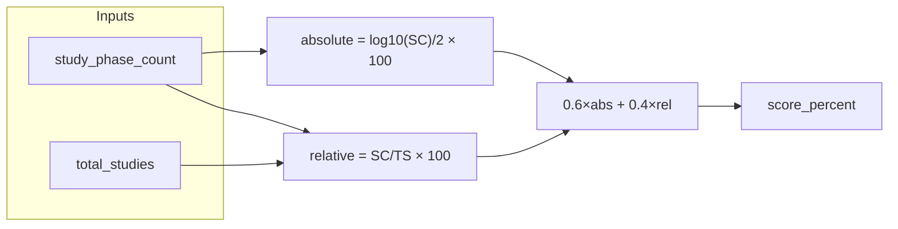
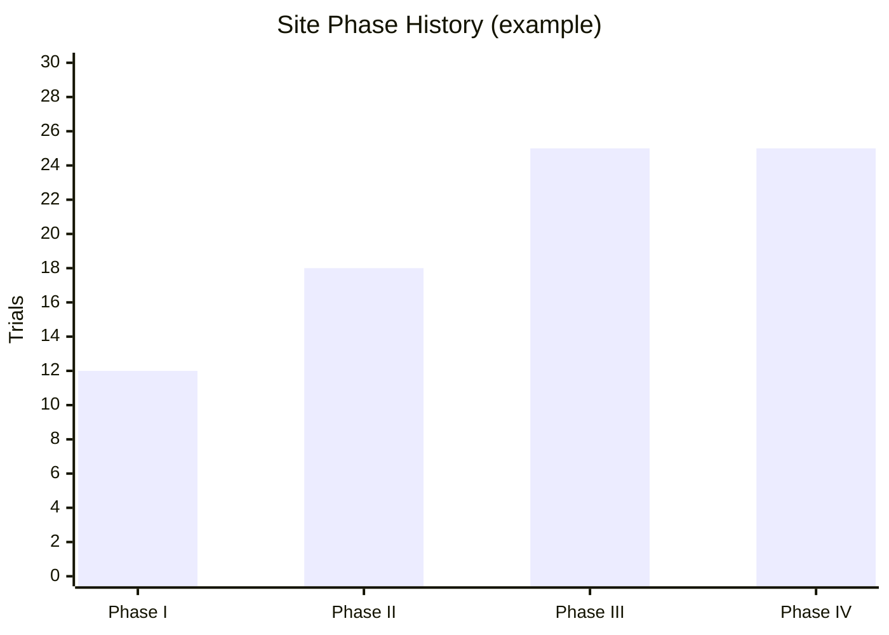

← [Back to Category A](./README.md)

# A2 — Phase Experience Match

| Property | Value |
|----------|-------|
| **Category** | A — Site Capabilities & Match |
| **Weight** | 10% of total match score (20% within category A) |
| **Generator** | `generate_a2_breakdown()` in `studies/breakdown/a_sections.py` |

---



## Purpose

Scores site experience in the **study's phase** using a blended model: absolute trial volume (log scale) plus relative share of the site's phase history.

---

## Data Sources

| Source | Role |
|--------|------|
| `Study.phase` | Required phase name |
| `StudyHistory` + `StudyHistorySite` | Trials at site |
| `StudyHistoryPhase` | Phase tag per trial |

---

## Calculation Logic

### Inputs

```text
study_phase_count = COUNT distinct trials at site tagged with study.phase
total_studies     = SUM of all phase-tagged trial counts at site
```

Phase keys normalized to snake_case (`phase_iii`, `phase_2`, etc.).

### Absolute score (60% weight)

Logarithmic scale — 100 trials in study phase saturates at 100%:

```text
LOG_ANCHOR = 2.0   # log10(100)

absolute_score = min( (log10(study_phase_count) / LOG_ANCHOR) × 100, 100 )
                 if study_phase_count > 0, else 0
```

| Trials in study phase | `absolute_score` |
|-----------------------|------------------|
| 0 | 0 |
| 1 | ~0 |
| 10 | 50 |
| 100+ | 100 |

### Relative score (40% weight)

```text
relative_score = (study_phase_count / total_studies) × 100   if total_studies > 0
               = 0                                           otherwise
```

### Final score

```text
score_percent = round(0.6 × absolute_score + 0.4 × relative_score)
```

Constants: `ABSOLUTE_WEIGHT = 0.6`, `RELATIVE_WEIGHT = 0.4`.

### Narrative thresholds

| `score_percent` | Summary tone |
|-----------------|--------------|
| 0 (no trials) | "Site has no previous {phase} experience" |
| < 25 | Limited |
| < 50 | Moderate |
| < 75 | Good |
| ≥ 75 | Excellent |



### Worked example

| Input | Value |
|-------|-------|
| Study phase | Phase III |
| Trials in Phase III at site | 25 |
| Total phase-tagged trials | 80 |
| Absolute | log10(25)/2 × 100 ≈ **70.0** |
| Relative | 25/80 × 100 = **31.25** |
| **Score** | 0.6×70 + 0.4×31.25 ≈ **54** |

---

## API Response Structure

```json
{
  "item_code": "A2",
  "item_title": "Phase Experience Match",
  "weight_percent": 10,
  "score_percent": 54,
  "section_summary": "...",
  "details": {
    "summary": "Moderate Phase III experience with 25 completed trials (31% of site's phase history).",
    "comparison": {
      "study_phase": "Phase III",
      "site_phase_history": {
        "phase_i": 12,
        "phase_ii": 18,
        "phase_iii": 25,
        "phase_iv": 25
      }
    },
    "assessment": "Site has some Phase III experience but it is not their primary focus..."
  }
}
```

---

## Frontend Usage

| UI element | Binding |
|------------|---------|
| Score badge | `score_percent` |
| Phase distribution chart | `details.comparison.site_phase_history` |
| Study phase label | `details.comparison.study_phase` |
| Narrative | `details.summary`, `details.assessment` |

Recommended chart: stacked or grouped bar chart of `site_phase_history` with study phase highlighted.



---

## Dependencies

- `StudyHistoryPhase` populated by ETL
- `math.log10` for absolute scaling

---

## Limitations

- Zero trials in study phase → score 0
- Phase name matching is exact string compare on `phase.name`
- Multi-phase trials counted per phase tag (not deduplicated across phases)
- No score when `Study.phase` is null — returns empty phase name

---

## Related Documentation

- [← Back to Category A](./README.md)
- [A1 — Therapeutic Area Match](./A1.md)
- [A3 — Site Capabilities Match](./A3.md)
