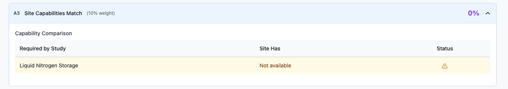
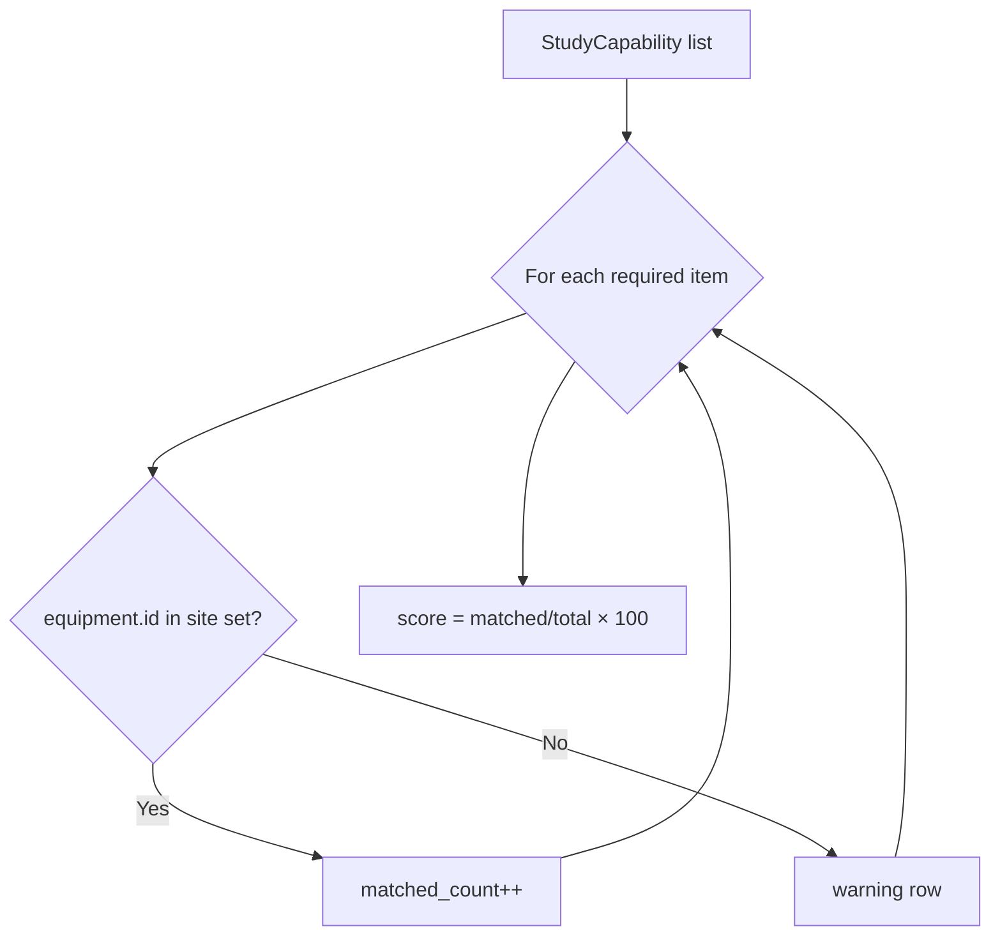
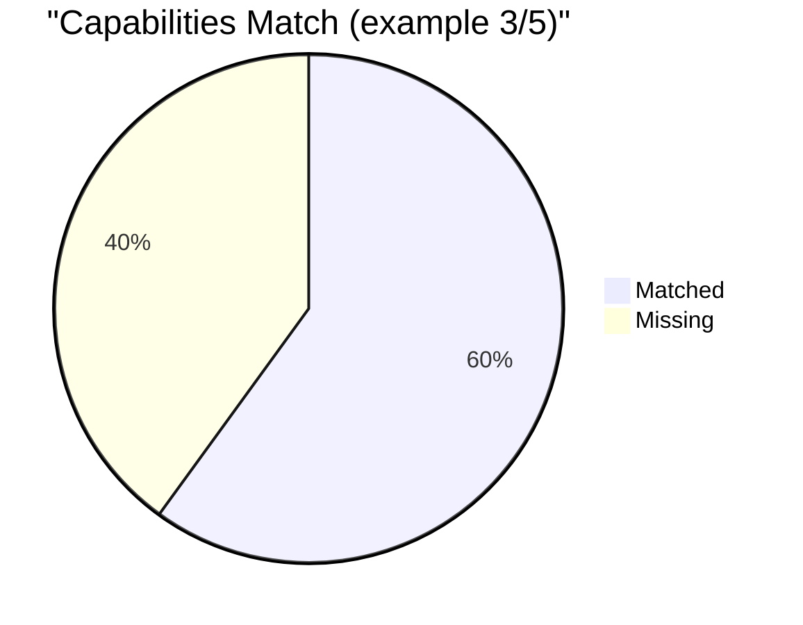

← [Back to Category A](./README.md)

# A3 — Site Capabilities Match

| Property | Value |
|----------|-------|
| **Category** | A — Site Capabilities & Match |
| **Weight** | 10% of total match score (20% within category A) |
| **Generator** | `generate_a3_breakdown()` in `studies/breakdown/a_sections.py` |

---



## Purpose

Binary checklist: for each study-required capability/equipment, does the site have it?

---

## Data Sources

| Source | Role |
|--------|------|
| `StudyCapability` | Required equipment per study |
| `CapabilityEquipment` | Equipment catalog (`name`, `spec`) |
| `SiteCapability` | Equipment linked to site |

---

## Calculation Logic

```text
total_required = COUNT(StudyCapability for study)
matched_count  = COUNT(required equipment WHERE equipment.id IN site_equipment_ids)
match_rate     = (matched_count / total_required) × 100   if total_required > 0
                 = 0                                       otherwise
score_percent  = match_rate
```

Per-row status:

| Site has equipment? | `status` | `icon` |
|---------------------|----------|--------|
| Yes | `matched` | `check` |
| No | `warning` | `warning` |



### Worked example

| Required | Site has | Result |
|----------|----------|--------|
| MRI Scanner | Yes | matched |
| PET-CT | No | warning |
| -80°C Freezer | Yes | matched |
| Infusion Pump | Yes | matched |
| ECG Monitor | No | warning |

```text
matched = 3, total = 5 → match_rate = 60% → score_percent = 60
```

---

## API Response Structure

```json
{
  "item_code": "A3",
  "item_title": "Site Capabilities Match",
  "weight_percent": 10,
  "score_percent": 60,
  "details": {
    "summary": "Critical capabilities matched: 3 of 5 (60%)",
    "match_rate": 60,
    "capabilities_table": [
      {
        "required": "MRI Scanner",
        "site_has": "MRI Scanner (3T)",
        "status": "matched",
        "icon": "check"
      },
      {
        "required": "PET-CT",
        "site_has": "Not available",
        "status": "warning",
        "icon": "warning"
      }
    ]
  }
}
```

---

## Frontend Usage

| UI element | Binding |
|------------|---------|
| Score / match rate | `score_percent`, `details.match_rate` |
| Checklist table | `details.capabilities_table` |
| Summary | `details.summary` |



---

## Dependencies

- Study creation populates `StudyCapability`
- Facility ETL syncs `SiteCapability`

---

## Limitations

- Exact equipment ID match only — no substitute/equivalent logic
- Zero required capabilities → score 0%
- No partial credit for similar equipment

---

## Related Documentation

- [← Back to Category A](./README.md)
- [A2 — Phase Experience Match](./A2.md)
- [A4 — Competing Trials Analysis](./A4.md)
