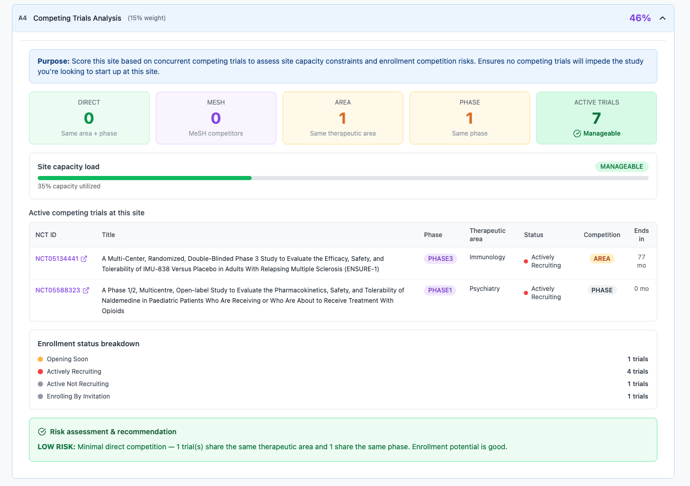
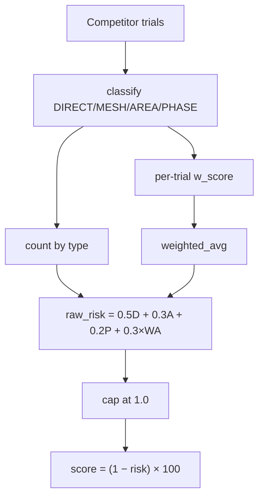
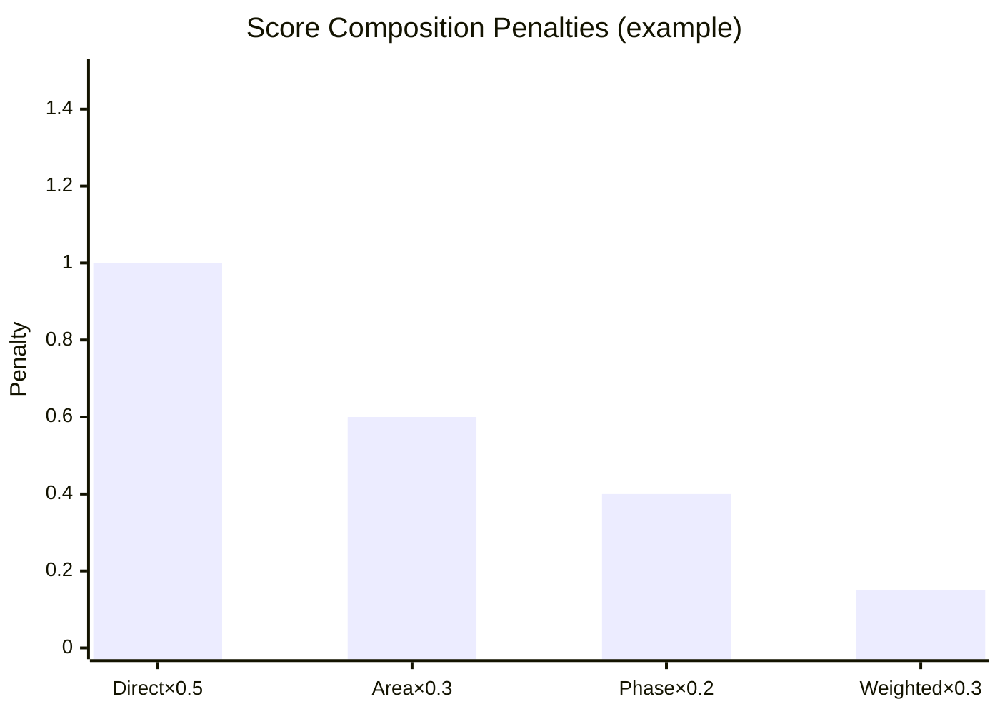

← [Back to Category A](./README.md)

# A4 — Competing Trials Analysis

| Property | Value |
|----------|-------|
| **Category** | A — Site Capabilities & Match |
| **Weight** | 15% of total match score (30% within category A) |
| **Generator** | `generate_a4_breakdown()` in `studies/breakdown/a_sections.py` |

---



## Purpose

Assesses enrollment competition and site capacity from **active/recruiting trials** at the site that overlap the study's TA, phase, or MeSH terms. Higher competition → lower score.

---

## Data Sources

| Source | Role |
|--------|------|
| `Study.therapeutic_area`, `Study.phase`, `StudyCondition` | Study overlap criteria |
| `StudyHistory` + `StudyHistorySite` | Trials at site (`nct_id`, `title`, `end_date`, `status`) |
| `StudyHistoryCondition` | MeSH overlap (all study MeSH must be on history) |
| `StudyHistoryPhase` | Phase overlap |
| `TherapeuticAreaCondition` | TA overlap |
| `StudyHistoryStatus` | Recruiting / active filters |

---

## Trial Universe

### Recruiting competitors (Pass 1)

Statuses: `RECRUITING`, `NOT_YET_RECRUITING`, `ENROLLING_BY_INVITATION`

Filter: `end_date IS NULL OR end_date >= today`

Overlap: trial ID in TA-matched **OR** phase-matched **OR** full-MeSH-matched set.

### Active capacity (Pass 2)

Adds `ACTIVE_NOT_RECRUITING` to statuses for `total_active_trials`.

Deduplication: `_study_dedup_key(nct_id, history_id)` — same NCT never counted twice.

---

## Competition Classification

Priority order (first match wins):

| Type | Priority | Criteria |
|------|----------|----------|
| `DIRECT` | 0 | Same TA **and** same phase; if study has MeSH, history must cover all study MeSH |
| `MESH` | 1 | All study `StudyCondition` MeSH IDs present on history |
| `AREA` | 2 | Same therapeutic area |
| `PHASE` | 3 | Same phase only |
| `UNRELATED` | 4 | No overlap |

### Per-trial weighted score

```text
w_score = BASE_SCORE[type]
        × enrollment_factor(status)
        × 0.4
        × temporal_factor(days_until_completion)
```

**BASE_SCORE:**

| Type | Value |
|------|-------|
| DIRECT | 1.0 |
| MESH | 0.5 |
| AREA | 0.6 |
| PHASE | 0.4 |
| UNRELATED | 0.05 |

**Enrollment factor:**

| Status | Factor |
|--------|--------|
| RECRUITING | 1.0 |
| NOT_YET_RECRUITING | 0.8 |
| ENROLLING_BY_INVITATION | 0.5 |
| Other | 0.2 |

**Temporal factor** (`days_until = end_date - today`):

| Days until completion | Factor |
|-----------------------|--------|
| NULL | 0.6 |
| ≤ 0 | 0.0 |
| < 90 | 0.2 |
| < 180 | 0.4 |
| < 365 | 0.6 |
| < 730 | 0.8 |
| ≥ 730 | 1.0 |

### Aggregate risk and score

```text
weighted_avg = mean(w_score for all competitors)
raw_risk     = 0.5×direct_count + 0.3×area_count + 0.2×phase_count + 0.3×weighted_avg
capped_risk  = min(raw_risk, 1.0)
a4_score     = 1.0 − capped_risk
score_percent = round(a4_score × 100)
```



### Risk level bands

| Condition | `risk_level` |
|-----------|--------------|
| direct ≥ 3 | CRITICAL |
| direct ≥ 2 | HIGH |
| direct ≥ 1 OR area ≥ 3 | MODERATE |
| area ≥ 1 OR phase ≥ 2 OR total_active ≥ 10 | LOW |
| Otherwise | MINIMAL |

### Capacity level

| `total_active_trials` | `capacity_level` |
|-----------------------|------------------|
| ≥ 20 | OVERLOADED |
| ≥ 15 | HIGH_LOAD |
| ≥ 10 | MODERATE_LOAD |
| ≥ 5 | MANAGEABLE |
| < 5 | LOW_LOAD |

`capacity_bar_pct = min(round(total_active_trials / 20 × 100), 100)`

---

## API Response Structure

### Key `details` fields

| Field | Description |
|-------|-------------|
| `risk_level` | CRITICAL / HIGH / MODERATE / LOW / MINIMAL |
| `risk_narrative` | Human-readable risk text |
| `a4_score` | 0.0–1.0 before percent conversion |
| `metrics` | `{ direct_competitors, therapeutic_area_competitors, phase_competitors, mesh_competitors, total_active_trials }` |
| `competing_trials` | Top 10 non-UNRELATED trials, sorted by competition priority |
| `competing_trials_shown_count` | Rows in table (≤ 10) |
| `competing_trials_total_count` | All non-UNRELATED competitors |
| `unrelated_trials_count` | UNRELATED count |
| `score_composition` | Penalty breakdown (see below) |
| `enrollment_status_breakdown` | Active trial counts by status category |
| `capacity` | `{ total_active_trials, capacity_level, capacity_bar_pct }` |
| `primary_competing_nct_id` | First DIRECT competitor NCT |

### `competing_trials[]` row

| Field | Type | Description |
|-------|------|-------------|
| `nct_id` | string | Clinical trial ID |
| `title` | string | Trial title |
| `phase` | string | Primary phase |
| `therapeutic_area` | string | Primary TA label |
| `enrollment_status_category` | string | `actively_recruiting`, `opening_soon`, etc. |
| `competition_type` | string | DIRECT / MESH / AREA / PHASE |
| `days_until_completion` | int \| null | Days to `end_date` |
| `ends_in_months` | int \| null | `round(days/30)` |
| `weighted_trial_score` | float | Per-trial `w_score` |

### `score_composition`

| Field | Description |
|-------|-------------|
| `rows[]` | `{ label, formula, penalty, bar_width_pct }` for each penalty component |
| `weighted_competition_risk` | `capped_risk` |
| `raw_risk_score` | `raw_risk` before cap |
| `final_a4_score` | `a4_score` |

### `enrollment_status_breakdown`

| Key | Meaning |
|-----|---------|
| `actively_recruiting` | RECRUITING |
| `opening_soon` | NOT_YET_RECRUITING |
| `enrolling_by_invitation` | ENROLLING_BY_INVITATION |
| `active_not_recruiting` | ACTIVE_NOT_RECRUITING |

---

## Frontend Usage

| UI element | Binding |
|------------|---------|
| Score (inverse of risk) | `score_percent` |
| Risk badge | `details.risk_level` |
| Competitor table | `details.competing_trials` |
| Penalty bars | `details.score_composition.rows` |
| Capacity gauge | `details.capacity.capacity_bar_pct` |
| Status breakdown chart | `details.enrollment_status_breakdown` |



---

## Dependencies

- `_dedupe_histories_by_study()`, `_study_dedup_key()`
- Fresh `StudyHistory.status` from ETL

---

## Limitations

- Does not model patient pool size or geography
- `UNRELATED` trials excluded from table but counted separately
- MeSH match requires **all** study MeSH on history (strict superset)
- Score is inverse of risk — low active trial sites score near 100%

---

## Related Documentation

- [← Back to Category A](./README.md)
- [A3 — Site Capabilities Match](./A3.md)
- [B1 — Enrollment Performance](../B/B1.md)
