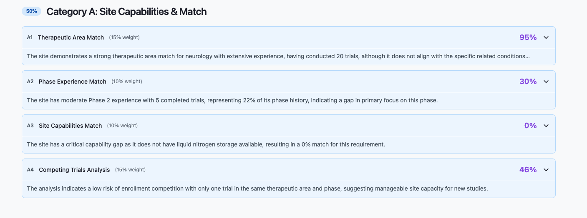
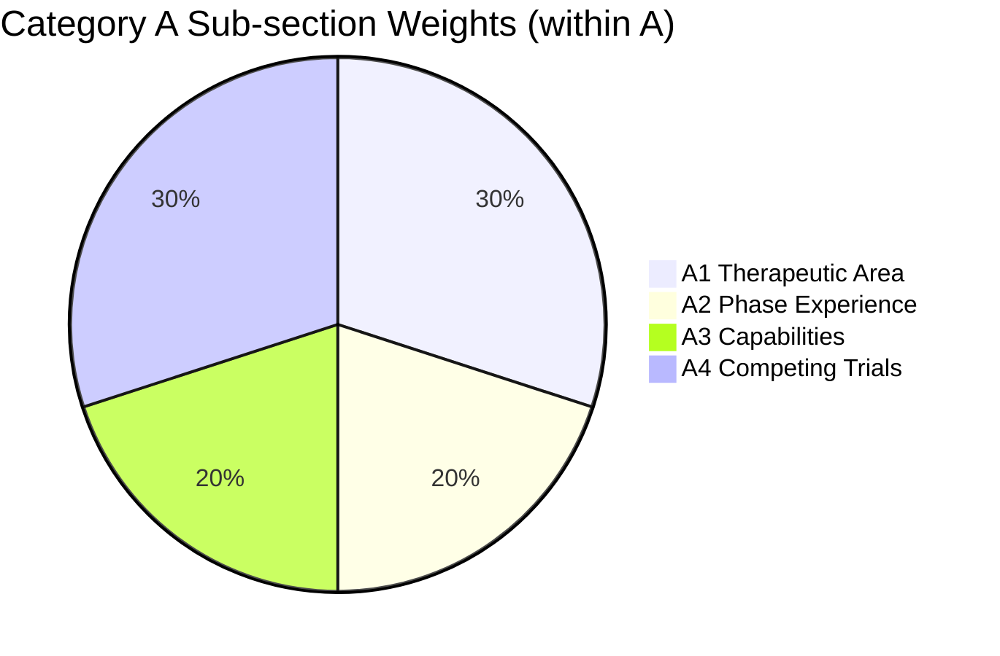

← [Back to Breakdown](../README.md)

# Category A — Site Capabilities & Match

| Property | Value |
|----------|-------|
| **Category code** | `A` |
| **Title** | Site Capabilities & Match |
| **Weight** | **50%** of total match score |
| **Code** | `studies/breakdown/a_sections.py` |

---



## Purpose

Category A evaluates how well the site **fits the study protocol** — therapeutic area experience, phase history, required equipment, and current enrollment competition. It is the largest contributor to the overall match score.

Category A answers:

- Has the site run trials in our therapeutic area, and how recently?
- Does the site have sufficient experience in our study phase?
- Does the site have the required capabilities and equipment?
- Are competing trials likely to impact enrollment at this site?

---

## Scoring within Category A

```text
category_a_score = Σ(sub_item.score × sub_item.weight) / Σ(sub_item.weight)
```

Sub-item `weight_percent` values are expressed as **percentage of the total match score** (not within A).



| Code | Title | Weight (total) | Weight (within A) | Status |
|------|-------|----------------|-------------------|--------|
| [A1](./A1.md) | Therapeutic Area Match | 15% | 30% | Implemented |
| [A2](./A2.md) | Phase Experience Match | 10% | 20% | Implemented |
| [A3](./A3.md) | Site Capabilities Match | 10% | 20% | Implemented |
| [A4](./A4.md) | Competing Trials Analysis | 15% | 30% | Implemented |

---

## Generation order

A1 → A2 → A3 → A4 (sequential in `generate_full_breakdown`)

| Progress | Milestone |
|----------|-----------|
| 15% | A1 complete |
| 25% | A2 complete |
| 30% | A3 complete |
| 35% | A4 complete |

---

## API path

```text
score_breakdown[] → category_code "A" → sub_items[]
```

---

## Sub-sections

- [A1 — Therapeutic Area Match](./A1.md)
- [A2 — Phase Experience Match](./A2.md)
- [A3 — Site Capabilities Match](./A3.md)
- [A4 — Competing Trials Analysis](./A4.md)

---

← [Back to Breakdown](../README.md)
