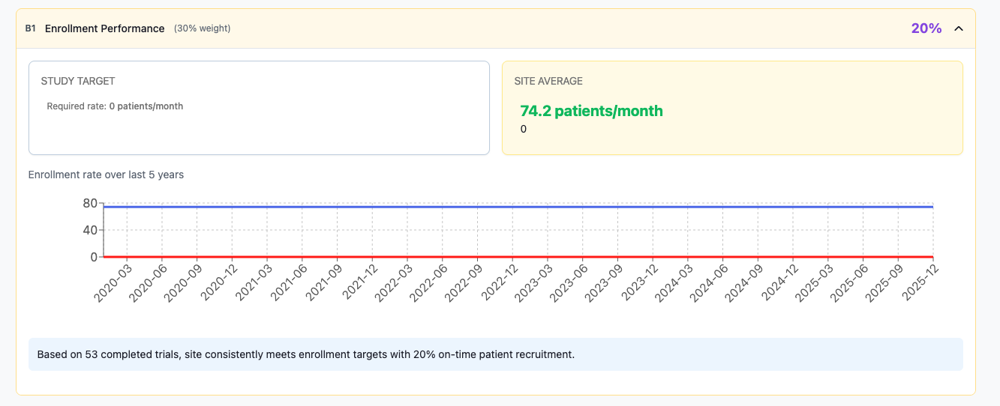
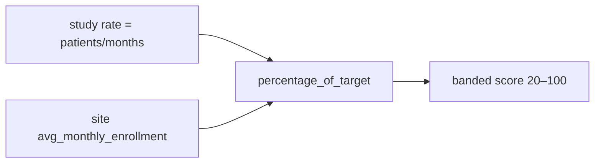
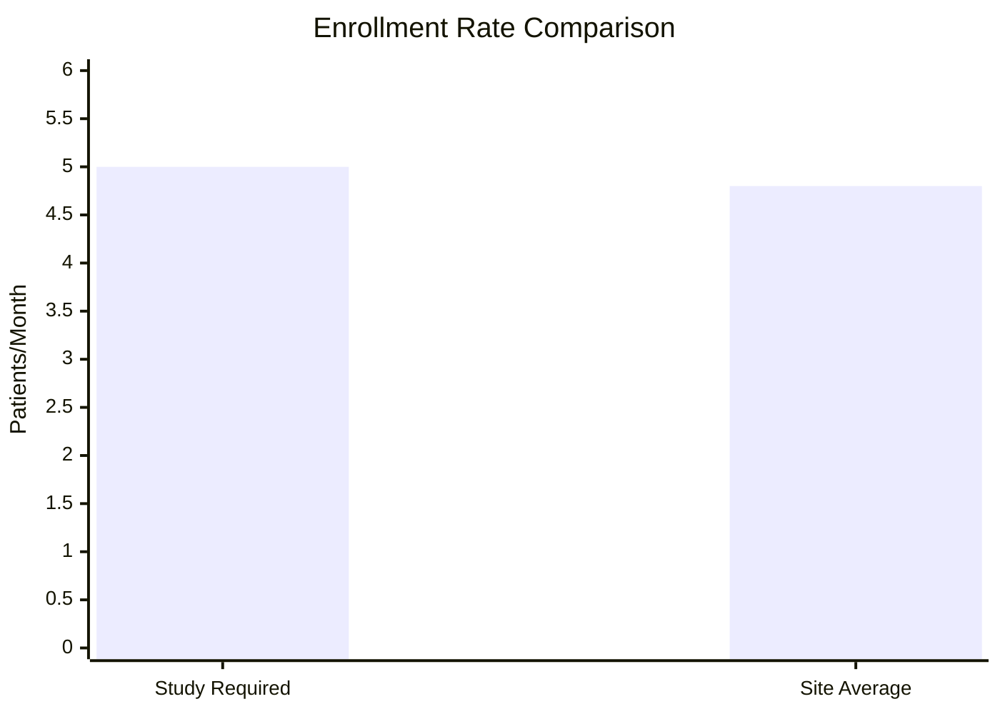

← [Back to Category B](./README.md)

# B1 — Enrollment Performance

| Property | Value |
|----------|-------|
| **Category** | B — Historical Performance |
| **Weight** | 30% of total match score (100% of category B today) |
| **Generator** | `generate_b1_breakdown()` in `studies/breakdown/b_sections.py` |

---



## Purpose

Compares the site's historical average monthly enrollment against the study's required enrollment rate.

---

## Data Sources

| Source | Field |
|--------|-------|
| `Study.total_enrollment_target` | Target patients |
| `Study.duration` | Duration in months |
| `Site.avg_monthly_enrollment` | Site historical rate (ETL) |
| `StudyHistory` | Completed trial count (narrative only) |

---

## Calculation Logic

### Study required rate

```text
study_average_rate = total_enrollment_target / duration_months   if duration > 0
                   = 0                                           otherwise
```

### Site rate

```text
site_average_rate = site.avg_monthly_enrollment OR 0
```

### Comparison

```text
percentage_of_target = round((site_average_rate / study_average_rate) × 100)   if study_rate > 0
                     = 0                                                         otherwise
```

**Performance indicator:**

| Condition | Label |
|-----------|-------|
| `site_rate ≥ study_rate` | Above target |
| `site_rate ≥ study_rate × 0.8` | On target |
| Otherwise | Below target |

### Score mapping (non-linear bands)

| % of target | `score_percent` |
|-------------|-----------------|
| ≥ 100 | 100 |
| ≥ 90 | 95 |
| ≥ 80 | 85 |
| ≥ 70 | 75 |
| ≥ 60 | 65 |
| < 60 | `max(20, percentage_of_target)` |



### Worked example

| Input | Value |
|-------|-------|
| Study target | 120 patients / 24 months = **5.0**/month |
| Site average | **4.8**/month |
| % of target | 96% |
| Performance | On target (≥ 80% of 5.0) |
| **Score** | **95** (≥ 90% band) |

---

## API Response Structure

```json
{
  "item_code": "B1",
  "item_title": "Enrollment Performance",
  "weight_percent": 30,
  "score_percent": 95,
  "details": {
    "summary": "Based on 42 completed trials, site consistently meets enrollment targets...",
    "comparison": {
      "study_target": {
        "total_patients": 120,
        "duration_months": 24,
        "required_rate": "5.0 patients/month"
      },
      "site_average": {
        "enrollment_rate": "4.8 patients/month",
        "percentage_of_target": 96,
        "performance_indicator": "On target"
      }
    },
    "chart_data": {
      "type": "line_chart",
      "description": "Enrollment rate over last 5 years",
      "trend": "consistent",
      "site_average": 4.8,
      "study_average": 5.0
    }
  }
}
```

`chart_data` provides comparison metadata for a line chart (site vs study average). Time-series points are not included in the payload.

---

## Frontend Usage

| UI element | Binding |
|------------|---------|
| Score | `score_percent` |
| Study vs site rates | `details.comparison` |
| Performance badge | `performance_indicator` |
| Chart | `details.chart_data` (`site_average` vs `study_average`) |



---

## Dependencies

- `Site.avg_monthly_enrollment` from facility ETL
- Study `total_enrollment_target` and `duration` from study creation

---

## Limitations

- Single site-level average — not phase/TA-specific
- `chart_data` is metadata only (no historical time series in API)
- Zero study duration → 0% of target and score floor
- B1 is the only implemented B section — category B = B1 score

---

## Related Documentation

- [← Back to Category B](./README.md)
- [B2 — Planned](./B2.md)
- [A4 — Competing Trials Analysis](../A/A4.md)
