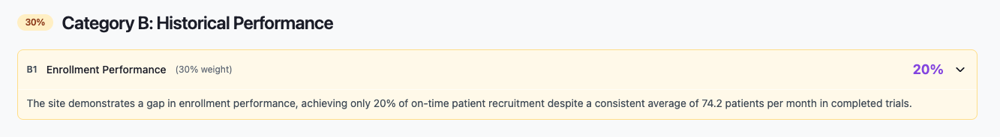

← [Back to Breakdown](../README.md)

# Category B — Historical Performance

| Property | Value |
|----------|-------|
| **Category code** | `B` |
| **Title** | Historical Performance |
| **Weight** | **30%** of total match score |
| **Code** | `studies/breakdown/b_sections.py` |

---



## Purpose

Category B evaluates the site's **operational track record** — how reliably the site has performed on past trials relative to study requirements. Today this is primarily enrollment performance.

Category B answers:

- Can this site recruit patients at the pace our study requires?
- *(Planned)* How strong is data quality, retention, and protocol compliance?

---

## Scoring within Category B

```text
category_b_score = Σ(sub_item.score × sub_item.weight) / Σ(sub_item.weight)
```

Currently only B1 exists, so **category B score = B1 score**.

| Code | Title | Weight (total) | Status |
|------|-------|----------------|--------|
| [B1](./B1.md) | Enrollment Performance | 30% | Implemented |
| [B2](./B2.md) | — | — | Planned |
| [B3](./B3.md) | — | — | Planned |

> Job progress messages reference B2 after B1, but B2/B3 generators are not implemented yet.

---

## Generation order

B1 runs after all Category A sections (progress 38%).

---

## API path

```text
score_breakdown[] → category_code "B" → sub_items[]
```

---

## Sub-sections

- [B1 — Enrollment Performance](./B1.md)
- [B2 — Planned](./B2.md)
- [B3 — Planned](./B3.md)

---

← [Back to Breakdown](../README.md)
