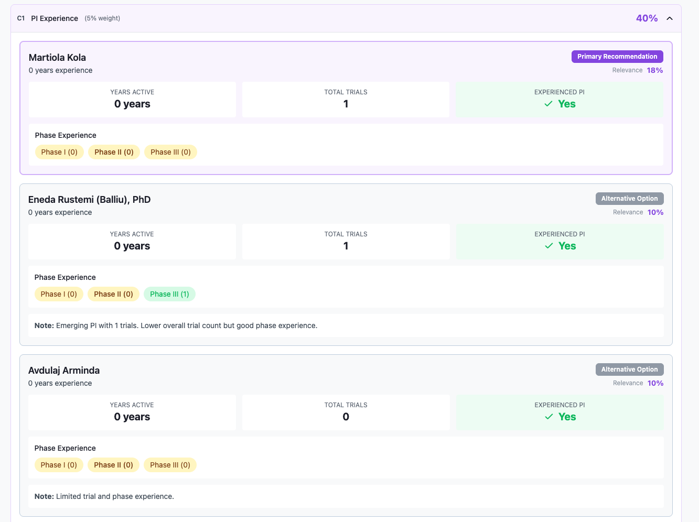
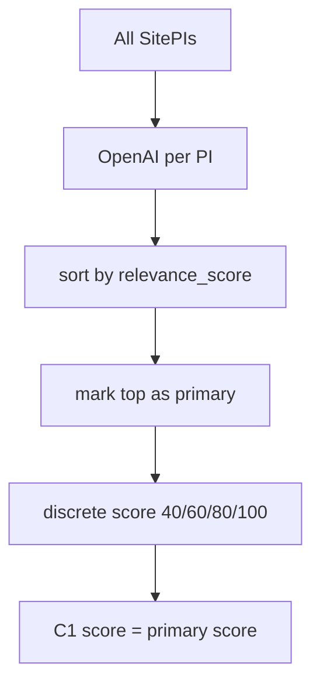
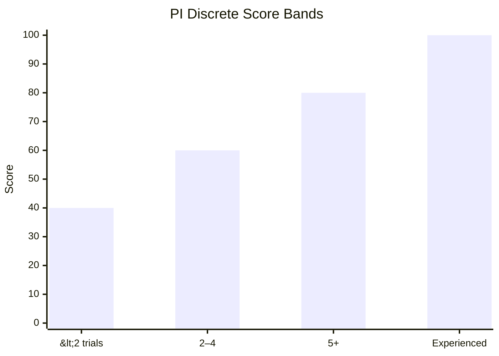

← [Back to Category C](./README.md)

# C1 — PI Experience

| Property | Value |
|----------|-------|
| **Category** | C — PI Experience |
| **Weight** | 5% of total match score (50% within category C) |
| **Generator** | `generate_c1_breakdown()` in `studies/breakdown/c_sections.py` |

---



## Purpose

Evaluates principal investigators at the site for trial experience. AI assigns a relevance score per PI; the **primary recommended PI's** discrete experience score becomes C1 `score_percent`.

---

## Data Sources

| Source | Role |
|--------|------|
| `SitePI` + `PI` | PI roster, `years_experience`, phase trial counts |
| `StudyHistoryPi` | Trial count fallback |
| `StudyHistoryCondition` | Specialty (dominant TA) derivation |
| OpenAI (`PI_SCORE_SYSTEM_PROMPT`) | Per-PI `relevance_score` + publication shortlist |

Shared upstream: `get_study_site_pi_recommendations(study, site)` — also used by C2.

---

## PI Selection & AI Scoring

### Candidate ranking (`_select_candidates`)

All `SitePI` at site, ranked by:

```text
rank = years_experience
     + total_trials (StudyHistoryPi count)
     + phase1..4 trial sum
     + exact_phase_boost × 3
     + adjacent_phase_boost × 1.5
```

Phase adjacency map (e.g. PHASE3 exact=`phase3_trials`, adjacent=`phase2_trials`,`phase4_trials`).

### OpenAI call (one per PI)

Each PI receives JSON payload with study phase/TA and full publication list (abstract truncated to 800 chars). Model returns:

```json
{
  "pi_id": "uuid",
  "relevance_score": 75,
  "publications": [{ "article_id": "uuid", "relevance_score": 90 }]
}
```

- Retracted publications penalized in prompt but excluded from output list
- On failure per PI: `relevance_score = 0`
- If **all** calls fail → `_fallback_pi_recommendations()` (primary facility PI or first)

### Primary PI

All scored PIs sorted by `relevance_score` descending. **Top scorer** gets `is_primary_recommendation: true`.

---

## C1 Experience Score (per PI)

Phase-aware `is_experienced` flag:

| Study phase contains | Sets experienced if |
|----------------------|---------------------|
| phase ii / 2 | `phase_ii ≥ 2` |
| phase i / 1 | `phase_i ≥ 2` |
| phase iii / 3 | `phase_iii ≥ 2` |
| phase iv / 4 | `phase_iv ≥ 2` |

Discrete PI score:

| Condition | PI score |
|-----------|----------|
| `is_experienced` OR model `is_experienced` | 100 |
| `total_trials ≥ 5` | 80 |
| `total_trials ≥ 2` | 60 |
| Otherwise | 40 |

```text
C1 score_percent = primary_PI_discrete_score
                 = 0 if no PIs
```



### Specialty derivation

Most frequent therapeutic area across PI's `StudyHistoryCondition` history → `specialty` string.

---

## API Response Structure

```json
{
  "item_code": "C1",
  "item_title": "PI Experience",
  "weight_percent": 5,
  "score_percent": 80,
  "details": {
    "summary": "3 Principal Investigators identified at this site...",
    "scoring_note": "Score based on primary PI (Dr. Jane Smith)",
    "principal_investigators": [
      {
        "pi_id": "uuid",
        "name": "Dr. Jane Smith",
        "specialty": "Oncology",
        "years_experience": 15,
        "relevance_score": 88,
        "is_primary_recommendation": true,
        "stats": {
          "years_active": 15,
          "total_trials": 24,
          "is_experienced": true
        },
        "phase_experience": {
          "phase_i": 4,
          "phase_ii": 8,
          "phase_iii": 10,
          "phase_iv": 2
        },
        "note": "optional emerging PI note"
      }
    ]
  }
}
```

Non-primary PIs with `< 10` trials may receive an `note` explaining emerging status.

---

## Frontend Usage

| UI element | Binding |
|------------|---------|
| Section score | `score_percent` |
| PI cards | `details.principal_investigators` |
| Primary badge | `is_primary_recommendation` |
| AI ranking | `relevance_score` (descending sort) |
| Phase bars | `phase_experience` |



---

## Dependencies

- `get_study_site_pi_recommendations()` — shared with C2
- `csi.openai_chat.get_chat_response`
- OpenAlex publication data via `PIArticle`/`Article`

---

## Limitations

- One OpenAI call per PI — latency scales with PI count
- `relevance_score` is display-only; C1 score uses discrete experience bands
- Only primary PI determines `score_percent`
- PI overrides — TODO: document deactivation impact

---

## Related Documentation

- [← Back to Category C](./README.md)
- [C2 — PI Publication Quality](./C2.md)
- [D1 — Country Regulatory Environment](../D/D1.md)
