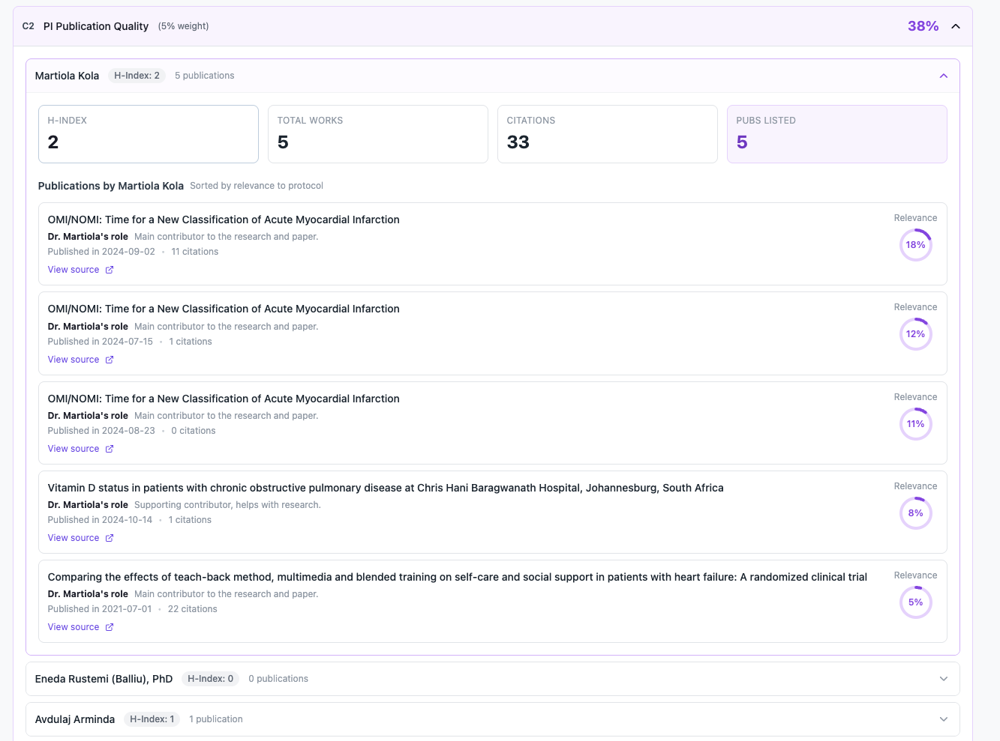
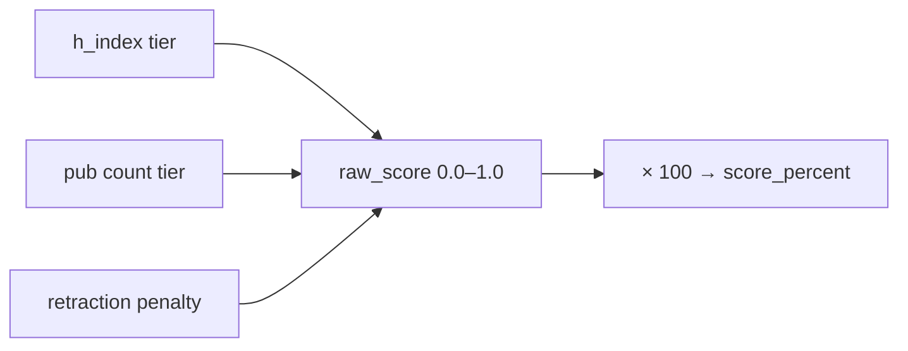
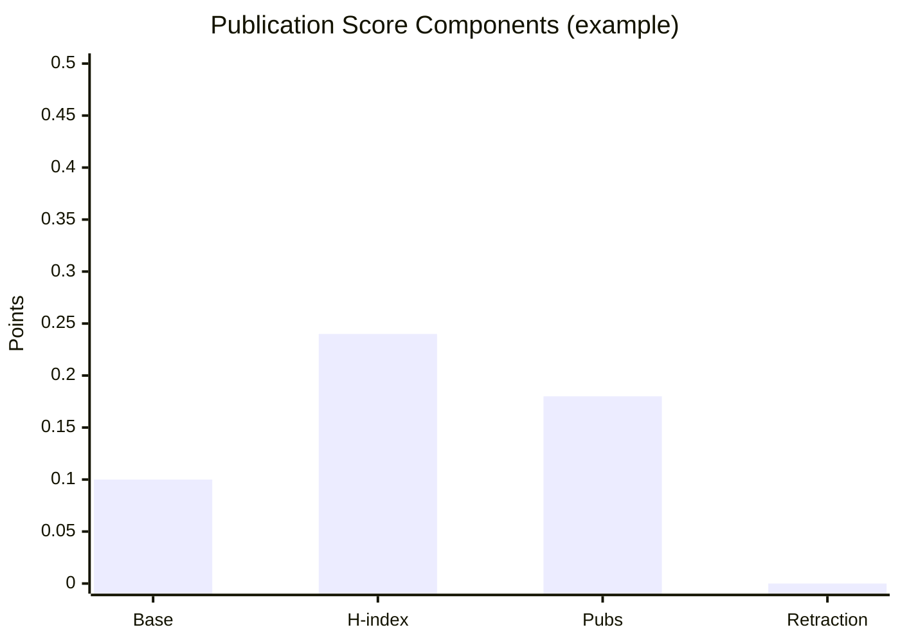

← [Back to Category C](./README.md)

# C2 — PI Publication Quality

| Property | Value |
|----------|-------|
| **Category** | C — PI Experience |
| **Weight** | 5% of total match score (50% within category C) |
| **Generator** | `generate_c2_breakdown()` in `studies/breakdown/c_sections.py` |

---



## Purpose

Scores publication quality of the **primary recommended PI** using bibliometric metrics. Reuses C1's PI recommendation list (no extra OpenAI calls).

---

## Data Sources

| Source | Fields |
|--------|--------|
| `PI` | `h_index`, `total_citations`, `openalex_author_id` |
| `PIArticle` + `Article` | Publications, retractions, citations, venue |
| PI recommendations (from C1 path) | Primary PI + AI-filtered relevant publications |

---

## Calculation Logic

### Per-PI raw publication score

```text
base_score = 0.1

h_index_score:
  h_index ≥ 100  → 0.4
  h_index ≥ 20   → 0.24
  h_index ≥ 1    → 0.16
  no data        → 0.0

pub_count_score:
  total_publications ≥ 200 → 0.3
  total_publications ≥ 40  → 0.18
  total_publications ≥ 1   → 0.12
  no data                  → 0.0

retraction_penalty = min(retraction_count × 0.3, 0.9)

raw_score = max(0, base + h_index_score + pub_count_score − retraction_penalty)
```

If no h-index **and** no publication count: `raw_score = 0.1`, explanation = `"PI identified"`.

### C2 score

```text
C2 score_percent = round(primary_PI_raw_score × 100)
```



### Publication list

Only articles returned by OpenAI in the recommendation step are hydrated with full metadata. Sorted by `relevance_score` descending.

---

## Score component reference

| h-index | Component | Pubs | Component |
|---------|-----------|------|-----------|
| ≥ 100 | +0.40 | ≥ 200 | +0.30 |
| ≥ 20 | +0.24 | ≥ 40 | +0.18 |
| ≥ 1 | +0.16 | ≥ 1 | +0.12 |
| — | +0.10 base | — | — |
| Retractions | −0.30 each (max −0.90) | | |

### Worked example

| Metric | Value | Component |
|--------|-------|-----------|
| h-index | 42 | +0.24 |
| Publications | 156 | +0.18 |
| Retractions | 0 | −0 |
| Base | — | +0.10 |
| **raw_score** | | **0.52** |
| **score_percent** | | **52** |

---

## API Response Structure

```json
{
  "item_code": "C2",
  "item_title": "PI Publication Quality",
  "weight_percent": 5,
  "score_percent": 52,
  "details": {
    "principal_investigators": [
      {
        "pi_id": "uuid",
        "name": "Dr. Jane Smith",
        "openalex_author_id": "A1234567890",
        "h_index": 42,
        "total_works": 156,
        "citations": 8200,
        "relevance_score": 88,
        "is_primary_recommendation": true,
        "explanation": "H-index: 42, 156 publications",
        "publications": [
          {
            "id": "uuid",
            "article_id": "uuid",
            "title": "Novel immunotherapy approaches in NSCLC",
            "publication_date": "2023-06-15",
            "citations_count": 45,
            "venue": "Journal of Clinical Oncology",
            "url": "https://...",
            "is_retracted": false,
            "author_position": "first",
            "is_corresponding_author": true,
            "open_alex_work_id": "W123",
            "relevance_score": 92
          }
        ]
      }
    ]
  }
}
```

---

## Frontend Usage

| UI element | Binding |
|------------|---------|
| Score | `score_percent` |
| H-index / works | `h_index`, `total_works`, `citations` |
| Publication table | `publications[]` |
| Retraction flag | `is_retracted` |
| External link | `url`, `open_alex_work_id` |



---

## Dependencies

- Shared `pi_recommendations` from `get_study_site_pi_recommendations()`
- OpenAlex ETL for `Article` / `PIArticle`

---

## Limitations

- Primary PI only — same as C1
- Publication list is AI-filtered subset, not full bibliography
- Missing metrics → minimum score ~10%
- `relevance_score` on publications is from OpenAI, separate from C2 numeric score

---

## Related Documentation

- [← Back to Category C](./README.md)
- [C1 — PI Experience](./C1.md)
- [D1 — Country Regulatory Environment](../D/D1.md)
