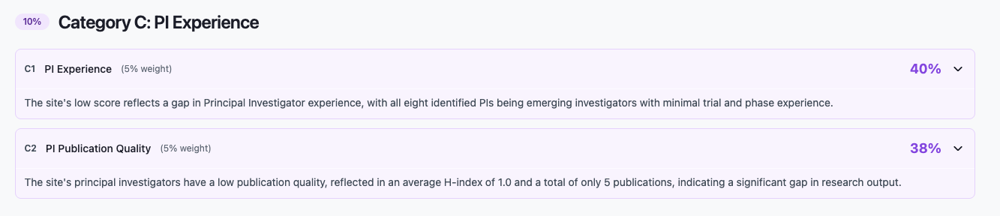
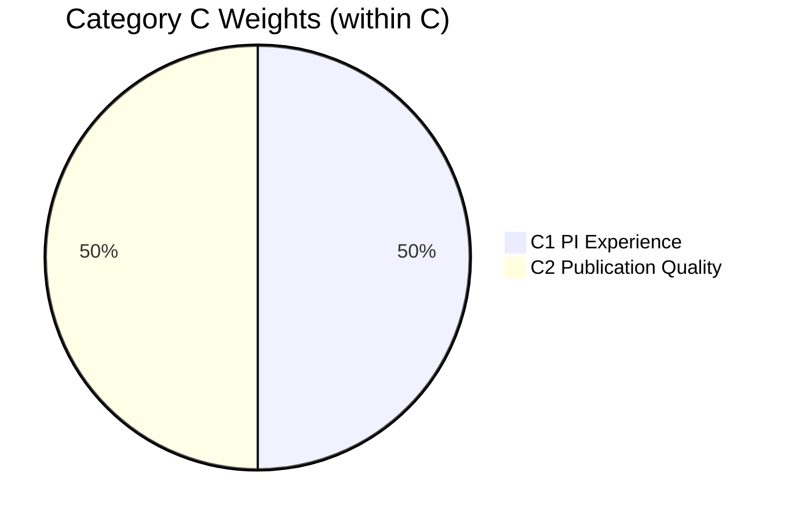

← [Back to Breakdown](../README.md)

# Category C — PI Experience

| Property | Value |
|----------|-------|
| **Category code** | `C` |
| **Title** | PI Experience |
| **Weight** | **10%** of total match score |
| **Code** | `studies/breakdown/c_sections.py` |

---



## Purpose

Category C evaluates **principal investigators** at the site — trial experience and publication quality. Both sub-sections share a single PI recommendation pass to avoid duplicate OpenAI calls.

Category C answers:

- Who are the qualified PIs at this site for our study?
- How experienced is the primary PI in relevant phases?
- How strong is the primary PI's publication profile?

---

## Scoring within Category C

```text
category_c_score = (C1.score × 5 + C2.score × 5) / 10
```

| Code | Title | Weight (total) | Weight (within C) | Status |
|------|-------|----------------|-------------------|--------|
| [C1](./C1.md) | PI Experience | 5% | 50% | Implemented |
| [C2](./C2.md) | PI Publication Quality | 5% | 50% | Implemented |



---

## Shared PI pipeline

`get_study_site_pi_recommendations(study, site)` runs once:

1. Rank all `SitePI` candidates
2. OpenAI scores each PI (one call per PI)
3. Top `relevance_score` → primary recommendation
4. Result passed to both C1 and C2

---

## API path

```text
score_breakdown[] → category_code "C" → sub_items[]
```

---

## Sub-sections

- [C1 — PI Experience](./C1.md)
- [C2 — PI Publication Quality](./C2.md)

---

← [Back to Breakdown](../README.md)
