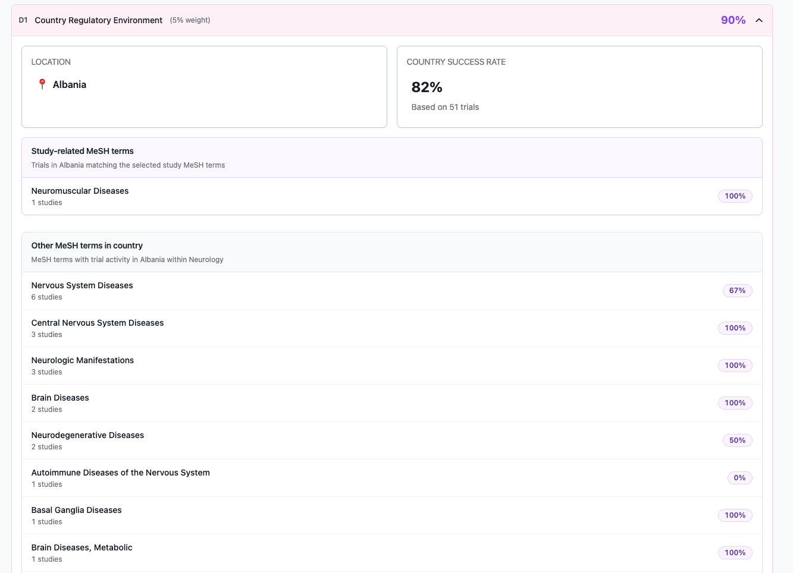
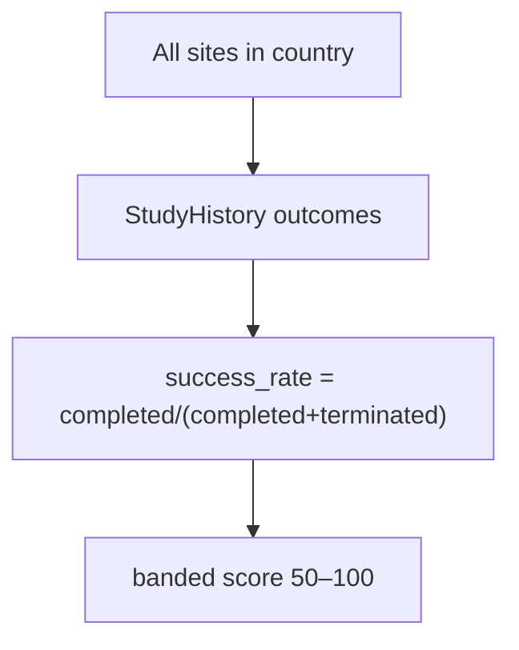
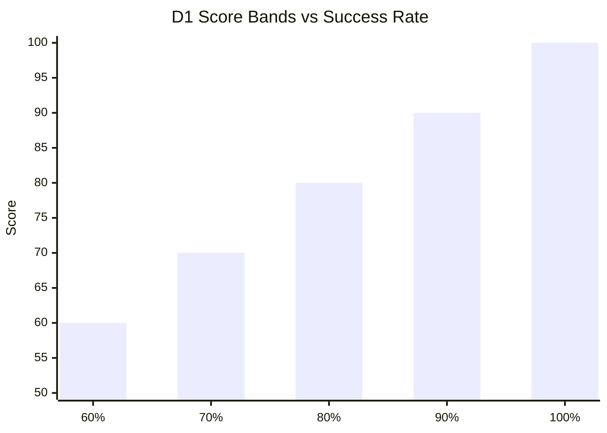

← [Back to Category D](./README.md)

# D1 — Country Regulatory Environment

| Property | Value |
|----------|-------|
| **Category** | D — Regulatory & Institution |
| **Weight** | 5% of total match score (50% within category D) |
| **Generator** | `generate_d1_breakdown()` in `studies/breakdown/d_sections.py` |

---



## Purpose

Scores the site's country regulatory environment using historical trial completion rates and provides TA-specific MeSH success rates in that country.

---

## Data Sources

| Source | Role |
|--------|------|
| `Site.country` | Country FK |
| `Country.assessment_text` | Pre-written regulatory narrative (ETL) |
| `Site.location` | City extraction (first comma-separated segment) |
| `StudyHistory` + `StudyHistoryStatus` | Completed / terminated trials in country |
| `build_ta_mesh_country_payload()` | Per-MeSH country stats (`mesh_country.py`) |

---

## Calculation Logic

### Country aggregate success rate

All sites in the country's `StudyHistory` filtered to completed + terminated statuses:

```text
success_rate = completed / (completed + terminated) × 100
total_relevant = completed + terminated
```

Status resolution: `StudyHistoryStatus` where name contains `"completed"` or `"terminated"`.

### Score bands

| Success rate | `score_percent` |
|--------------|-----------------|
| ≥ 90% | 100 |
| ≥ 80% | 90 |
| ≥ 70% | 80 |
| ≥ 60% | 70 |
| < 60% | `max(50, success_rate)` |



### MeSH country payload (`mesh_terms`)

Built by `build_ta_mesh_country_payload(study, site)`:

**Part 1 — `study_related`:** MeSH terms selected on study (`StudyCondition`)

**Part 2 — `country_other`:** Other MeSH in study TA not on study

Per MeSH row (trials in **site's country only**):

```text
study_count = completed_count + terminated_count (for that MeSH in country)
success_rate_percent = completed / study_count × 100
```

Only rows with `study_count > 0` are returned. Sorted by `study_count` desc.

### Envelope shape

```json
{
  "country": { "id": "uuid", "name": "United States" },
  "therapeutic_area": { "id": "uuid", "name": "Oncology" },
  "study_related": [ /* MeSH rows */ ],
  "country_other": [ /* MeSH rows */ ]
}
```

Each MeSH row: `{ mesh_term_id, mesh_term, study_count, success_rate_percent, success_rate }`

---

## API Response Structure

```json
{
  "item_code": "D1",
  "item_title": "Country Regulatory Environment",
  "weight_percent": 5,
  "score_percent": 90,
  "details": {
    "assessment": "Pre-written country regulatory text...",
    "comparison": {
      "location": {
        "city": "Boston",
        "icon": "location",
        "country": "United States"
      },
      "country_success_rate": {
        "rate_percent": 82,
        "based_on_trials": 1240
      }
    },
    "mesh_terms": {
      "country": { "id": "...", "name": "United States" },
      "therapeutic_area": { "id": "...", "name": "Oncology" },
      "study_related": [],
      "country_other": []
    }
  }
}
```

---

## Frontend Usage

| UI element | Binding |
|------------|---------|
| Score | `score_percent` |
| Regulatory narrative | `details.assessment` |
| Location | `details.comparison.location` |
| Country success gauge | `details.comparison.country_success_rate` |
| MeSH tables | `mesh_terms.study_related`, `mesh_terms.country_other` |



---

## Dependencies

- `mesh_country.py` helpers
- Country ETL (`assessment_text`)
- `StudyHistoryStatus` catalog

---

## Limitations

- Country-level aggregate — not site-specific regulatory performance
- Binary completed vs terminated — no termination reason breakdown
- No country or TA → empty `mesh_terms` arrays
- `assessment_text` is static, not study-specific

---

## Related Documentation

- [← Back to Category D](./README.md)
- [D2 — Institution Type](./D2.md)
- [C2 — PI Publication Quality](../C/C2.md)
