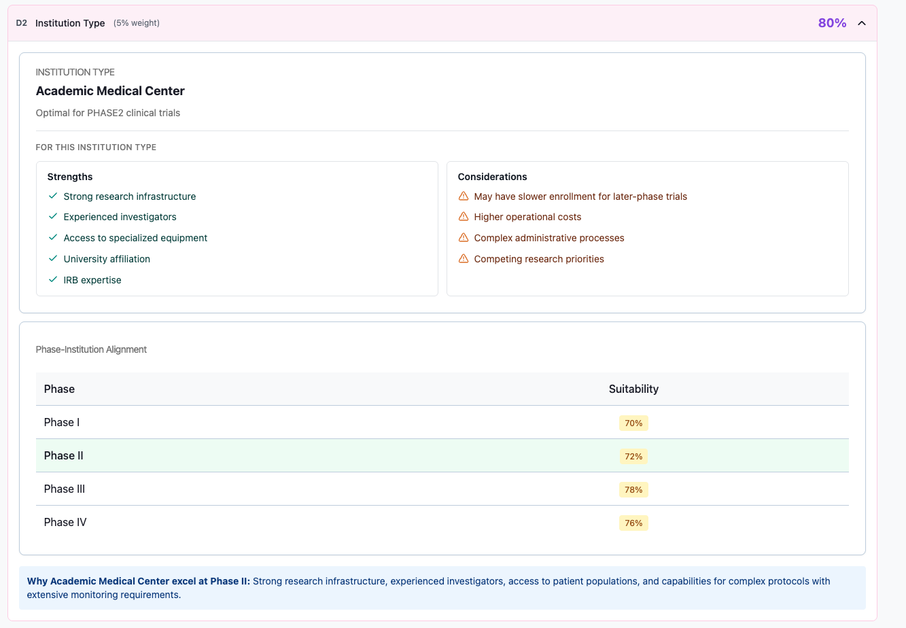
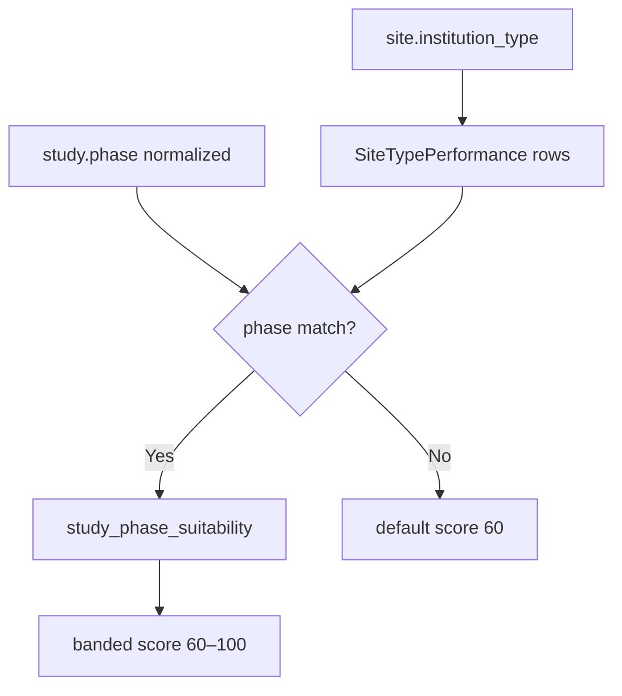
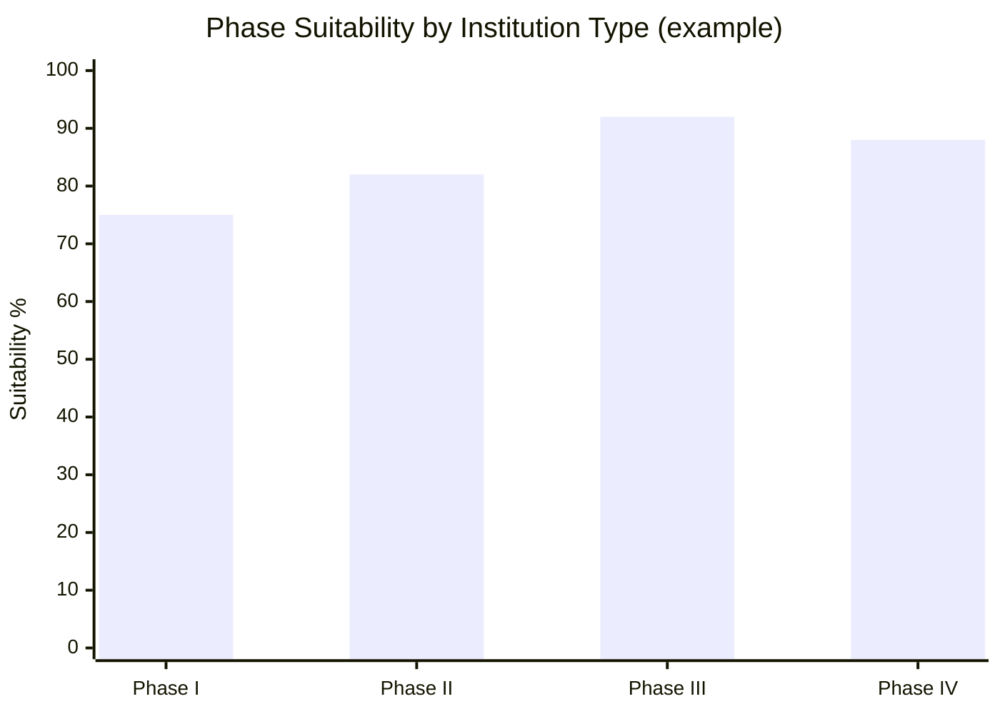

← [Back to Category D](./README.md)

# D2 — Institution Type

| Property | Value |
|----------|-------|
| **Category** | D — Regulatory & Institution |
| **Weight** | 5% of total match score (50% within category D) |
| **Generator** | `generate_d2_breakdown()` in `studies/breakdown/d_sections.py` |

---



## Purpose

Scores suitability of the site's **institution type** (e.g. Academic Medical Center) for the study's phase using ETL-fed `SiteTypePerformance` benchmarks.

---

## Data Sources

| Source | Role |
|--------|------|
| `Site.institution_type` | Institution type string |
| `SiteType` | `key_strengths`, `considerations` (ETL) |
| `SiteTypePerformance` | Per-phase `performance` % per institution type |
| `Study.phase` | Study phase for match |
| `normalize_phase_name()` | Roman/digit/word → `phase1`…`phase4` |

---

## Calculation Logic

### Lookup

1. Query `SiteTypePerformance` where `site_type.type` matches `institution_type` (case-insensitive).
2. If no rows → fall back to `SiteType` **"Other"**.
3. Normalize study phase and each performance row phase.
4. Exact normalized match → `study_phase_suitability`.

### Score bands

Default **60** when no phase data. When matched:

| `study_phase_suitability` | `score_percent` |
|---------------------------|-----------------|
| ≥ 90% | 100 |
| ≥ 80% | 90 |
| ≥ 70% | 80 |
| ≥ 60% | 70 |
| < 60% | 60 |

### Phase bar colors

| Suitability % | `color` |
|---------------|---------|
| ≥ 90 | green |
| ≥ 70 | yellow |
| < 70 | red |

Study's phase row gets `highlighted: true`.



### Worked example

| Input | Value |
|-------|-------|
| Institution | Academic Medical Center |
| Study phase | Phase III → `phase3` |
| Matched suitability | 92% |
| Color | green |
| **Score** | **100** (≥ 90%) |

---

## API Response Structure

```json
{
  "item_code": "D2",
  "item_title": "Institution Type",
  "weight_percent": 5,
  "score_percent": 100,
  "details": {
    "description": "Optimal for Phase III clinical trials",
    "explanation": "Strong research infrastructure, experienced investigators...",
    "institution_type": "Academic Medical Center",
    "key_strengths": "ETL narrative text",
    "considerations": "ETL narrative text",
    "phase_suitability": [
      {
        "phase": "Phase I",
        "suitability_percent": 75,
        "color": "yellow"
      },
      {
        "phase": "Phase III",
        "suitability_percent": 92,
        "color": "green",
        "highlighted": true
      }
    ]
  }
}
```

---

## Frontend Usage

| UI element | Binding |
|------------|---------|
| Score | `score_percent` |
| Institution label | `details.institution_type` |
| Phase bars | `details.phase_suitability` |
| Highlighted phase | `highlighted: true` |
| ETL narrative | `key_strengths`, `considerations` |



---

## Dependencies

- `SiteType` / `SiteTypePerformance` ETL
- `normalize_phase_name()` in `d_sections.py`
- `_site_type_for_institution_type()` with "Other" fallback

---

## Limitations

- `institution_type` must match ETL catalog (case-insensitive)
- No match for study phase → default score 60 with "data not available" text
- Template `explanation` — not site-specific LLM narrative
- Does not replace A3 equipment/capability checks

---

## Related Documentation

- [← Back to Category D](./README.md)
- [D1 — Country Regulatory Environment](./D1.md)
- [A3 — Site Capabilities Match](../A/A3.md)
