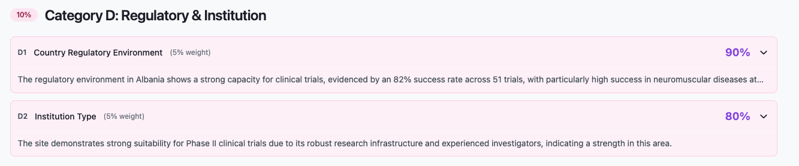
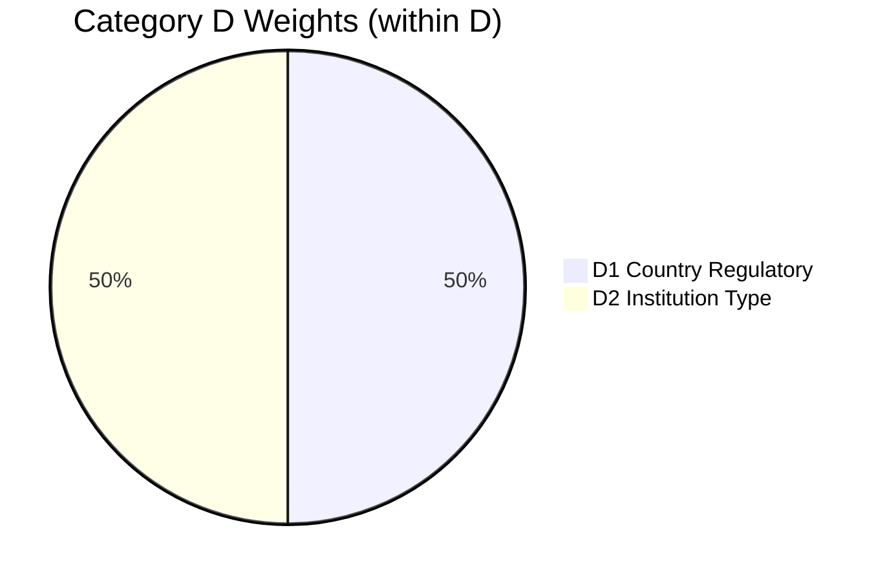

← [Back to Breakdown](../README.md)

# Category D — Regulatory & Institution

| Property | Value |
|----------|-------|
| **Category code** | `D` |
| **Title** | Regulatory & Institution |
| **Weight** | **10%** of total match score |
| **Code** | `studies/breakdown/d_sections.py` |

---



## Purpose

Category D evaluates the **external context** around the site — country regulatory track record and whether the institution type is suited to the study phase.

Category D answers:

- How favorable is this country's regulatory environment for clinical trials?
- Is this institution type a good fit for our study phase?

---

## Scoring within Category D

```text
category_d_score = (D1.score × 5 + D2.score × 5) / 10
```

| Code | Title | Weight (total) | Weight (within D) | Status |
|------|-------|----------------|-------------------|--------|
| [D1](./D1.md) | Country Regulatory Environment | 5% | 50% | Implemented |
| [D2](./D2.md) | Institution Type | 5% | 50% | Implemented |



---

## Generation order

D1 → D2 (after Category C completes)

---

## API path

```text
score_breakdown[] → category_code "D" → sub_items[]
```

---

## Sub-sections

- [D1 — Country Regulatory Environment](./D1.md)
- [D2 — Institution Type](./D2.md)

---

← [Back to Breakdown](../README.md)
