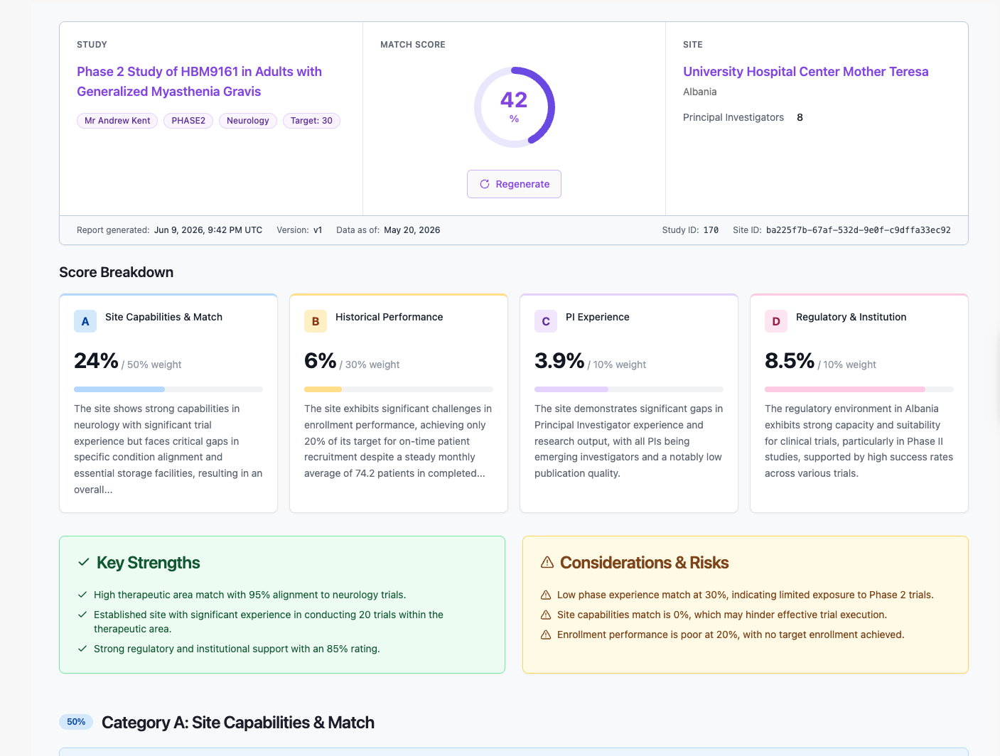
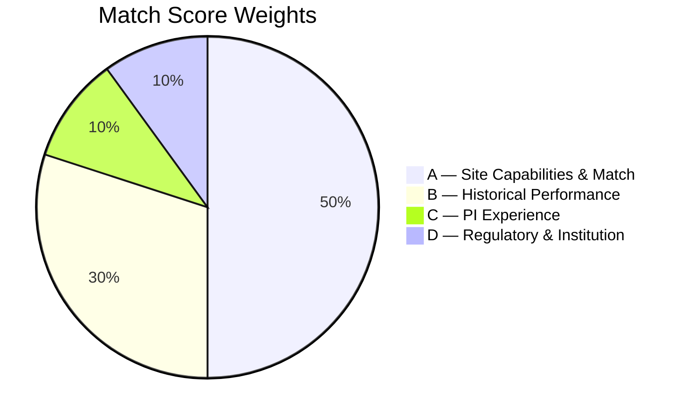
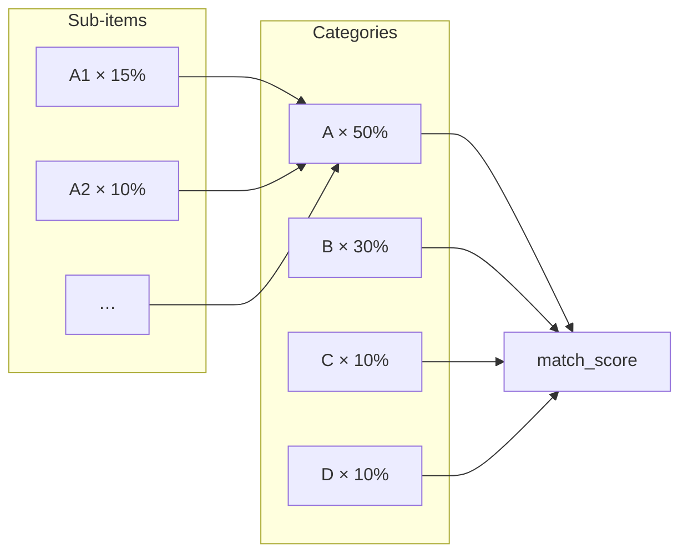

# Breakdown System

The **Breakdown** system evaluates how well a clinical research **site** fits a specific **study**. For each study–site pair it produces a structured report with per-section scores, an overall **match score** (0–100), narrative strengths/risks, and UI-ready detail payloads.



Code entry point: `studies/breakdown/full_breakdown.py` → `generate_full_breakdown()`.

---

## Purpose

Site Selection Unit (SSU) teams need a consistent, explainable feasibility assessment before engaging a site. The breakdown answers:

- Does the site have relevant therapeutic-area and phase experience?
- Does it have required equipment and capacity headroom?
- How does historical enrollment performance compare to study targets?
- Are the site's PIs qualified for this protocol?
- What is the regulatory and institutional context?

Each question maps to a scored sub-section. Scores roll up into four category groups and a single match score the frontend displays on the study–site detail view.

---

## API Endpoints

| Method | Path | Behavior |
|--------|------|----------|
| `GET` | `/api/v1/studies/<study_pk>/sites/<site_pk>/breakdown/` | Return saved breakdown or in-progress job status |
| `POST` | `/api/v1/studies/<study_pk>/sites/<site_pk>/breakdown/` | Start initial generation (409 if already exists) |
| `POST` | `/api/v1/studies/<study_pk>/sites/<site_pk>/breakdown/regenerate/` | Delete snapshot and regenerate (version increments) |
| `GET` | `/api/v1/studies/breakdown-jobs/<job_id>/` | Poll job progress |

### Top-level response fields

| Field | Type | Description |
|-------|------|-------------|
| `match_score` | float \| null | Overall 0–100 score |
| `score_breakdown` | array \| null | Four category objects (A, B, C, D) with nested `sub_items` |
| `overview` | object | Study/site metadata, report version, timestamps |
| `strength` | string[] | LLM-generated strengths |
| `risk` | string[] | LLM-generated risks |
| `recommended_steps` | string[] | LLM-generated next steps |
| `job` | object | `{ id, status, message, progress }` |

JSON path to a sub-section:

```text
data.score_breakdown[] → category "A" → sub_items[] → item_code "A1" → details
```

---

## Category Groups



| Code | Title | Weight (of total) | Sub-sections |
|------|-------|-------------------|--------------|
| **A** | Site Capabilities & Match | **50%** | [A1–A4](./A/README.md) |
| **B** | Historical Performance | **30%** | [B1–B3](./B/README.md) |
| **C** | PI Experience | **10%** | [C1, C2](./C/README.md) |
| **D** | Regulatory & Institution | **10%** | [D1, D2](./D/README.md) |

### Category documentation

| Category | Description | Doc |
|----------|-------------|-----|
| **A** | Site capabilities & protocol match | [Category A](./A/README.md) |
| **B** | Historical enrollment performance | [Category B](./B/README.md) |
| **C** | PI experience & publications | [Category C](./C/README.md) |
| **D** | Regulatory & institution context | [Category D](./D/README.md) |

---

## Scoring Model

Scoring happens at three levels. All scores are clamped to **0–100**.

### Level 1 — Sub-section score

Each generator returns `item_code`, `item_title`, `weight_percent`, `score_percent`, `section_summary`, and `details`.

`weight_percent` on sub-items is expressed as **percentage of the total match score**.

### Level 2 — Category score

```text
category_score = Σ(sub_item.score_percent × sub_item.weight_percent) / Σ(sub_item.weight_percent)
```

### Level 3 — Match score

```text
match_score = Σ(category.score_percent × category.weight_percent) / Σ(category.weight_percent)
```



LLM narrative (`strength`, `risk`, `recommended_steps`) does **not** alter `match_score`.

---

## Generation Flow

| Progress | Milestone |
|----------|-----------|
| 15% | A1 complete |
| 25% | A2 complete |
| 30% | A3 complete |
| 35% | A4 complete |
| 38% | B1 complete |
| — | PI recommendations (shared by C1 + C2) |
| 100% | All categories + LLM insights persisted |

---

## Documentation

- [Category A — Site Capabilities & Match](./A/README.md)
- [Category B — Historical Performance](./B/README.md)
- [Category C — PI Experience](./C/README.md)
- [Category D — Regulatory & Institution](./D/README.md)

---

## Related Resources

- A1 MeSH hierarchy (engineering): `dev-docs/A1_BREAKDOWN_MESH_HIERARCHY_README.md`
- Overview card API fields: `dev-docs/STUDY_SITE_BREAKDOWN_OVERVIEW.md`
