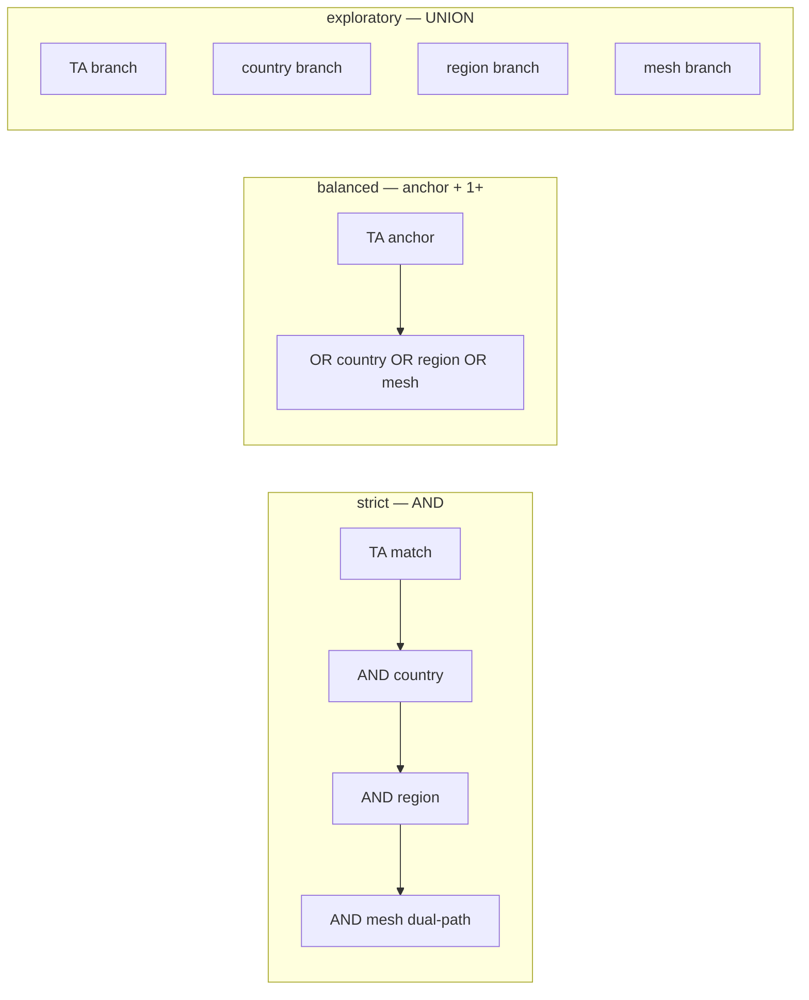
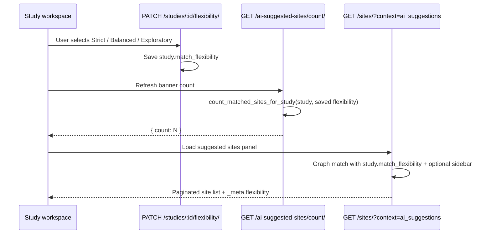
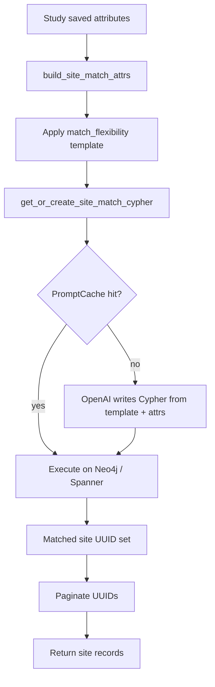

# Flexibility Modes & AI Suggestions

Flexibility modes control **how strictly** study requirements are applied when the platform suggests candidate sites. **AI Suggested Sites** is the study workspace feature that lists those candidates — matched from the knowledge graph against saved study attributes.

> **Important:** Suggested sites are **graph-driven**, not AI-generated. The product label *AI Suggestions* refers to automated site discovery, not an LLM choosing or ranking individual sites. Matching is performed by graph database queries (Neo4j or Google Spanner) against structured study criteria. OpenAI may be used only to **author Cypher query strings** from fixed templates; it does not score, rank, or recommend sites.

Code entry points:

| Area | Location |
|------|----------|
| Flexibility API | `studies/views.py` → `StudyFlexibilityAPIView` |
| Suggested-site count | `studies/views.py` → `StudyAISuggestedSitesCountAPIView` |
| Site study selection listing | `sites/views.py` → `SiteViewSet.list()` (`context=ai_suggestions`) |
| Match attrs + Cypher generation | `sites/services.py` |
| Graph providers | `csi/graph_providers.py` |
| Spanner study-match execution | `csi/spanner_service.py` |

---

## What gets matched

Study attributes are converted to graph match criteria via `build_site_match_attrs(study)`:

| Study data | Graph criterion |
|------------|-----------------|
| `therapeutic_area` | `(site)-[:SPECIALISES_IN]->(TherapeuticArea)` |
| `StudyCondition` rows (MeSH) | Mesh term via dual-path (studies at site + TA mapping) |
| `StudyCountry` rows | `(site)-[:LOCATED_IN]->(Country)` |
| `StudyRegion` rows | Region name via `(:Country)-[:PART_OF]->(Region)` |
| `StudyCapability` rows | **Not in graph** — Postgres overlay after graph match |
| PI requirements, enrollment, phase | **Not used** for site suggestion matching |

At least one graph criterion (TA, mesh, country, or region) must be present; otherwise matching returns zero results.

---

## Flexibility modes

Three modes are stored on the study as `match_flexibility` and drive Cypher template selection:

| Mode | Logic | User-facing intent |
|------|-------|-------------------|
| **strict** | **AND** — site must satisfy **every** provided criterion | No compromises on any dimension |
| **balanced** | **Anchor + optional** — site must satisfy the anchor criterion **and at least one other** | Most requirements met; minor deviations acceptable |
| **exploratory** | **OR** — site must satisfy **at least one** criterion | Broader net; close matches included |

### Graph templates per mode



**Strict mesh rule:** When mesh terms are present, strict mode requires **both** graph paths OR'd together:

- Studies conducted at the site tagged with the MeSH term (`CONDUCTED_AT` → `Study` ← `TAGGED_IN`)
- Site therapeutic area linked via `MAPS_TO_THERAPEUTIC_AREA`

**Balanced mesh rule:** Uses only the `TAGGED_IN` / `CONDUCTED_AT` branch — not `MAPS_TO_THERAPEUTIC_AREA`.

**Exploratory:** Each criterion becomes an independent `UNION` branch ending in `RETURN DISTINCT site.uuid AS uuid`.

**Anchor order** (first populated criterion anchors the query): TherapeuticArea → Country → Region → MeshTerm.

---

## Flexibility workflow



### Default and overrides

| Context | Flexibility used |
|---------|------------------|
| New study (manual create) | `strict` (set by create serializer) |
| Study model default | `balanced` (if not explicitly set elsewhere) |
| AI suggestions listing | Saved `study.match_flexibility` |
| Count API (default) | Saved `study.match_flexibility` |
| Count API `?flexibility=` | **Request-only override** — does not persist |
| Study-only site list (no `context=ai_suggestions`, no description) | Always **strict** (sync with count API when no override) |

Invalid flexibility values fall back to `strict`.

---

## Suggestion generation process

Suggestions are produced by a **graph query pipeline**, not by an LLM recommendation model.



### Role of OpenAI

OpenAI (`gpt-4o-mini`) receives:

- A fixed system prompt with graph schema and mode-specific Cypher **templates**
- Structured study attributes (TA UUID, mesh IDs, country UUIDs, region names)
- Validation rules (read-only Cypher, `site` alias, no `$parameters`)

OpenAI **outputs a Cypher string**. The graph database **executes** that query and returns UUIDs. OpenAI does **not**:

- Receive candidate site lists to re-rank
- Assign relevance scores to sites
- Decide which sites are "recommended" beyond template logic

Generated Cypher is cached in `PromptCache` for **8 hours** (keyed by attrs signature including flexibility).

### Capability overlay 

Equipment/capability nodes are **excluded from graph queries**. After graph matching, `filter_by_capabilities` intersects candidates with `SiteCapability` rows:

| Flexibility | Minimum capability overlap |
|-------------|---------------------------|
| strict | All study capability IDs (`cnt >= N`) |
| balanced | At least half, rounded up: `max(1, (N+1)//2)` |
| exploratory | At least one (`cnt >= 1`) |

Only capabilities with `status="ok"` count. The **count API intentionally excludes** capabilities to avoid misleadingly low banner numbers when capability data is sparse. Use `match_site_uuids_for_study()` when capability filtering is required.

### Result ordering

Suggested sites are ordered by **`site.uuid`** in the graph — deterministic, not AI relevance ranking. No semantic match score is applied at the suggestion layer (breakdown `match_score` is a separate feature).

---

## Graph database architecture

### Schema (site matching subset)

```
(site:Site)          uuid, name, country_id, institution_type
(ta:TherapeuticArea) uuid, name
(c:Country)          uuid, name
(r:Region)           uuid, name
(m:MeshTerm)         mesh_id, name
(st:Study)           uuid, study_status_id

(site)-[:LOCATED_IN]->(c)-[:PART_OF]->(r)
(site)-[:SPECIALISES_IN]->(ta)
(site)-[:CONDUCTED_AT]->(st)
(m)-[:TAGGED_IN]->(st)
(m)-[:MAPS_TO_THERAPEUTIC_AREA]->(ta)
```

MeSH node IDs use `mesh_id` (not UUID). Region matching uses **region name**.


### Data dependencies

Graph matching requires ETL-populated graph data synced from Postgres/CSI pipelines:

| Dependency | Required for |
|------------|--------------|
| Site nodes + `LOCATED_IN` | Geography matching |
| TherapeuticArea + `SPECIALISES_IN` | TA matching |
| MeshTerm + study tagging | Condition matching |
| Study nodes + `CONDUCTED_AT` | Trial history / mesh via studies |
| Country/Region hierarchy | Region matching |

Missing or stale graph data produces empty or incomplete suggestion sets even when Postgres study fields are populated.

---

## API reference

### Flexibility modes

**Get current mode and available options:**

```http
GET /api/v1/studies/{id}/flexibility/
Authorization: Bearer <token>
```

```json
{
  "data": {
    "current_flexibility": "balanced",
    "modes": [
      {
        "id": "strict",
        "name": "Strict",
        "description": "Sites must meet all of your requirements without exception."
      },
      {
        "id": "balanced",
        "name": "Balanced",
        "description": "Sites must meet most of your requirements. Minor deviations are acceptable."
      },
      {
        "id": "exploratory",
        "name": "Exploratory",
        "description": "Include sites that are close matches to your criteria."
      }
    ]
  },
  "code": 200,
  "message": "Flexibility modes retrieved successfully"
}
```

**Update mode:**

```http
PATCH /api/v1/studies/{id}/flexibility/
Content-Type: application/json

{ "flexibility": "exploratory" }
```

```json
{
  "data": { "flexibility": "exploratory" },
  "code": 200,
  "message": "Study flexibility updated"
}
```

Writes a study log entry. Invalid mode returns **404** (*Flexibility mode not found*).

### AI suggested site count

```http
GET /api/v1/studies/{id}/ai-suggested-sites/count/?flexibility=balanced
Authorization: Bearer <token>
```

| Param | Description |
|-------|-------------|
| `flexibility` | Optional override: `strict`, `balanced`, or `exploratory`. Omit to use saved study mode. |

```json
{
  "data": { "count": 47 },
  "code": 200,
  "message": "AI suggested site count retrieved successfully"
}
```

Count reflects graph criteria only — **capabilities excluded**.

| Error | HTTP |
|-------|------|
| Study not found | 404 |
| Invalid Cypher generation | 502 |
| Graph backend unavailable | 503 |
| Unexpected failure | 500 |

### Site study selection (AI suggestions listing)

```http
GET /api/v1/sites/?study={id}&context=ai_suggestions&page=1
    &specialization={ta_id}&country={id}&region={id}&phase={id}
    &min_capacity={n}&mesh_term={mesh_id}
Authorization: Bearer <token>
```

| Param | Required | Description |
|-------|----------|-------------|
| `study` | **Yes** | Study ID |
| `context` | **Yes** | Must be `ai_suggestions` |
| `page` | No | Page number (default 1) |
| `specialization` | No | Override therapeutic area (clears study mesh terms) |
| `country`, `region`, `phase` | No | Narrow suggestions |
| `min_capacity` | No | Postgres capacity filter |
| `mesh_term` | No | MeSH term ID(s), comma-separated |

**Response** (page size **10**):

```json
{
  "_pagination": {
    "current_page": 1,
    "total_pages": 5,
    "total_items": 42,
    "items_per_page": 10,
    "has_next": true,
    "has_previous": false
  },
  "_data": [ { "id": "...", "name": "...", "country": { "...": "..." } } ],
  "_meta": {
    "context": "ai_suggestions",
    "flexibility": "balanced"
  }
}
```

Sidebar filters override study attrs on overlapping dimensions (sidebar wins). See [AI Suggestions & site study selection](./ai-suggestions.md) for the full panel workflow and example scenarios.

---

## Further reading

- [AI Suggestions & site study selection](./ai-suggestions.md) — Panel workflow, sidebar overrides, example scenarios
- [Limitations & edge cases](./limitations.md) — Graph vs AI clarification, constraints, fallbacks

← [Back to Documentation](../README.md)
