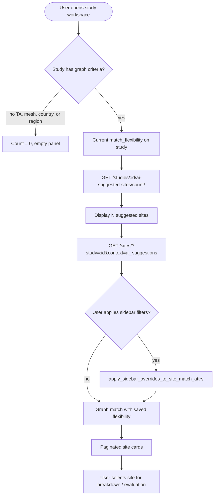
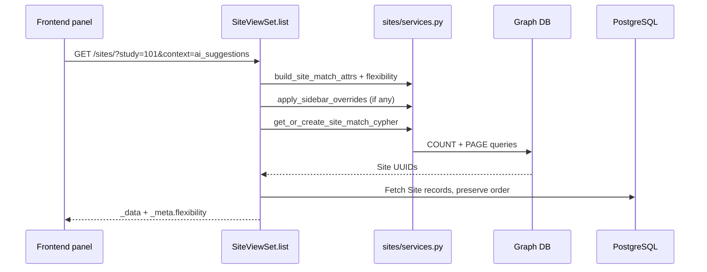

# AI Suggestions & Site Study Selection

The **AI Suggested Sites** panel in the study workspace shows candidate sites whose graph profile aligns with the saved study — filtered by the selected **flexibility mode** and optional sidebar refinements. This is **site study selection**: choosing from graph-matched candidates, not LLM-picked recommendations.

← [Back to Flexibility Modes & AI Suggestions](./README.md)

---

## Important: graph-driven, not AI-generated

| What the name suggests | What actually happens |
|------------------------|----------------------|
| "AI" suggests sites | **Graph queries** return sites matching structured study criteria |
| Model picks best sites | **Template logic** (strict / balanced / exploratory) defines match rules |
| Ranked by AI relevance | Ordered by **`site.uuid`** — no AI ranking |

OpenAI may generate the **Cypher query text** from study attributes and fixed templates. The **recommendation set** is entirely determined by graph execution (+ optional Postgres capability overlay). No LLM evaluates individual sites.

---

## End-to-end workflow



### Typical user journey

1. **Complete study fields** — therapeutic area, conditions (MeSH), target countries/regions.
2. **Choose flexibility mode** — `PATCH /studies/{id}/flexibility/` (Strict / Balanced / Exploratory).
3. **View count** — banner shows `GET /studies/{id}/ai-suggested-sites/count/`.
4. **Browse suggestions** — panel loads `GET /sites/?study={id}&context=ai_suggestions`.
5. **Refine** — sidebar filters (country, specialization, mesh term, capacity) narrow the graph set.
6. **Select site** — user opens breakdown or site detail for a chosen candidate.

---

## Matching logic in the suggestions panel

When `context=ai_suggestions`:

1. Load study → `build_site_match_attrs(study)`.
2. Apply saved `study.match_flexibility` via `attrs_for_site_match_cypher(study, flex_mode)`.
3. Apply sidebar overrides via `apply_sidebar_overrides_to_site_match_attrs`.
4. Generate / cache Cypher → execute on graph provider.
5. Paginate UUIDs → fetch `Site` rows from Postgres in graph order.
6. Return `_meta.context` and `_meta.flexibility` in the response.



### Sidebar override rules

| Sidebar param | Effect on study attrs |
|---------------|----------------------|
| `specialization` | Replaces therapeutic area; **clears mesh terms** (avoids TA/mesh double-constraint) |
| `country` | Replaces country list |
| `mesh_term` | Replaces mesh term list |
| `region`, `phase` | Applied via listing enforcement after graph |
| `min_capacity` | Postgres filter on `Site.capacity` |

Sidebar wins over study baseline on the same dimension.

### Count vs listing

| Aspect | Count API | Suggestions listing |
|--------|-----------|---------------------|
| Capabilities | **Excluded** | Not applied in standard ai_suggestions list path |
| Flexibility | Saved mode or `?flexibility=` override | Saved mode only |
| Sidebar | Not supported | Supported |


Preview count with a different mode without saving:

```http
GET /api/v1/studies/101/ai-suggested-sites/count/?flexibility=exploratory
```

---

## Example recommendation scenarios

### Scenario 1 — Strict oncology study in the US

**Study:** Therapeutic area = Oncology, MeSH = *Non-Small Cell Lung Carcinoma*, Countries = United States, Mode = **strict**.

**Graph behavior:** Site must `SPECIALISES_IN` Oncology **AND** be in the US **AND** satisfy mesh dual-path (trial history or TA mapping).

**Expected result:** Smallest, highest-precision set. Count and panel both reflect strict AND logic.

---

### Scenario 2 — Balanced multi-region study

**Study:** TA = Cardiology, Countries = Germany + France, Regions = Western Europe, Mode = **balanced**.

**Graph behavior:** Cardiology anchor required; site must also match **at least one** of: Germany, France, Western Europe region, or mesh (if present). Mesh uses `TAGGED_IN` path only.

**Expected result:** More sites than strict — includes cardiology sites in one target geography even if not all geographies match.

---

### Scenario 3 — Exploratory early feasibility

**Study:** TA = Neurology, MeSH = Alzheimer's, no countries set, Mode = **exploratory**.

**Graph behavior:** UNION of neurology-specialized sites **OR** sites with Alzheimer's-tagged trials.

**Expected result:** Broad candidate pool for early scouting. Count typically much higher than strict.

---

### Scenario 4 — Preview count before changing mode

**Current saved mode:** strict (count = 12).

**User previews exploratory:**

```http
GET /api/v1/studies/101/ai-suggested-sites/count/?flexibility=exploratory
→ { "count": 89 }
```

**User saves exploratory:**

```http
PATCH /api/v1/studies/101/flexibility/
{ "flexibility": "exploratory" }
```

Panel reload uses exploratory; count API without override now returns 89.

---

### Scenario 5 — Sidebar mesh refinement

**Study:** Oncology + broad mesh list, Mode = balanced.

**User filters panel:**

```http
GET /api/v1/sites/?study=101&context=ai_suggestions&mesh_term=mesh-uuid-nsclc
```

**Behavior:** Sidebar replaces study mesh IDs with the single NSCLC term. Graph re-runs with narrowed mesh criterion. `_meta.flexibility` still reflects saved study mode.

---

### Scenario 6 — Specialization override

**Study:** TA = Oncology with condition-derived mesh terms.

**User selects sidebar specialization = Rare Diseases:**

```http
GET /api/v1/sites/?study=101&context=ai_suggestions&specialization=ta-rare-disease-uuid
```

**Behavior:** Therapeutic area replaced; **mesh terms cleared** so oncology conditions do not over-constrain the rare-disease filter.

---


## Site study selection after suggestions

Suggested sites are **candidates for further evaluation**, not final selections:

| Next step | API / feature |
|-----------|---------------|
| View site detail | `GET /api/v1/sites/{id}/` |
| Run feasibility breakdown | `POST /api/v1/studies/{study_id}/sites/{site_id}/breakdown/` |
| Apply site override | `POST /api/v1/sites/{id}/override/` |
| Natural language search (separate) | `GET /api/v1/sites/?description=...` — see [Natural Search](../natural-search/README.md) |

Breakdown `match_score` is computed separately and is **not** used to order AI suggestions.

---

## Related APIs summary

| Method | Endpoint | Purpose |
|--------|----------|---------|
| `GET` | `/api/v1/studies/{id}/flexibility/` | List modes + current selection |
| `PATCH` | `/api/v1/studies/{id}/flexibility/` | Persist flexibility mode |
| `GET` | `/api/v1/studies/{id}/ai-suggested-sites/count/` | Banner count (graph only) |
| `GET` | `/api/v1/sites/?study={id}&context=ai_suggestions` | Paginated suggestion list |

← [Back to Flexibility Modes & AI Suggestions](./README.md)
