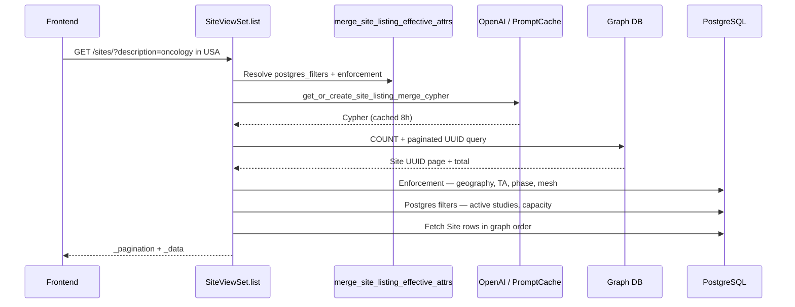
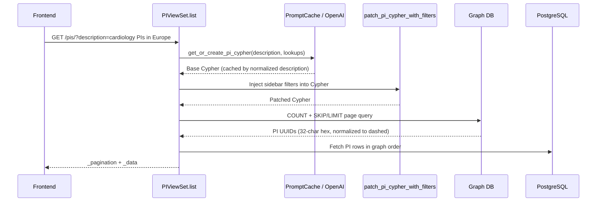

# Natural Language Search

Natural language search lets users find **sites** and **principal investigators (PIs)** by typing free-text queries instead of setting every filter manually. Examples:

- *"oncology sites in the United States"*
- *"PIs with phase 3 experience in cardiology and more than 10 publications"*

Both flows translate user text into graph queries (Neo4j or Spanner), paginate UUID results, and re-fetch full records from PostgreSQL in graph order.

| Entity | Entry point | Trigger |
|--------|-------------|---------|
| **Site** | `sites/views.py` → `SiteViewSet.list()` | `?description=<text>` |
| **PI** | `principal_investigators/views.py` → `PIViewSet.list()` | `?description=<text>` |

Shared infrastructure: `csi/graph_providers.py` (Neo4j / Spanner), OpenAI Cypher generation, `PromptCache` (8-hour TTL).

---

## Overview

```mermaid
flowchart TD
    subgraph Site["Site natural search"]
        SD[?description= + optional sidebar filters]
        SD --> SM[merge_site_listing_merge_cypher]
        SM --> SG[Graph DB]
        SG --> SP[Postgres enforcement + filters]
        SP --> SR[_pagination + _data]
    end

    subgraph PI["PI natural search"]
        PD[?description= + optional sidebar filters]
        PD --> PC[get_or_create_pi_cypher]
        PC --> PP[patch_pi_cypher_with_filters]
        PP --> PG[Graph DB]
        PG --> PR[_pagination + _data]
    end
```



Without `?description=`, both endpoints use standard Postgres listing (sidebar filters only, DRF pagination).

---

## Site natural search

### When it runs

Graph-backed site search activates when `?description=` is present (non-empty). Optional structured sidebar params refine the same request.

### Architecture



**Inputs merged for each request:**

| Input | Source | Examples |
|-------|--------|----------|
| Natural language | `?description=` | *"oncology sites in USA"*, *"active studies count greater than 2"* |
| Sidebar filters | Structured query params | `specialization`, `phase`, `country`, `region`, `min_capacity` |

On overlapping dimensions, **sidebar wins** over natural text. Postgres **enforcement** re-applies merged geography / TA / phase / mesh after graph execution so missing Cypher clauses do not leak wrong countries.

**Backend split:**

| Concern | Backend |
|---------|---------|
| Site master records, overrides | PostgreSQL |
| Graph traversal (TA, geography, phase, study history) | Neo4j or Spanner (`GRAPH_DB_PROVIDER`) |

Cypher is generated by OpenAI from natural text, lookup tables, and strict AND templates. Pagination uses `ORDER BY site.uuid` — deterministic, not relevance-ranked.

### Supported query patterns (site)

Natural text is interpreted against lookup tables (therapeutic areas, countries, regions, phases, MeSH terms, recruiting study statuses).

**Geography**

| User input | Resolution |
|------------|------------|
| `USA`, `US`, `U.S.A.` | United States (alias expansion) |
| `UK`, `UAE` | United Kingdom, United Arab Emirates |
| Full country or region names | Substring match against lookup names |

**Therapeutic area and phase**

| User input | Resolution |
|------------|------------|
| Disease domain (*oncology*, *cardiology*) | `SPECIALISES_IN` → TherapeuticArea |
| `phase 2`, `Phase II`, `p2` | `OPERATES_IN_PHASE` → Phase |

Phase numbers inside *"greater than 2"* are **not** treated as trial phase unless *phase* or `p1`–`p4` appears.

**MeSH / conditions**

Condition names map to MeSH lookup entries via dual-path graph matching (studies at site + therapeutic area mapping).

**Active / recruiting study counts**

| User input | Filter |
|------------|--------|
| *active studies*, *recruiting trials* | Recruiting count via Postgres |
| *greater than N*, *more than N* | `active_studies__gt` = N |
| *count must be than N* (typo) | Treated as *greater than N* |

**Capacity**

| User input | Filter |
|------------|--------|
| *capacity greater than N* | `capacity__gte` in Postgres |
| Sidebar `min_capacity=N` | `capacity__gte` = N |

Capacity is never filtered in Cypher.

**Combined queries**

> *Active oncology sites in the United States with more than 3 active studies*

ANDs all resolved dimensions: country + therapeutic area + recruiting count.

### Sidebar filters (site)

| Query param | Maps to |
|-------------|---------|
| `specialization` | Therapeutic area ID(s), comma-separated |
| `phase` | Study phase ID |
| `country` | Country ID(s), comma-separated |
| `region` | Region ID |
| `min_capacity` | Minimum site capacity (integer) |

Param names are case-insensitive.

### API — site

```http
GET /api/v1/sites/?description={text}&page={n}
    &specialization={ta_id}&phase={phase_id}&country={country_id}
    &region={region_id}&min_capacity={n}
Authorization: Bearer <token>
```

| Param | Required | Description |
|-------|----------|-------------|
| `description` | **Yes** | Natural-language search text |
| `page` | No | Page number (default 1) |
| `specialization`, `phase`, `country`, `region`, `min_capacity` | No | Sidebar structured filters |
| `fields` | No | Comma-separated serializer field subset |

**Response** (custom envelope, page size fixed at **10**):

```json
{
  "_pagination": {
    "current_page": 1,
    "total_pages": 5,
    "total_items": 42,
    "items_per_page": 10,
    "has_next": true,
    "has_previous": false
  },
  "_data": [
    {
      "id": "a1b2c3d4-e5f6-7890-abcd-ef1234567890",
      "name": "Memorial Research Center",
      "country": { "id": "...", "name": "United States" },
      "active_studies": 4,
      "capacity": 120
    }
  ]
}
```

**Errors:** Cypher or graph failures return HTTP **200** with empty `_data` (fail-soft). Logged server-side.

### Ranking (site)

| Stage | Ordering |
|-------|----------|
| Graph pagination | `ORDER BY site.uuid` |
| Postgres re-fetch | Preserves graph page order via `Case/When` |

No semantic relevance score. Listing order is not sorted by breakdown match score.

Code: `sites/services.py` — `get_or_create_site_listing_merge_cypher`, `merge_site_listing_effective_attrs`, `paginate_site_listing_from_graph`.

---

## PI natural search

### When it runs

Graph-backed PI search activates when `?description=` is present. Without it, `PIViewSet.list()` uses Postgres with standard sidebar filters and DRF pagination.

### Architecture — four-step pipeline



**Step 1 — Lookups:** Therapeutic areas, regions, countries, and study phases are loaded from Postgres and passed to OpenAI so names in text resolve to canonical UUIDs.

**Step 2 — Cypher generation:** `get_or_create_pi_cypher` checks `PromptCache` (key = normalized lowercase description). On miss, OpenAI generates Cypher with a fixed PI graph schema. Up to **two attempts** with self-correction on validation failure.

**Step 3 — Sidebar patch:** `patch_pi_cypher_with_filters` injects or replaces constraints in the cached Cypher. Sidebar filters are **not** part of the cache key.

**Step 4 — Execute:** Count query + paginated UUID query against Neo4j or Spanner. UUIDs normalized (Neo4j stores PI UUIDs without dashes). Results re-fetched from Postgres in order.

### Supported query patterns (PI)

OpenAI interprets free text against the PI graph schema:

| Dimension | Graph pattern |
|-----------|---------------|
| Therapeutic expertise | `(pi)-[:EXPERTISE_IN]->(TherapeuticArea)` |
| Site / geography | `(pi)-[:WORKS_AT]->(Site)-[:LOCATED_IN]->(Country)` |
| Phase experience | `(pi)-[:HAS_PHASE]->(Phase)` |
| Trial participation | `(pi)-[:PARTICIPATED_IN]->(Study)` |
| Publications | `(pi)-[:AUTHORED]->(Article)` with count aggregation |
| MeSH / conditions | `(m)-[:TAGGED_IN]->(Study)` linked to PI trials |

Text matching uses `toLower(x) CONTAINS toLower('value')`. Lookup table UUIDs are inlined — no `$parameter` placeholders.

### Sidebar filters (PI)

Applied via Cypher patching after generation:

| Query param | Cypher effect |
|-------------|---------------|
| `min_experence` | `pi.years_active >= N` |
| `min_publications` | `count((pi)-[:AUTHORED]->(:Article)) >= N` |
| `max_active_study_count` | `pi.total_trials <= N` |
| `specialization` | `:EXPERTISE_IN` → TherapeuticArea UUID set (sidebar overrides description TA) |

Override semantics: same value → no-op; different value → replace; missing → inject before `RETURN`.

### API — PI

```http
GET /api/v1/principal_investigators/?description={text}&page={n}
    &specialization={ta_id}&min_experence={n}&min_publications={n}
    &max_active_study_count={n}
Authorization: Bearer <token>
```

| Param | Required | Description |
|-------|----------|-------------|
| `description` | **Yes** | Natural-language search text |
| `page` | No | Page number (default 1) |
| `specialization` | No | Therapeutic area ID(s), comma-separated |
| `min_experence` | No | Minimum years of experience (note: param spelling in API) |
| `min_publications` | No | Minimum publication count |
| `max_active_study_count` | No | Maximum active trial count |
| `fields` | No | Comma-separated serializer field subset |

**Response** (same envelope shape as site search, page size **10**):

```json
{
  "_pagination": {
    "current_page": 1,
    "total_pages": 3,
    "total_items": 24,
    "items_per_page": 10,
    "has_next": true,
    "has_previous": false
  },
  "_data": [
    {
      "id": "b2c3d4e5-f6a7-8901-bcde-f12345678901",
      "name": "Dr. Jane Smith",
      "years_experience": 15,
      "specializations": ["Cardiology"]
    }
  ]
}
```

**Errors:**

| Condition | HTTP | Behavior |
|-----------|------|----------|
| Cypher generation failure | 200 | Empty `_data` (fail-soft) |
| Neo4j driver unavailable | 503 | Error message in standard envelope |
| Graph execution failure | 200 | Empty `_data` (fail-soft) |

### Ranking (PI)

Graph pagination uses `ORDER BY pi.uuid`. Postgres re-fetch preserves that order. No semantic relevance ranking.

Code: `principal_investigators/services.py` — `get_or_create_pi_cypher`, `patch_pi_cypher_with_filters`.

---

## Further reading

- [Limitations, edge cases & fallbacks](./limitations.md)
