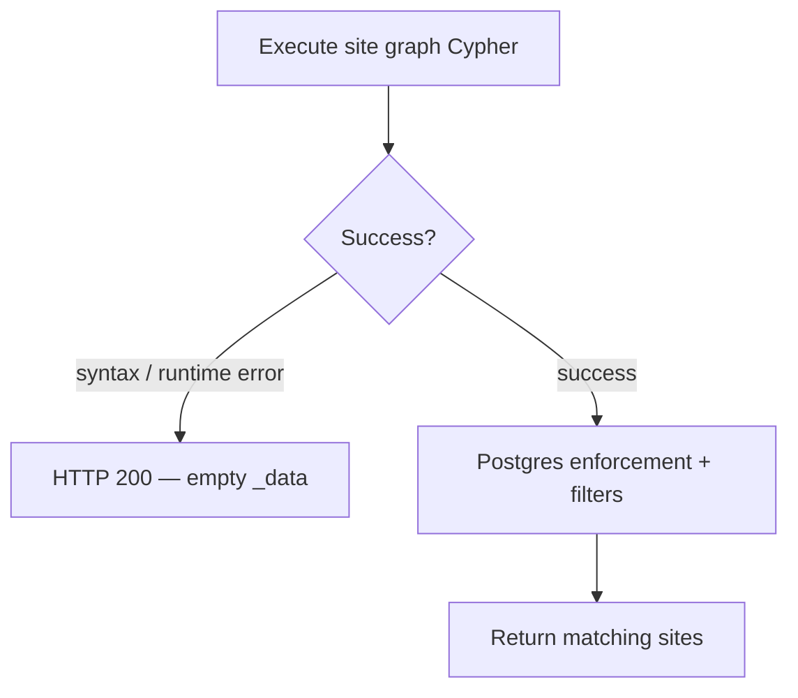
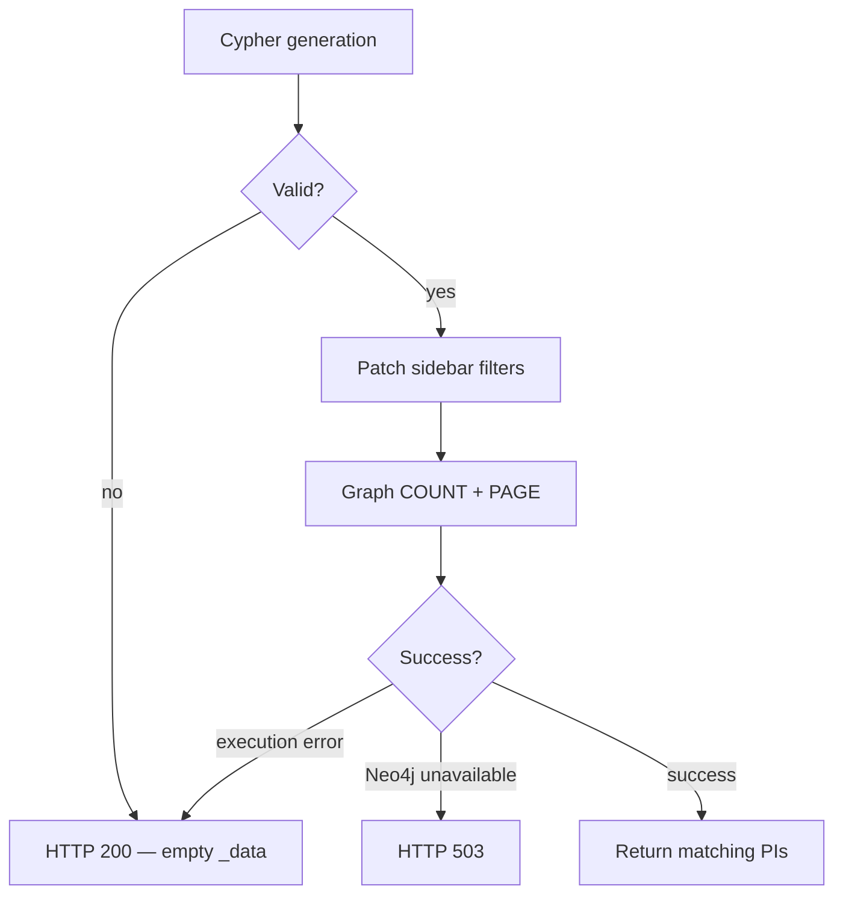

# Limitations, Edge Cases & Fallbacks

Known constraints and defensive behaviors for **site** and **PI** natural language search.

← [Back to Natural Search](./README.md)

---

## Shared limitations

| Limitation | Detail |
|------------|--------|
| **No semantic ranking** | Both flows order by graph UUID — not relevance or match quality. |
| **Fixed page size** | Description search returns **10** items per page (not configurable via query params). |
| **OpenAI dependency** | Cypher generation requires OpenAI (`gpt-4o-mini`). First request per novel text waits for generation. |
| **8-hour prompt cache** | Identical normalized descriptions reuse cached Cypher. Prompt version bumps invalidate site cache entries. |
| **Fail-soft listing** | Most graph/Cypher failures return HTTP **200** with empty `_data` so the UI can show an empty state. |
| **English-oriented parsing** | Site search expands common geography shortcodes (USA, UK, UAE). Other languages rely on lookup name matching or OpenAI interpretation. |

---

## Site search

### Product limits

| Limitation | Detail |
|------------|--------|
| **Strict AND logic** | Merge listing always uses strict AND — all resolved dimensions must match. |
| **Capacity not in graph** | Capacity filters run in Postgres only. |
| **Postgres-only fast path** | Queries that resolve only to active-study or capacity filters may skip dimensional graph matching. |

### Query edge cases

**Typos** — Common patterns are tolerated:

| Input | Interpretation |
|-------|----------------|
| *count must be **than** 2* | Active recruiting count > 2 |
| *active studies **cout** must be than 2* | Same |

**Phase vs numbers** — Bare numbers in *"greater than 2"* are not mapped to Phase 2 unless *phase* or `p1`–`p4` appears.

**Geography** — Python expands `USA` / `US` / `UK` / `UAE` before lookup matching. Other abbreviations depend on substring match against country names.

**Specialization sidebar** — Selecting a sidebar therapeutic area clears MeSH enforcement to avoid over-constraining when TA is explicitly changed.

**Empty description** — Without `?description=`, the standard Postgres site list is used (not natural search).

### Fallback behavior

- **No criteria** — Empty description with no searchable input returns empty results without calling OpenAI.
- **Unresolved text** — Arbitrary prose is sent to OpenAI via the merge prompt; no deterministic fallback.
- **Enforcement guard** — Postgres re-applies geography / TA / phase / mesh even when generated Cypher omits clauses.

---

## PI search

### Product limits

| Limitation | Detail |
|------------|--------|
| **Cache key excludes sidebar** | Same description with different sidebar filters reuses base Cypher; filters are patched per request. |
| **PI UUID format** | Neo4j stores PI UUIDs as 32-char hex without dashes; API normalizes to dashed Postgres format. |
| **Schema-bound** | OpenAI only uses labels/relationships in `PI_NEO4J_SCHEMA`; schema changes require prompt updates. |
| **Publication / experience properties** | Sidebar uses `years_active` and `total_trials` on the PI node — closest available graph properties. |

### Query edge cases

**Validation retry** — Invalid Cypher from OpenAI triggers one self-correction attempt before failing.

**Stale cache eviction** — Cached Cypher that fails validation (e.g. wrong alias `p` instead of `pi`) is deleted and regenerated.

**Patch safety** — If `patch_pi_cypher_with_filters` cannot parse the Cypher tail, the original query is returned unchanged (natural-search text remains the safety net).

**Sidebar TA override** — `specialization` fully replaces therapeutic-area constraints from the description-side Cypher.

### Fallback behavior

---

## Provider notes

| Provider | Site | PI |
|----------|------|-----|
| **Neo4j** (default) | Direct Cypher via `GRAPH_DB_PROVIDER` | Direct Cypher via `get_graph_db_provider()` |
| **Spanner** | Cypher translated to GQL/SQL | Dedicated `run_pi_*_cypher_on_spanner` helpers |

Misconfigured provider env vars surface as empty listings (fail-soft) or, for PI Neo4j driver failure, **503**.

---

## Performance

- **PromptCache** — Reduces repeat OpenAI calls for identical descriptions (8-hour TTL).
- **Two graph round-trips** — Count + page query per request.
- **Debug logging** — `[Site-Search]` and `[PI-Search]` prefixes print Cypher to stdout in development.

---

## Testing reference

Site merge tests: `sites/tests.py` → `SiteListingMergeTests` (geography tokens, active study parsing, combined enforcement).

← [Back to Natural Search](./README.md)
