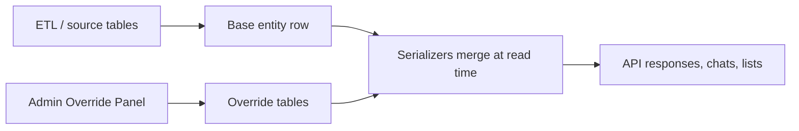
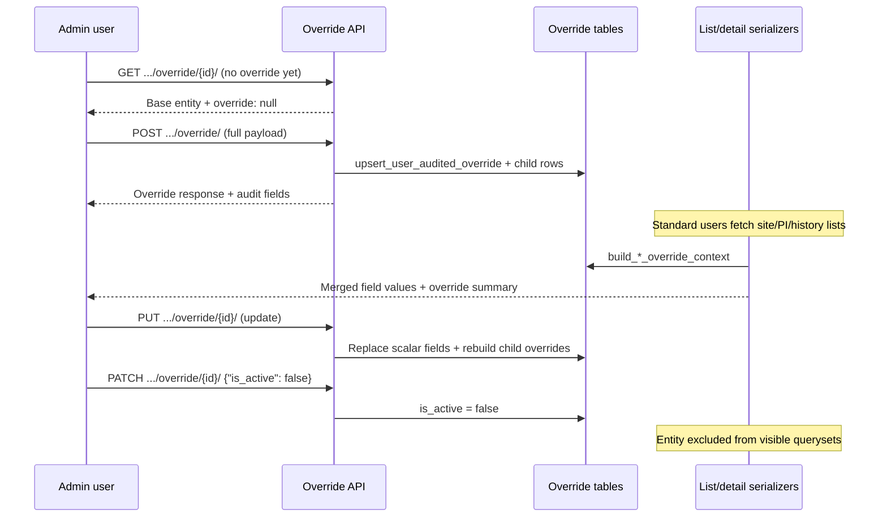

# Override Panel

The Override Panel lets **admin users** correct or enrich master data for **sites**, **principal investigators (PIs)**, and **study history** records without modifying ETL-fed source tables. Overrides are stored in separate Postgres tables and merged at **read time** through serializers.

Code entry points:

| Entity | API | Code |
|--------|-----|------|
| Site | `sites/views.py` → `SiteOverrideViewSet` | `sites/serializers.py`, `sites/models.py` |
| PI | `principal_investigators/views.py` → `PIOverrideViewSet` | `principal_investigators/serializers.py` |
| Study history | `studies/views.py` → `StudyHistoryOverrideViewSet` | `studies/serializers.py` |

---

## Design principles

| Principle | Detail |
|-----------|--------|
| **Same primary key** | Override row `id` equals the base entity UUID (site, PI, or study history). |
| **Presentation layer** | Active overrides replace selected fields in API responses — base `Site` / `PI` / `StudyHistory` rows are unchanged. |
| **Admin-only writes** | Create, update, and deactivate require `IsAuthenticated` + `IsAdminRole`. |
| **Soft deactivation** | `PATCH` with `{"is_active": false}` hides the entity from standard listings and returns **404** on detail. |
| **Audit trail** | Every override stores `created_by`, `updated_by`, `created_at`, `updated_at`. |



---

## Override workflow



### Operations

| Action | Method | When |
|--------|--------|------|
| **Create** | `POST` | First override for an entity |
| **Read override** | `GET` | Fetch current override payload (or base entity if none) |
| **Update** | `PUT` | Change override fields (full replace of child collections) |
| **Deactivate** | `PATCH` | Set `is_active: false` — only field allowed on PATCH |

Create and update use **transactional** saves: child override rows (phases, capabilities, publications, etc.) are deleted and recreated on each write.

---

## Permission and access

| Operation | Requirement |
|-----------|-------------|
| Override create / update / deactivate | Authenticated + **`admin`** role (`UserProfile.role`) |
| Read merged data in lists/detail | Any user with normal entity access |
| Override panel GET/POST/PUT/PATCH | **403** if role is not admin |

Permission class: `csi/permissions.py` → `IsAdminRole`.

Regular **`user`** role can consume overridden values in API responses but cannot modify overrides.

---

## Configuration options by entity

### Site override

**Endpoint base:** `/api/v1/sites/{site_id}/override/`

| Field | Type | Description |
|-------|------|-------------|
| `name` | string | Display name |
| `description` | text | Site description |
| `location` | string | Location label |
| `institution_type` | UUID | `SiteType` reference (stored as type name on override row) |
| `capacity` | integer | Site capacity (≥ 0) |
| `site_phases` | UUID[] | Operating phases → `SitePhaseOverride` |
| `specializations` | UUID[] | Therapeutic areas → `SiteTherapeuticAreaOverride` |
| `capabilities` | UUID[] | Equipment/capabilities → `SiteCapabilityOverride` (status copied from base `SiteCapability` when present) |
| `principal_investigators` | UUID[] | Linked PIs → `SitePIOverride` |

Map coordinates (`map_lang`, `map_lat`) are copied from the base site on save — not independently configurable via the override API.

### PI override

**Endpoint base:** `/api/v1/principal_investigators/{pi_id}/override/`

| Field | Type | Description |
|-------|------|-------------|
| `name` | string | PI display name |
| `orcid` | string | ORCID identifier |
| `openalex_author_id` | string | OpenAlex author ID (optional) |
| `email` | string | Contact email |
| `phone` | string | Contact phone |
| `recent_working` | string | Location / recent affiliation (stored as `location`) |
| `years_of_exp` | integer | Years of experience (≥ 0) |
| `availability` | string | Availability text |
| `status` | string | Status label |
| `rating` | float | Rating (rounded to integer on save) |
| `publications` | UUID[] | Article IDs → `PIArticleOverride` |
| `specializations` | UUID[] | Therapeutic areas → `PITherapeuticAreaOverride` |

### Study history override

**Endpoint base:** `/api/v1/studies/history/{study_history_id}/override/`

| Field | Type | Description |
|-------|------|-------------|
| `title` | string | Trial title |
| `primary_endpoint` | text | Primary endpoint (optional) |
| `mesh_terms` | UUID[] | Conditions → `StudyHistoryConditionOverride` |
| `phases` | UUID[] | Phases → `StudyHistoryPhaseOverride` |
| `sites` | UUID[] | Participating sites → `StudyHistorySiteOverride` |
| `principal_investigators` | UUID[] | PIs → `StudyHistoryPiOverride` |
| `sponsors` | UUID[] | Sponsors → `StudyHistorySponsorOverride` |

Alias: request body may use `specializations` instead of `mesh_terms` (validated in serializer).

---

## Impact on calculations and outputs

Overrides affect **API presentation and filtering**, not ETL source tables or graph databases.

### What overrides change

| Surface | Behavior |
|---------|----------|
| **Site list / detail** | Name, location, capacity, institution type, phases, specializations, capabilities, PI list when active override exists |
| **PI list / detail** | Name, experience, publications count/list, specializations, contact fields, rating, availability |
| **Study history list / detail** | Title, endpoint, mesh, phases, sites, PIs, sponsors |
| **Site AI chat** | `SiteOverviewSerializer` uses override context — chat answers reflect overridden fields |
| **List filter `?has_override=true`** | Sites / PIs with active overrides (site and PI list endpoints) |
| **Override summary on cards** | `override: { override_count, created_at, updated_at }` on list serializers |

### What overrides do **not** change (current behavior)

| Surface | Behavior |
|---------|----------|
| **Breakdown numeric scoring** | Generators read base `Site` / `PI` model fields — override values are **not** applied to A1–D2 formulas |
| **Graph / Neo4j / Spanner** | ETL-synced graph nodes unchanged |
| **PI AI scoring input (C1)** | Breakdown C1 uses base `PI` fields and publications from ORM, not override tables |
| **Natural search / AI suggestions** | Graph matching uses ETL graph data, not override presentation layer |
| **Postgres `SiteCapability` base rows** | Override capabilities are separate rows; capability match overlay uses base `SiteCapability` |

Admins should treat overrides as **UI and API truth** for human-facing workflows; automated scoring may still reflect source data until generators are extended to read overrides.

### Deactivation impact

When `is_active = false`:

- Entity **hidden** from standard querysets (`exclude_deactivated_*_overrides`).
- Detail endpoints return **404** (*Site not found* / *PI not found* / *Study history not found*).
- Override row retained in database for audit; can be re-activated only by creating/updating override with `is_active: true` via PUT (not PATCH).

---

## Audit and tracking

Each override header row stores:

| Field | Description |
|-------|-------------|
| `created_at` | First override creation timestamp |
| `created_by` | Admin user who created the override |
| `updated_at` | Last modification timestamp |
| `updated_by` | Admin user who last modified |

`upsert_user_audited_override()` sets `created_by` on first insert and always updates `updated_by` on save.

### Response audit fields

Override GET/POST/PUT responses include `created_by` and `updated_by` as display usernames (`audit_username()` — full name or username).

List serializers expose a compact summary:

```json
"override": {
  "override_count": 5,
  "created_at": "2025-06-01T10:00:00Z",
  "updated_at": "2025-06-08T14:30:00Z"
}
```

`override_count` includes scalar override plus related child override rows (phases, capabilities, publications, etc.).

**No separate audit log table** — history is limited to `created_*` / `updated_*` on the override row. Study workspace logs (`StudyLogs`) are not written for override changes.

---

## API reference

### Site

```http
POST   /api/v1/sites/{site_id}/override/
GET    /api/v1/sites/{site_id}/override/{site_id}/
PUT    /api/v1/sites/{site_id}/override/{site_id}/
PATCH  /api/v1/sites/{site_id}/override/{site_id}/
```

**Create example:**

```http
POST /api/v1/sites/a1b2c3d4-e5f6-7890-abcd-ef1234567890/override/
Authorization: Bearer <admin-token>
Content-Type: application/json

{
  "id": "a1b2c3d4-e5f6-7890-abcd-ef1234567890",
  "name": "Memorial Research Center (Updated)",
  "description": "Academic oncology center with expanded capacity.",
  "location": "Boston, MA",
  "institution_type": "uuid-of-site-type",
  "capacity": 150,
  "site_phases": ["phase-uuid-1", "phase-uuid-2"],
  "specializations": ["ta-oncology-uuid"],
  "capabilities": ["mri-scanner-uuid"],
  "principal_investigators": ["pi-uuid-1"]
}
```

**Response (abbreviated):**

```json
{
  "data": {
    "id": "a1b2c3d4-e5f6-7890-abcd-ef1234567890",
    "name": "Memorial Research Center (Updated)",
    "capacity": 150,
    "site_phases": [{ "id": "...", "name": "Phase 3" }],
    "specializations": [{ "id": "...", "name": "Oncology" }],
    "is_active": true,
    "created_at": "2025-06-09T12:00:00Z",
    "created_by": "Admin User",
    "updated_at": "2025-06-09T12:00:00Z",
    "updated_by": "Admin User"
  },
  "code": 200,
  "message": "Site override created successfully"
}
```

**Deactivate:**

```http
PATCH /api/v1/sites/{site_id}/override/{site_id}/
Content-Type: application/json

{ "is_active": false }
```

If no override existed, PATCH bootstraps one from current base site values, then deactivates.

---

### Principal investigator

```http
POST   /api/v1/principal_investigators/{pi_id}/override/
GET    /api/v1/principal_investigators/{pi_id}/override/{pi_id}/
PUT    /api/v1/principal_investigators/{pi_id}/override/{pi_id}/
PATCH  /api/v1/principal_investigators/{pi_id}/override/{pi_id}/
```

**Create example:**

```json
{
  "id": "b2c3d4e5-f6a7-8901-bcde-f12345678901",
  "name": "Dr. Jane Smith",
  "orcid": "0000-0002-1234-5678",
  "email": "j.smith@hospital.org",
  "phone": "+1-555-0100",
  "recent_working": "Boston, MA",
  "years_of_exp": 18,
  "availability": "Available Q3 2025",
  "status": "active",
  "rating": 4.5,
  "publications": ["article-uuid-1", "article-uuid-2"],
  "specializations": ["ta-cardiology-uuid"]
}
```

---

### Study history

```http
POST   /api/v1/studies/history/{study_history_id}/override/
GET    /api/v1/studies/history/{study_history_id}/override/{study_history_id}/
PUT    /api/v1/studies/history/{study_history_id}/override/{study_history_id}/
PATCH  /api/v1/studies/history/{study_history_id}/override/{study_history_id}/
```

**Create example:**

```json
{
  "id": "c3d4e5f6-a7b8-9012-cdef-123456789012",
  "title": "Phase III NSCLC Immunotherapy Trial",
  "primary_endpoint": "Overall survival at 24 months",
  "mesh_terms": ["condition-uuid-nsclc"],
  "phases": ["phase-3-uuid"],
  "sites": ["site-uuid-1"],
  "principal_investigators": ["pi-uuid-1"],
  "sponsors": ["sponsor-uuid-1"]
}
```

---

## Error responses

| Condition | HTTP | Message |
|-----------|------|---------|
| Body `id` ≠ URL entity id | 400 | Body id must match site/PI/history id |
| Override id ≠ entity id on GET/PUT/PATCH | 400 | Override id must match … id |
| Entity not found | 404 | Site / PI / study history not found |
| Override not found on PUT | 404 | … override not found |
| Non-admin user | 403 | Only admin role can perform this action |
| PATCH body not exactly `{"is_active": false}` | 400 | Validation error |
| Invalid FK UUID (institution type, phase, etc.) | 400 | Field validation errors |

---

## Further reading

- [Limitations & edge cases](./limitations.md)

← [Back to Documentation](../README.md)
