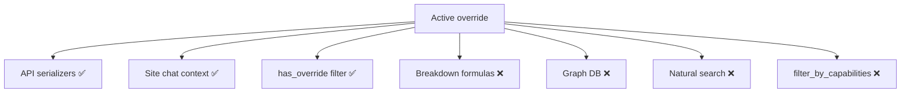

# Override Panel — Limitations

Known constraints, edge cases, and operational considerations for the Override Panel.

← [Back to Override Panel](./README.md)

---

## Product limitations

| Limitation | Detail |
|------------|--------|
| **Admin-only writes** | Only users with `admin` profile role can create, update, or deactivate overrides. |
| **No source table mutation** | Base ETL rows (`Site`, `PI`, `StudyHistory`) are never updated by override APIs. |
| **Breakdown scoring gap** | Weighted breakdown (A1–D2) and PI AI scoring (C1) use **base ORM data**, not override values. |
| **Graph data unchanged** | Neo4j/Spanner nodes are not updated when overrides are saved. |
| **PATCH is deactivate-only** | Partial field updates are not supported via PATCH — use PUT for field changes. |
| **Full child replace** | Each PUT/POST deletes and recreates all child override rows (phases, publications, etc.). |
| **No version history** | Only latest `created_*` / `updated_*` — no diff or rollback API. |
| **No study override** | Workspace `Study` records (protocol being built) are not overridable — only **study history** (trial archive). |

---

## Deactivation behavior

| Aspect | Detail |
|--------|--------|
| **Visibility** | `is_active: false` excludes entity from list querysets and detail (404). |
| **Data retention** | Override row and child rows remain in Postgres. |
| **Re-activation** | Requires PUT with full payload and `is_active: true` (implicit default on create/update). |
| **Bootstrap on PATCH** | Deactivating a never-overridden entity creates a minimal override from base values first, then sets inactive. |
| **Cross-entity refs** | Deactivated sites/PIs filtered from study history override PI/site lists via `site_is_visible` / `pi_is_visible`. |

---

## Configuration edge cases

### Site

- **`institution_type`** — API accepts UUID; stored as resolved type **name** string on `SiteOverride`.
- **Map coordinates** — Always copied from base site; cannot be overridden via API.
- **Capabilities** — Override `status` copied from existing `SiteCapability` or empty string if none.
- **PI links** — `is_primary_facility` preserved from base `SitePI` when present.

### PI

- **`rating`** — Float input rounded to integer on save.
- **`openalex_author_id`** — Falls back to base PI value when omitted on create.
- **Publications** — Must reference existing `Article` UUIDs; invalid IDs skipped silently.

### Study history

- **`mesh_terms` vs `specializations`** — Either key accepted in validation for condition IDs.
- **Invalid FK IDs** — Phases, sites, PIs, sponsors that do not exist are skipped (not error).
- **Sponsors** — Optional on create; empty list clears sponsor overrides.

---

## Impact gaps (calculations & integrations)

| Integration | Override applied? |
|-------------|-------------------|
| Site/PI/history API responses | Yes |
| Site AI chat context | Yes |
| PI list sidebar filters (experience, publications) | Partial — uses override values when PI has active override |
| Breakdown match score | No — uses base models |
| AI suggested sites count | No — graph match on ETL data |
| Capability overlay after graph match | No — uses base `SiteCapability` |

Teams validating feasibility should re-run breakdown after source data corrections, or accept that override corrections may not yet flow into numeric scores.

---

## Audit limitations

| Gap | Detail |
|-----|--------|
| **No field-level audit** | Cannot see which individual fields changed between updates. |
| **No StudyLogs entry** | Override changes are not written to study activity logs. |
| **Child row replacement** | Related overrides are deleted/recreated — no history of prior phase/publication sets. |
| **Username only** | Audit exposes display name/username, not user ID in all list summaries. |

---

## Permission edge cases

- Missing `UserProfile` → admin check fails → **403**.
- Authenticated non-admin attempting override write → **403** with *Only admin role can perform this action*.
- Deactivated entity detail returns **404** to all users including admins (by design for hidden records).

---

## API edge cases

| Scenario | Result |
|----------|--------|
| GET override when none exists | Returns base entity serializer output with `"override": null` |
| GET override when deactivated | **404** |
| POST with duplicate create | Upserts — updates existing override if same PK |
| URL/body ID mismatch | **400** |
| Empty child arrays on PUT | Clears all child overrides for that dimension |

---

## Operational recommendations

1. **Document why** an override was applied outside the system (internal process) — the API stores only who/when.
2. **Prefer ETL fixes** when graph matching and breakdown must align with corrected data long-term.
3. **Test list/detail** after override to confirm serializer merge behaves as expected.
4. **Use deactivate** rather than delete — there is no DELETE endpoint; deactivation is the retirement path.

← [Back to Override Panel](./README.md)
