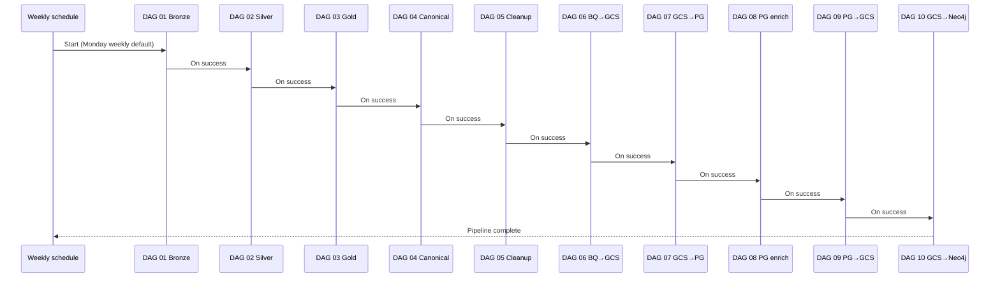

# Sites Intelligence Pipeline — Documentation

Welcome. This documentation explains **what the pipeline does**, **how data moves through it**, and **what to expect** when reviewing outputs or planning releases.

It is written for **clients, product owners, and stakeholders** — not as a developer manual. For deployment and code-level detail, see [`airflow_dags/README.md`](../airflow_dags/README.md).

---

## Quick navigation

### Start here

| | Document |
|---|----------|
| 🗺️ | [**Pipeline overview**](pipeline-overview.md) — the full journey from raw data to the knowledge graph |
| 🗄️ | [**Data layers**](data-layers.md) — bronze, silver, gold, canonical, and cleaned datasets in BigQuery |
| 📋 | [**Pipeline notes**](pipeline-notes.md) — dependencies, coverage, and remaining gaps |

### Pipeline steps (DAGs 01–10)

| DAG | Name | Summary |
|-----|------|---------|
| [01](dags/01-bronze-layer.md) | Bronze layer | Load raw clinical trials and OpenAlex data |
| [02](dags/02-silver-layer.md) | Silver layer | Clean and combine into analytics-ready tables |
| [03](dags/03-gold-layer.md) | Gold layer | Enriched investigator and publication data |
| [04](dags/04-canonical-tables.md) | Canonical tables | Unified site-intelligence model in `scl_staging` |
| [05](dags/05-facility-cleanup.md) | Facility cleanup | Score and improve facility names (AI-assisted) |
| [06](dags/06-bigquery-to-gcs.md) | BigQuery → GCS | Export tables as CSV files |
| [07](dags/07-gcs-to-postgres.md) | GCS → PostgreSQL | Load data into the application database |
| [08](dags/08-postgres-enrichment.md) | Postgres enrichment | OpenRouter populate + SQL link updates |
| [09](dags/09-postgres-to-gcs.md) | PostgreSQL → GCS | Prepare graph inputs |
| [10](dags/10-gcs-to-neo4j.md) | GCS → Neo4j | Build the knowledge graph |

[→ Full DAG index with diagrams](dags/README.md)

---

## How the pipeline is triggered

You can also trigger **DAG 01** manually from the Airflow UI for an ad-hoc run.

---

## BigQuery datasets (cheat sheet)

| Dataset | Layer | Used by |
|---------|-------|---------|
| `clinical_trials_bronze` | Bronze | DAG 01 |
| `clinical_trials_silver` | Silver | DAG 02 |
| `clinical_trials_gold` | Gold | DAG 03 |
| `open_alex_bronze` / `open_alex_silver` | Bronze / Silver | DAG 01–02 |
| `scl_staging` | Canonical | DAG 04+ |
| `scl_staging_cleaned` | Enriched facilities | DAG 05+ |

Details: [Data layers](data-layers.md)

---

## Related links

- [Project README (repository root)](../README.md)
- [Pipeline notes](pipeline-notes.md)
- [Operator / developer guide](../airflow_dags/README.md)
- [Ubuntu VPS runbook](UBUNTU_VPS_RUNBOOK.md) — deploy Airflow on Linux
