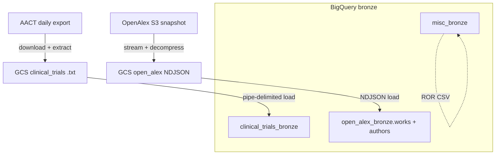

# DAG 01 — Bronze layer

[← DAG index](README.md) · [Documentation home](../README.md)

| | |
|---|---|
| **Airflow ID** | `dag_01_bronze_layer` |
| **Schedule** | Weekly (pipeline entry point) |
| **Next step** | [DAG 02 — Silver](02-silver-layer.md) |
| **Primary output** | `clinical_trials_bronze`, `open_alex_bronze`, `misc_bronze` |

---

## Safe testing (backup dataset)

```bash
BQ_LAYER_TEST_DATASET=scl_staging_backup
```

AACT loads, OpenAlex bronze, misc stub, and silver reads all use the backup dataset when set.

---

## Purpose

Load **raw** clinical trial and publication data into BigQuery. Bronze tables stay close to source files so later steps can clean and combine them without re-downloading from external systems every time.

---

## What it does



### Task flow

| Task | What it does |
|------|----------------|
| `ensure_output_datasets` | Create bronze datasets if missing |
| `stage_aact_to_gcs` | Download AACT zip, upload 7 `.txt` files to GCS |
| `bronze_ct_*_raw` (×7) | Load GCS `.txt` → `clinical_trials_bronze` |
| `stage_openalex_to_gcs` | Stream OpenAlex **works** from S3, decompress to GCS |
| `bronze_oa_works` | Load GCS NDJSON → `open_alex_bronze.works` |
| `stage_openalex_authors_to_gcs` | Stream OpenAlex **authors** from S3, decompress to GCS |
| `bronze_oa_authors` | Load GCS NDJSON → `open_alex_bronze.authors` (h_index / i10_index for DAG 02) |
| `stage_ror_to_gcs` | Download ROR zip from Zenodo, normalize CSV, upload to GCS |
| `bronze_misc_research_organization_registry` | Load normalized CSV → `misc_bronze.research_organization_registry` |

AACT, OpenAlex, and ROR staging run **in parallel** after datasets are ensured.

---

### Clinical trials (AACT)

| Table | Source file |
|-------|-------------|
| `studies_raw` | `studies.txt` |
| `browse_conditions_raw` | `browse_conditions.txt` |
| `facilities_raw` | `facilities.txt` |
| `facility_investigators_raw` | `facility_investigators.txt` |
| `sponsors_raw` | `sponsors.txt` |
| `conditions_raw` | `conditions.txt` |
| `interventions_raw` | `interventions.txt` |

**GCS path:** `gs://{GCS_BUCKET}/clinical_trials/processed/aact/{YYYYMMDD}/`

### OpenAlex authors

| Table | Source |
|-------|--------|
| `authors` | Latest `s3://openalex/data/authors/updated_date=*/` snapshot |

Used by DAG 02 `pi_master` phase 3 for `summary_stats.h_index` and `summary_stats.i10_index` (joined on matched `openalex_id`).

### OpenAlex works

| Table | Source |
|-------|--------|
| `works` | Latest `s3://openalex/data/works/updated_date=*/` snapshot |

**GCS paths:**
- Landing: `open_alex/landing/works/{date}/*.gz`
- Processed: `open_alex/processed/works/{date}/*` (NDJSON for BigQuery)

**Size:** ~230–250 GB compressed for the full works entity. DAG task timeouts are set to 12h (staging) and 6h (BigQuery load). Re-runs skip files already in GCS with matching size.

### Misc reference data

| Table | Source |
|-------|--------|
| `research_organization_registry` | Latest [ROR Zenodo](https://zenodo.org/communities/ror-data) CSV (normalized on staging) |

**GCS path:** `gs://{GCS_BUCKET}/misc_bronze/processed/ror/{version}/research_organization_registry.csv`

---

## Configuration

| Variable | Default | Purpose |
|----------|---------|---------|
| `AACT_BASE_URL` | `https://aact.ctti-clinicaltrials.org` | Official daily `*_export_ctgov.zip` |
| `AACT_DIRECT_URL` | — | Optional override (must be flat-file export, not PG dump) |
| `AACT_GCS_PREFIX` | `clinical_trials/processed/aact` | Processed AACT `.txt` path |
| `OPENALEX_S3_BUCKET` | `openalex` | Public OpenAlex bucket |
| `OPENALEX_GCS_PROCESSED_PREFIX` | `open_alex/processed` | NDJSON path for BQ load |
| `OPENALEX_UPDATED_DATE` | latest in S3 | Pin a specific snapshot date |
| `ROR_ZENODO_API_URL` | Zenodo ROR community API | Latest ROR dump metadata |
| `ROR_GCS_PREFIX` | `misc_bronze/processed/ror` | Normalized ROR CSV path |
| `BQ_LAYER_TEST_DATASET` | — | Route all bronze writes to backup dataset |

**DAG params (optional):** `skip_aact_download`, `skip_ror_download`, `force_openalex_reupload`, `aact_data_version`, `openalex_updated_date`, `ror_version`

---

## Notes

| Topic | Impact |
|-------|--------|
| OpenAlex size / runtime | First works + authors ingest may take many hours |
| ROR registry | Requires network access to Zenodo API + GCS write |
| Gold OpenAlex downstream | DAG 03 builds investigator tables from bronze/silver OpenAlex — empty bronze means empty gold |
| Worker disk | OpenAlex staging buffers each part file locally during decompress |

See also: [Pipeline notes](../pipeline-notes.md)

---

## Related

- [Data layers — Bronze](../data-layers.md#bronze-layer)  
- [DAG 02 — Silver](02-silver-layer.md)  
