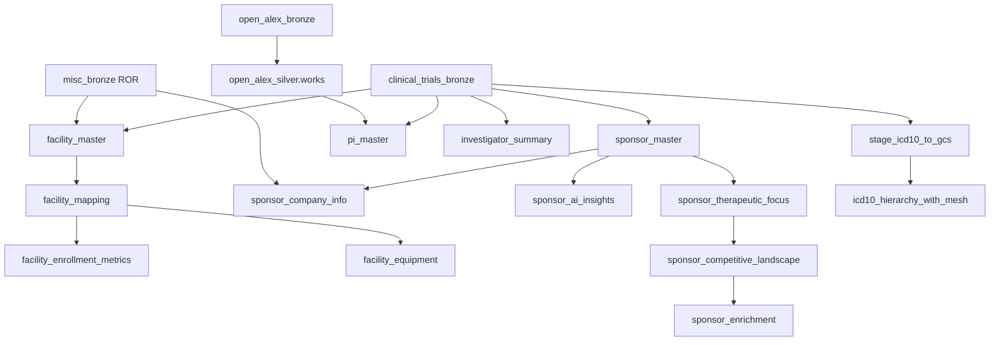
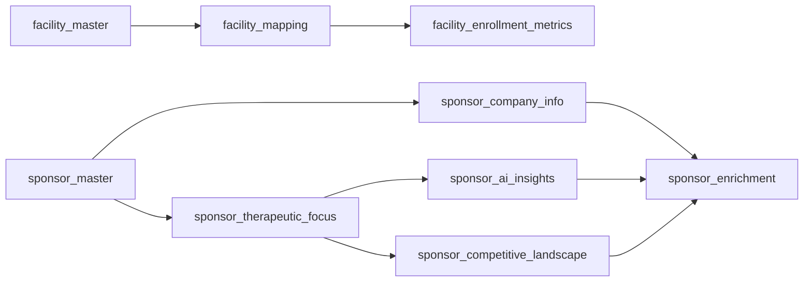

# DAG 02 — Silver layer

[← DAG index](README.md) · [Documentation home](../README.md)

| | |
|---|---|
| **Airflow ID** | `dag_02_silver_layer` |
| **Schedule** | Triggered after DAG 01 succeeds |
| **Previous** | [DAG 01 — Bronze](01-bronze-layer.md) |
| **Next** | [DAG 03 — Gold](03-gold-layer.md) |
| **Primary output** | `clinical_trials_silver` by default — or **`scl_staging_backup`** when testing (see below) |

---

## Safe testing (backup dataset)

Use the same setting as DAG 01 (recommended — keeps bronze reads and silver writes aligned):

```bash
BQ_LAYER_TEST_DATASET=scl_staging_backup
```

Or silver only: `BQ_SILVER_DATASET=scl_staging_backup` (bronze inputs stay in production unless you also set `BQ_BRONZE_CT_DATASET`, etc.).

DAG 04 canonical build still reads production silver unless you change that separately.

---

## Purpose

Transform bronze data into **cleaned, joined, analytics-ready** tables: master facilities, mappings, enrollment metrics, sponsor masters, PI masters, institution classifications, and more.

---

## What it does



### Main silver tables (clinical trials)

| Table | Business meaning |
|-------|------------------|
| `facility_master` | Deduplicated site list (~80k masters from millions of raw rows) |
| `facility_mapping` | Maps every raw facility row to a master ID |
| `facility_enrollment_metrics` | Enrollment rate signals per site |
| `facility_equipment` | Equipment detected per site |
| `facility_institution_classification` | Hospital vs academic vs other |
| `institution_type_performance` | Performance scores by institution type and phase |
| `investigator_summary` | Trial counts and phase mix per investigator name |
| `pi_master` | Clustered principal investigator identities with OpenAlex phase 3 |
| `sponsor_master` | Deduplicated sponsors |
| `sponsor_therapeutic_focus` | Sponsor focus areas from trial conditions |
| `sponsor_competitive_landscape` | Competitor landscape structures |
| `sponsor_company_info` | ROR-based HQ location for INDUSTRY sponsors |
| `sponsor_ai_insights` | OpenRouter-generated sponsor profile JSON |
| `sponsor_enrichment` | Combined sponsor profile for UI |
| `icd10_hierarchy_with_mesh` | WHO ICD-10 tree joined to AACT MeSH (DAG 02 staging + load) |
| `therapeutic_area_mapping` | Reference therapeutic area list |
| `equipment_mapping` | Reference equipment categories |
| `country_regulatory_assessments` | Country regulatory reference text |
| `institution_type_assessments` | Institution type reference text |

### OpenAlex silver

| Table | Purpose |
|-------|---------|
| `open_alex_silver.works` | Deduplicated publication works (input to PI OpenAlex matching) |

### ICD-10 reference (WHO 2019)

| Task | Operator | Notes |
|------|----------|-------|
| `stage_icd10_to_gcs` | `ICD10StageToGCSOperator` | Download WHO meta zip, normalize hierarchy CSV |
| `silver_ct_icd10_hierarchy_with_mesh` | `BigQueryICD10HierarchyLoadOperator` | Load staging table + MeSH join; skips if table exists |

### Enrichment operators

| Task | Operator | Notes |
|------|----------|-------|
| `silver_ct_sponsor_ai_insights` (populate) | `BigQueryLayerEnrichmentOperator` | Calls OpenRouter; requires `OPENROUTER_API_KEY` |

Task wiring is defined in `plugins/layers/_registry.py` and built by `_dag_factory.py`.

---

## Task dependencies (simplified)

Facility and sponsor chains run in order — for example, `facility_mapping` waits for `facility_master`, and `sponsor_enrichment` waits for sponsor sub-tables including company info and AI insights.



---

## Notes

| Table / area | Note |
|--------------|------------|
| **`icd10_hierarchy_with_mesh`** | One-time WHO load — set `ICD10_SKIP_IF_EXISTS=false` to force reload; MeSH matches depend on AACT browse conditions |
| **`sponsor_company_info`** | ROR exact-name match only — website, size, founded year still NULL |
| **`sponsor_ai_insights`** | OpenRouter — incremental; INDUSTRY sponsors with enough trials; API key required |
| **`pi_master`** | OpenAlex name match; `h_index` / `i10_index` from `open_alex_bronze.authors` when `openalex_id` matches |
| **OpenAlex silver** | Only useful if bronze `works` has data |
| **ROR dependency** | Optional — `facility_master` runs with NULL ROR fields when registry is empty |
| **`sponsor_master` ROR fields** | NULL in silver; full sponsor ROR mapping deferred to gold |

See also: [Pipeline notes](../pipeline-notes.md)

---

## Related

- [Data layers — Silver](../data-layers.md#silver-layer)
- [DAG 03 — Gold](03-gold-layer.md)
