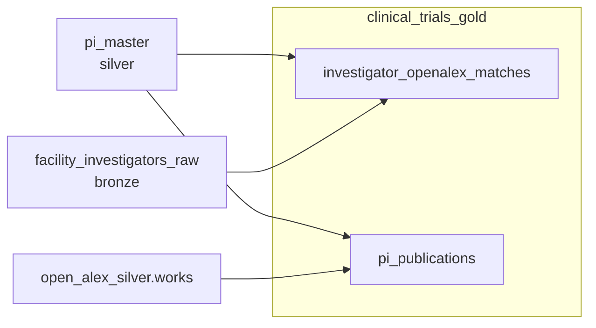

# DAG 03 — Gold layer

[← DAG index](README.md) · [Documentation home](../README.md)

| | |
|---|---|
| **Airflow ID** | `dag_03_gold_layer` |
| **Schedule** | Triggered after DAG 02 succeeds |
| **Previous** | [DAG 02 — Silver](02-silver-layer.md) |
| **Next** | [DAG 04 — Canonical](04-canonical-tables.md) |
| **Primary output** | `clinical_trials_gold` by default — or **`scl_staging_backup`** when testing |

---

## Safe testing (backup dataset)

Pair with DAG 01–02 backup mode:

```bash
BQ_LAYER_TEST_DATASET=scl_staging_backup
```

Or gold only: `BQ_GOLD_DATASET=scl_staging_backup`.

Gold tables are created alongside silver tables in the same backup dataset (no table name collisions).

---

## Purpose

Build **enriched** tables that connect trial investigators to the publication world — who publishes where, and which OpenAlex authors match which investigators.

---

## What it does



| Table | Content |
|-------|---------|
| `investigator_openalex_matches` | Trial investigator names linked to OpenAlex author IDs from `pi_master`, with confidence tier |
| `pi_publications` | Publication titles, venues, citations per PI from OpenAlex authorships |

Both tables are populated by **BigQuery SQL** in DAG 03 (`plugins/layers/gold/enrichment_sql.py`) — not by a separate OpenRouter matching step.

### Matching logic (high level)

- **`investigator_openalex_matches`** — joins `pi_master` rows with OpenAlex IDs to bronze principal investigators via staging links and normalized names; deduplicates by confidence.
- **`pi_publications`** — joins `pi_master` OpenAlex author IDs to flattened authorships in `open_alex_silver.works`.

---

## Limitations

| Limitation | Detail | Downstream effect |
|------------|--------|-------------------|
| **Depends on silver OpenAlex** | Needs `pi_master.openalex_id` from DAG 02 phase 3 | No matches or publications when OpenAlex bronze/silver is empty |
| **Name-based matching** | PI OpenAlex assignment is SQL name match, not LLM | False negatives for ambiguous or misspelled names |
| **No live OpenAlex API fetch** | Publications come from the bronze/silver snapshot | Stale relative to OpenAlex updates until next DAG 01 run |
| **Depends on silver summaries** | Uses `pi_master` and bronze investigators | Empty silver → empty gold |

See also: [Pipeline notes](../pipeline-notes.md)

---

## Related

- [Data layers — Gold](../data-layers.md#gold-layer)
- [DAG 04 — Canonical](04-canonical-tables.md)
