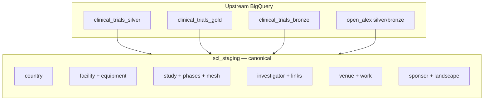
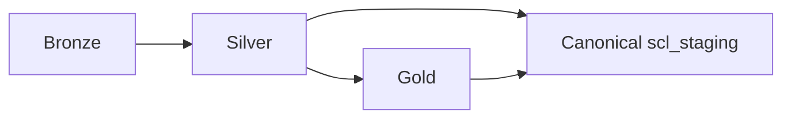

# DAG 04 — Canonical tables

[← DAG index](README.md) · [Documentation home](../README.md)

| | |
|---|---|
| **Airflow ID** | `dag_04_build_canonical_tables` |
| **Schedule** | Triggered after DAG 03 succeeds |
| **Previous** | [DAG 03 — Gold](03-gold-layer.md) |
| **Next** | [DAG 05 — Facility cleanup](05-facility-cleanup.md) |
| **Primary output** | **`scl_staging`** dataset in BigQuery |

---

## Purpose

Build the **unified site-intelligence data model** — one consistent set of tables that products, exports, and reports treat as the source of truth in BigQuery.

Think of `scl_staging` as the **canonical layer**: stable IDs, clear relationships, ready for CSV export and application load.

---

## What it does

---

## Main table groups

### Geography & sites

| Table | Description |
|-------|-------------|
| `country` | Countries with regulatory assessment text |
| `facility` | Canonical sites with geo, enrollment, institution type |
| `facility_equipment` | Equipment types |
| `facility_facility_equipment` | Which equipment at which site |

### Studies & conditions

| Table | Description |
|-------|-------------|
| `study` | Trials (NCT IDs, status, completion) |
| `study_phase` | Phase lookup (fixed list) |
| `study_statuses` | Status lookup from bronze |
| `study_study_phase` | Trial ↔ phase links |
| `facility_study` | Site ↔ trial links |
| `mesh_term` | MeSH condition terms |
| `mesh_study` | Trial ↔ MeSH links |
| `MeSH_hierarchy` | MeSH tree for navigation |
| `therapeutic_area` | Therapeutic area dimension |

### Investigators & publications

| Table | Description |
|-------|-------------|
| `investigator` | PI profiles with trial and citation stats |
| `investigator_study` | Investigator ↔ trial |
| `investigator_facility` | Investigator ↔ site |
| `investigator_work` | Investigator ↔ publication |
| `venue` | Publication venues |
| `work` | Publications |

### Sponsors

| Table | Description |
|-------|-------------|
| `sponsor` | Sponsor profiles |
| `sponsor_study` | Sponsor ↔ trial |
| `sponsor_competitive_landscape` | Competitor rows |
| `sponsor_event_category` | Event categories |
| `sponsor_events_and_activities` | Timeline events |
| `sponsor_highlights` | Highlight cards |

### Institution types

| Table | Description |
|-------|-------------|
| `institution_type` | Type definitions |
| `institution_type_performance` | Performance by phase |

---

## Data flow (high level)

Canonical does **not** re-copy all bronze — it reads the minimum upstream tables needed per entity (see silver/gold docs).

---

## Limitations

| Limitation | Effect on canonical output |
|------------|---------------------------|
| Sparse **MeSH label matches** | **`MeSH_hierarchy`** only includes rows where ICD-10 labels match AACT MeSH browse terms |
| Sparse **OpenAlex** upstream | **`investigator_study`**, **`work`**, **`investigator_work`** depend on gold + silver OpenAlex coverage |
| Partial **sponsor enrichment** | ROR-only company info and incremental OpenRouter AI — sponsor events/highlights sparse until enrichment runs |
| **`study_phase`** | Fixed enum in SQL — not every real-world phase variant from source |
| **`therapeutic_area`** | Built but not all export manifests include it |

See also: [Pipeline notes](../pipeline-notes.md)

---

## Related

- [Data layers — Canonical](../data-layers.md#canonical-layer-scl_staging)  
- [DAG 05 — Facility cleanup](05-facility-cleanup.md)  
