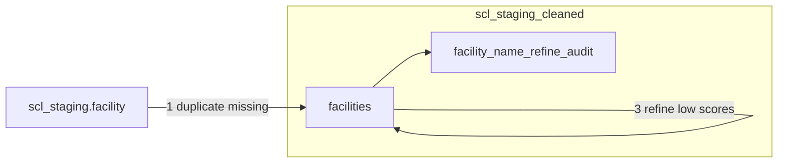

# DAG 05 — Facility cleanup

[← DAG index](README.md) · [Documentation home](../README.md)

| | |
|---|---|
| **Airflow ID** | `dag_05_scl_staging_cleanup` |
| **Schedule** | Triggered after DAG 04 succeeds |
| **Previous** | [DAG 04 — Canonical](04-canonical-tables.md) |
| **Next** | [DAG 06 — Export](06-bigquery-to-gcs.md) |
| **Primary output** | **`scl_staging_cleaned`** in BigQuery |

---

## Purpose

Improve **site name quality** before data is exported to applications. Sites with unclear, junk, or placeholder names get a confidence score and, when needed, a clearer suggested name.

---

## What it does

### Step 1 — Duplicate missing facilities

Copies site rows from canonical `facility` into `scl_staging_cleaned.facilities`:

- **First run:** full copy  
- **Later runs:** only sites **not yet** in the cleaned table (by ID)

### Step 2 — Score facility names

Adds **`name_confidence_score`** (0–100):

| Score | Meaning |
|-------|---------|
| 0 | Empty name or obvious junk (auto, no AI) |
| 1–99 | Ambiguous — AI-assigned |
| 100 | High confidence valid site name |

- Only names **without** an existing score are processed (incremental)  
- **“Research Site”** is skipped for AI scoring  

### Step 3 — Refine low-confidence names

For sites with score **≤ 60** and no refined name yet:

- Adds **`refined_name`** (suggested label)  
- Logs before/after in **`facility_name_refine_audit`**  
- May use map lookup + AI (OpenRouter)

---

## Requirements

| Requirement | Why |
|-------------|-----|
| **`OPENROUTER_API_KEY`** | Powers name scoring and refinement |
| DAG 04 complete | Source `scl_staging.facility` must exist |
| `scl_staging.country` | Used when refining (country context) |

---

## Limitations

| Limitation | Detail |
|------------|--------|
| **API cost & latency** | Large numbers of unique names mean many AI calls |
| **Incremental by default** | Won’t re-score or re-refine unless configuration changed |
| **AI quality** | Refinement quality depends on model and input coordinates |
| **Export dataset** | DAG 06 may still read `scl_staging.facility` depending on manifest — confirm which facility table products use |
| **Network** | OpenRouter and optional map services must be reachable from Airflow |

See also: [Pipeline notes](../pipeline-notes.md)

---

## Related

- [Data layers — Cleaned facilities](../data-layers.md#cleaned-facilities-scl_staging_cleaned)  
- [DAG 06 — Export](06-bigquery-to-gcs.md)  
