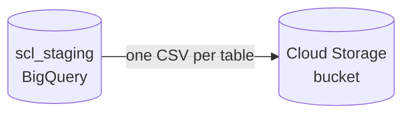

# DAG 06 — BigQuery to Cloud Storage

[← DAG index](README.md) · [Documentation home](../README.md)

| | |
|---|---|
| **Airflow ID** | `dag_06_gcs_generate_csvs` |
| **Schedule** | Triggered after DAG 05 succeeds |
| **Previous** | [DAG 05 — Facility cleanup](05-facility-cleanup.md) |
| **Next** | [DAG 07 — Postgres load](07-gcs-to-postgres.md) |
| **Primary output** | CSV files in **Google Cloud Storage** |

---

## Purpose

Export canonical BigQuery tables to **CSV files** so they can be loaded into PostgreSQL and other systems without direct BigQuery connectors in the app tier.

---

## What it does

### Exported entities (examples)

| Category | Tables exported |
|----------|-----------------|
| Geography & sites | `country`, `facility`, `facility_equipment`, … |
| Studies | `study`, `study_phase`, `mesh_term`, `facility_study`, … |
| Investigators | `investigator`, `investigator_study`, `investigator_facility`, … |
| Publications | `venue`, `work` (large — sharded files), `investigator_work` (sharded) |
| Sponsors | `sponsor`, `sponsor_study`, competitive landscape, events, highlights |
| Other | `institution_type`, `MeSH_hierarchy`, therapeutic area links |

Large tables (`work`, `investigator_work`) export as **multiple shard files** (`*.csv` with wildcards).

---

## Optional parameters

When triggering manually, operators can filter exports:

- Include / exclude specific tables  
- Override BigQuery project or dataset  
- Override GCS bucket  

---

## Limitations

| Limitation | Detail |
|------------|--------|
| **Fixed manifest** | Only listed tables export — not every BigQuery table in the project |
| **Shard handling** | Downstream load (DAG 07) must understand sharded prefixes |
| **Export time** | Large publication tables can take significant time and storage |
| **Facility source** | Export uses canonical `facility` from `scl_staging` — cleaned names in `scl_staging_cleaned` are separate unless manifest is updated |
| **Empty upstream tables** | Empty canonical tables still produce small or empty CSVs |

---

## Related

- [DAG 07 — GCS → PostgreSQL](07-gcs-to-postgres.md)  
- [Pipeline overview](../pipeline-overview.md)  
