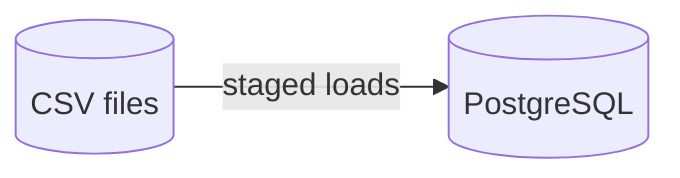
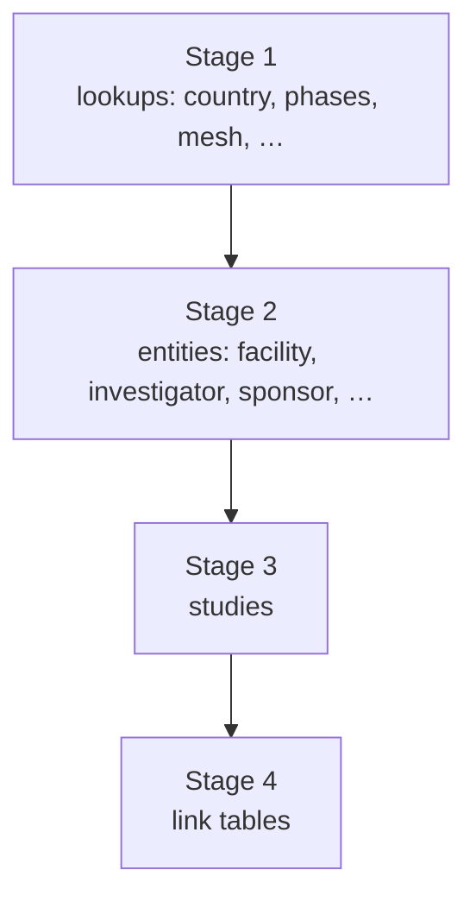

# DAG 07 — Cloud Storage to PostgreSQL

[← DAG index](README.md) · [Documentation home](../README.md)

| | |
|---|---|
| **Airflow ID** | `dag_07_gcs_to_postgres` |
| **Schedule** | Triggered after DAG 06 succeeds |
| **Previous** | [DAG 06 — Export](06-bigquery-to-gcs.md) |
| **Next** | [DAG 08 — Enrichment](08-postgres-enrichment.md) |
| **Primary output** | **PostgreSQL** application database |

---

## Purpose

Load exported CSV files into the **operational PostgreSQL database** used by the Sites Intelligence application — sites, studies, investigators, sponsors, and link tables.

---

## What it does

Loads run in **stages** to respect foreign-key order — for example, countries and lookup tables before facilities and studies, then relationship tables.

### Load stages (conceptual)

---

## Requirements

| Requirement | Detail |
|-------------|--------|
| **Postgres connection** | `DB_HOST`, `DB_USER`, `DB_PASSWORD`, `DB_NAME` in environment |
| **DAG 06 complete** | CSVs must exist in the bucket |
| **Schema compatibility** | Postgres tables must match loader expectations |

---

## Limitations

| Limitation | Detail |
|------------|--------|
| **Upsert semantics** | Loads update existing rows per entity loader — not always full table replace |
| **Sharded files** | `work` and `investigator_work` need all shard parts present |
| **Load duration** | Proportional to CSV size; large publication shards dominate |
| **Data gaps propagate** | Empty canonical/gold tables → empty Postgres entities |
| **No enrichment yet** | Region/TA links for sites come in DAG 08 |

---

## Related

- [DAG 08 — Postgres enrichment](08-postgres-enrichment.md)  
- [DAG 06 — Export](06-bigquery-to-gcs.md)  
