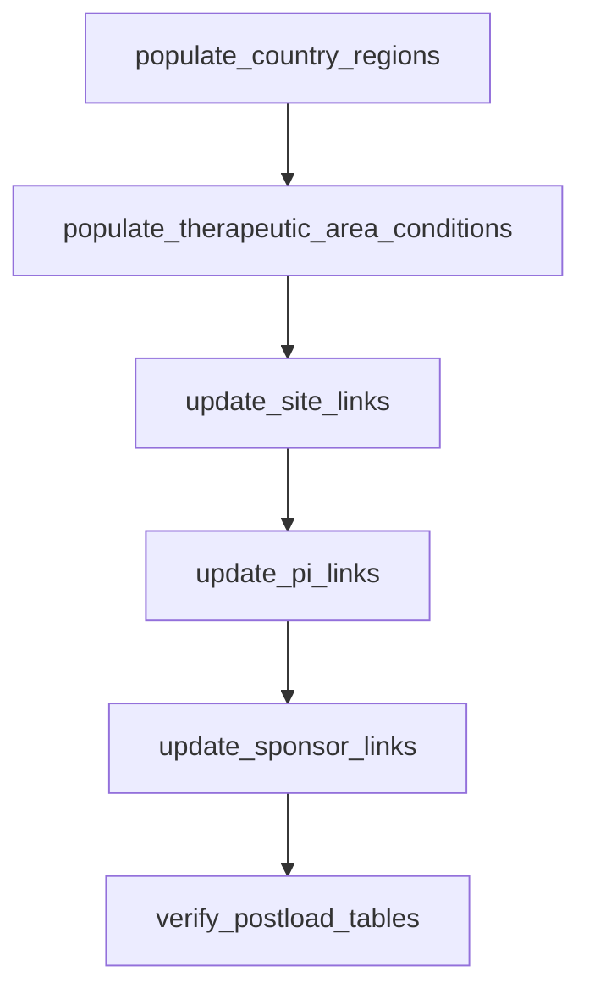

# DAG 08 — PostgreSQL enrichment

[← DAG index](README.md) · [Documentation home](../README.md)

| | |
|---|---|
| **Airflow ID** | `dag_08_postgres_management_commands` |
| **Schedule** | Triggered after DAG 07 succeeds |
| **Previous** | [DAG 07 — Postgres load](07-gcs-to-postgres.md) |
| **Next** | [DAG 09 — Re-export](09-postgres-to-gcs.md) |
| **Primary output** | Updated **PostgreSQL** link tables |

---

## Purpose

Enrich Postgres after the GCS → Postgres load:

1. Populate country↔region and condition↔therapeutic-area reference tables (OpenRouter)
2. Derive site, PI, and sponsor therapeutic-area links from study history

Runs natively in Airflow (no Django `manage.py` subprocess).

---

## What it does

| Task | Implementation | Purpose |
|------|----------------|---------|
| `populate_country_regions` | `postgres_enrichment/country_regions.py` | Fill `studies_countryregion` via OpenRouter (resume: skip mapped countries) |
| `populate_therapeutic_area_conditions` | `postgres_enrichment/therapeutic_area_conditions.py` | Fill `studies_therapeuticareacondition` via OpenRouter (resume: skip mapped conditions) |
| `update_site_links` | `postgres_enrichment/link_updates.py` | `sites_sitetherapeuticarea`, `sites_sitephase` |
| `update_pi_links` | `postgres_enrichment/link_updates.py` | `principal_investigators_pitherapeuticarea` |
| `update_sponsor_links` | `postgres_enrichment/link_updates.py` | `sponsors_sponsortherapeuticarea` |
| `verify_postload_tables` | — | Row-count check on output tables |

Batch size is fixed at **20**. Populate tasks always **resume** (skip rows already present in the mapping tables).

---

## Configuration

| Variable | Purpose |
|----------|---------|
| `OPENROUTER_API_KEY` | Required for the two populate tasks |
| `OPENROUTER_ENRICHMENT_MODEL` | Default OpenRouter model (default: `openai/gpt-4o`) |
| `OPENROUTER_COUNTRY_REGION_MODEL` | Model for country↔region mapping (default: `openai/gpt-4o`) |
| `OPENROUTER_THERAPEUTIC_AREA_MODEL` | Model for condition↔TA mapping (defaults to `OPENROUTER_ENRICHMENT_MODEL`) |
| `DB_*` | Same Postgres credentials as DAG 07 |

---

## Limitations

| Limitation | Detail |
|------------|--------|
| **OpenRouter runtime** | Populate tasks can take hours on first full run |
| **Incremental by design** | Already-mapped countries/conditions are skipped (no LLM call) |

See also: [Pipeline notes](../pipeline-notes.md)

---

## Related

- [DAG 07 — Postgres load](07-gcs-to-postgres.md)  
- [DAG 09 — Postgres → GCS](09-postgres-to-gcs.md)  
