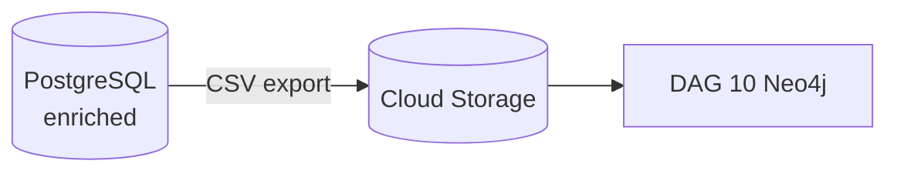

# DAG 09 — PostgreSQL to Cloud Storage

[← DAG index](README.md) · [Documentation home](../README.md)

| | |
|---|---|
| **Airflow ID** | `dag_09_postgres_to_gcs` |
| **Schedule** | Triggered after DAG 08 succeeds |
| **Previous** | [DAG 08 — Enrichment](08-postgres-enrichment.md) |
| **Next** | [DAG 10 — Neo4j](10-gcs-to-neo4j.md) |
| **Primary output** | CSV files in **Cloud Storage** (graph inputs) |

---

## Purpose

Export selected **PostgreSQL** tables — especially regions, link tables, and therapeutic-area mappings — back to Cloud Storage so the **Neo4j graph loader** can use application-enriched data, not only the original BigQuery export.

---

## What it does

Typical exports include:

- Country / region structures  
- Site ↔ therapeutic area links  
- Study ↔ therapeutic area / condition links  
- Other graph inputs defined in `postgres_exports.py`

When all export tasks succeed, DAG 10 is triggered. Each export task already validates row count and GCS upload.

---

## Limitations

| Limitation | Detail |
|------------|--------|
| **Depends on DAG 08** | If enrichment failed or was skipped, graph inputs may be incomplete |
| **Fixed file names** | DAG 10 expects specific CSV names and columns (`neo4j_loads.py`) |
| **Not a full DB backup** | Only graph-relevant tables export |
| **Second GCS pass** | Adds operational complexity — Postgres is source of truth for these files |

---

## Related

- [DAG 08 — Postgres enrichment](08-postgres-enrichment.md)  
- [DAG 10 — Neo4j](10-gcs-to-neo4j.md)  
