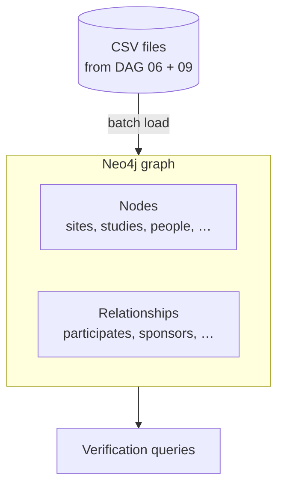

# DAG 10 — Cloud Storage to Neo4j

[← DAG index](README.md) · [Documentation home](../README.md)

| | |
|---|---|
| **Airflow ID** | `dag_10_gcs_to_neo4j` |
| **Schedule** | Triggered after DAG 09 succeeds |
| **Previous** | [DAG 09 — Re-export](09-postgres-to-gcs.md) |
| **Next** | End of pipeline |
| **Primary output** | **Neo4j** knowledge graph |

---

## Purpose

Load nodes and relationships into **Neo4j** so users and APIs can query connected data: sites linked to trials, investigators, sponsors, therapeutic areas, and publications.

This is the **final step** of the weekly pipeline.

---

## What it does

### Typical load sequence

1. **Constraints** — uniqueness rules on node IDs  
2. **Nodes** — create or merge entities  
3. **Relationships** — wire edges between nodes  
4. **Verification** — sanity checks on counts or sample paths  

---

## Requirements

| Requirement | Detail |
|-------------|--------|
| **Neo4j connection** | `NEO4J_URI`, `NEO4J_USER`, `NEO4J_PASSWORD` |
| **DAG 09 complete** | Graph input CSVs in the bucket |
| **Neo4j capacity** | Sufficient memory for bulk import |

---

## Limitations

| Limitation | Detail |
|------------|--------|
| **Schema fixed to loaders** | Custom node types outside the pipeline are not loaded |
| **Partial upstream data** | Missing gold/OpenAlex or MeSH hierarchy → fewer publication or condition nodes |
| **Load time** | Large `work` / investigator publication sets slow import |
| **Not real-time** | Graph refreshes on pipeline schedule, not continuous sync |
| **Verification scope** | Checks defined in pipeline — not full business QA |

---

## Pipeline complete

When DAG 10 succeeds:

- BigQuery holds analytics and canonical copies  
- PostgreSQL holds application data with enrichment links  
- Neo4j holds the relationship graph for exploration  

To run again, trigger **DAG 01** (or wait for the weekly schedule).

---

## Related

- [Pipeline overview](../pipeline-overview.md)  
- [Pipeline notes](../pipeline-notes.md)  
- [DAG 01 — Bronze](01-bronze-layer.md) (start next run)  

[← DAG index](README.md) · [Documentation home](../README.md)
