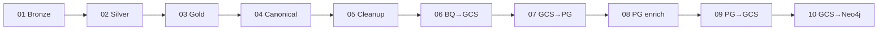

# DAG reference (pipeline steps 01–10)

[← Documentation home](../README.md)

Each **DAG** (Directed Acyclic Graph) is one Airflow workflow. Together they form the Sites Intelligence pipeline.

---

## Chain overview

| # | Document | Airflow ID | Schedule |
|---|----------|------------|----------|
| 01 | [Bronze layer](01-bronze-layer.md) | `dag_01_bronze_layer` | Weekly |
| 02 | [Silver layer](02-silver-layer.md) | `dag_02_silver_layer` | After 01 |
| 03 | [Gold layer](03-gold-layer.md) | `dag_03_gold_layer` | After 02 |
| 04 | [Canonical tables](04-canonical-tables.md) | `dag_04_build_canonical_tables` | After 03 |
| 05 | [Facility cleanup](05-facility-cleanup.md) | `dag_05_scl_staging_cleanup` | After 04 |
| 06 | [BigQuery → GCS](06-bigquery-to-gcs.md) | `dag_06_gcs_generate_csvs` | After 05 |
| 07 | [GCS → PostgreSQL](07-gcs-to-postgres.md) | `dag_07_gcs_to_postgres` | After 06 |
| 08 | [Postgres enrichment](08-postgres-enrichment.md) | `dag_08_postgres_management_commands` | After 07 |
| 09 | [PostgreSQL → GCS](09-postgres-to-gcs.md) | `dag_09_postgres_to_gcs` | After 08 |
| 10 | [GCS → Neo4j](10-gcs-to-neo4j.md) | `dag_10_gcs_to_neo4j` | After 09 |

---

## By concern

| If you care about… | Read |
|--------------------|------|
| Raw trial data landing in BigQuery | [DAG 01](01-bronze-layer.md) |
| Facility deduplication and sponsor masters | [DAG 02](02-silver-layer.md) |
| Investigator publications | [DAG 03](03-gold-layer.md) |
| Sponsor AI profiles | [DAG 02](02-silver-layer.md), [pipeline notes](../pipeline-notes.md) |
| The main “product” tables in BigQuery | [DAG 04](04-canonical-tables.md) |
| Site name quality | [DAG 05](05-facility-cleanup.md) |
| CSV exports and Postgres | [DAGs 06–07](06-bigquery-to-gcs.md) |
| Site–therapeutic-area links in Postgres | [DAG 08](08-postgres-enrichment.md) |
| Knowledge graph | [DAG 10](10-gcs-to-neo4j.md) |

---

[← Documentation home](../README.md) · [Pipeline overview](../pipeline-overview.md) · [Pipeline notes](../pipeline-notes.md)
