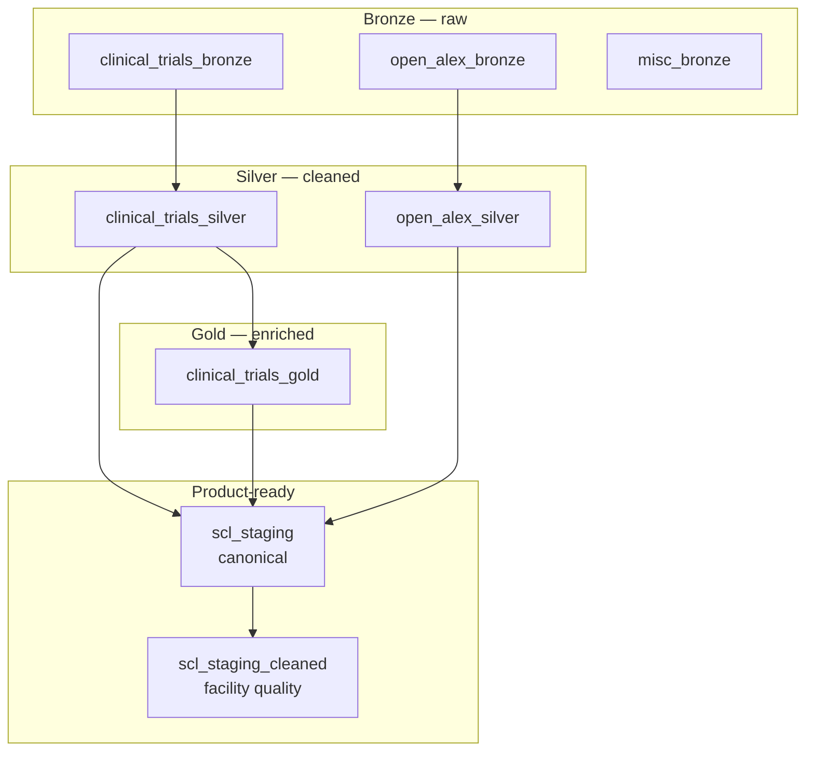

# Data layers in BigQuery

[← Documentation home](README.md)

BigQuery holds the analytics copy of the data. Tables are organized in **layers**, from raw ingestion through to the **canonical model** used by exports and downstream systems.

Default GCP project in configuration: **`hyvv-aitesting`** (your deployment may differ).

### Testing without overwriting production bronze / silver / gold

Set **one variable** in `.env` before running DAGs 01–03:

```bash
BQ_LAYER_TEST_DATASET=scl_staging_backup
```

That routes **bronze (AACT + misc + OpenAlex stub), silver, and gold** writes — and all **cross-layer SQL reads** — through `hyvv-aitesting.scl_staging_backup`. Production datasets (`clinical_trials_bronze`, `clinical_trials_silver`, etc.) are left untouched.

Or override each layer separately (`BQ_BRONZE_CT_DATASET`, `BQ_SILVER_DATASET`, …).

**Note:** OpenAlex bronze and silver both use a table named `works` in the backup dataset. DAG 01 creates a stub, then DAG 02 replaces it with the silver transform — that is expected in test mode.

DAG 04+ still target `scl_staging` unless changed separately.

---

## Layer diagram



---

## Bronze layer

**Created by:** [DAG 01 — Bronze layer](dags/01-bronze-layer.md)

| Dataset | Contents |
|---------|----------|
| `clinical_trials_bronze` | Raw AACT tables (studies, facilities, investigators, sponsors, conditions, etc.) |
| `open_alex_bronze` | Raw OpenAlex works and authors (S3 snapshot via DAG 01) |
| `misc_bronze` | Supporting reference data (e.g. research organization registry) |

Bronze tables are close to **source files** — minimal transformation, used as input for silver builds.

---

## Silver layer

**Created by:** [DAG 02 — Silver layer](dags/02-silver-layer.md)

| Dataset | Contents |
|---------|----------|
| `clinical_trials_silver` | Deduplicated facilities, facility mappings, enrollment metrics, sponsor masters (incl. ROR company info and OpenRouter AI insights), PI masters with OpenAlex matching, institution classifications, and more |
| `open_alex_silver` | Deduplicated and cleaned publication works |

Silver tables **combine and clean** bronze data — for example, millions of facility rows mapped to a master facility list.

---

## Gold layer

**Created by:** [DAG 03 — Gold layer](dags/03-gold-layer.md)

| Dataset | Contents |
|---------|----------|
| `clinical_trials_gold` | Investigator–OpenAlex matches and PI publication lists (SQL from silver OpenAlex data) |

Gold holds **higher-value enrichment** built from silver and OpenAlex — principally investigator–publication links for the canonical model.

---

## Canonical layer (`scl_staging`)

**Created by:** [DAG 04 — Canonical tables](dags/04-canonical-tables.md)

This is the **unified site-intelligence model** — the main set of tables products and exports use.

| Area | Example tables |
|------|----------------|
| Geography | `country` |
| Sites | `facility`, `facility_equipment`, `facility_facility_equipment` |
| Studies | `study`, `study_phase`, `study_statuses`, `study_study_phase`, `facility_study`, `mesh_study` |
| Conditions | `mesh_term`, `MeSH_hierarchy`, `therapeutic_area` |
| Investigators | `investigator`, `investigator_study`, `investigator_facility`, `investigator_work` |
| Publications | `venue`, `work` |
| Sponsors | `sponsor`, `sponsor_study`, `sponsor_competitive_landscape`, `sponsor_events_and_activities`, `sponsor_highlights` |
| Institution types | `institution_type`, `institution_type_performance` |

OpenAlex flatten helpers (`flattened_open_alex_bronze_works`, `flattened_open_alex_silver_works`) also live in `scl_staging` and support investigator–publication links.

---

## Cleaned facilities (`scl_staging_cleaned`)

**Created by:** [DAG 05 — Facility cleanup](dags/05-facility-cleanup.md)

| Table | Purpose |
|-------|---------|
| `facilities` | Copy of canonical facilities, plus quality fields |
| `facility_name_refine_audit` | Audit log of AI name refinements |

Key added fields on facilities:

- `name_confidence_score` — how trustworthy the site name is (0–100)  
- `refined_name` — suggested clearer name for low-confidence entries  

Downstream exports (DAG 06+) can use cleaned facility data where configured.

---

## After BigQuery

| Step | From | To |
|------|------|-----|
| DAG 06 | `scl_staging` (and related) | CSV files in **Cloud Storage** |
| DAG 07 | Cloud Storage | **PostgreSQL** |
| DAG 10 | Cloud Storage | **Neo4j** |

See [Pipeline overview](pipeline-overview.md).

---

## Related

- [Pipeline notes](pipeline-notes.md) — dependencies and coverage characteristics  
- [DAG 04 detail](dags/04-canonical-tables.md) — what feeds canonical tables  

[← Back to documentation home](README.md)
