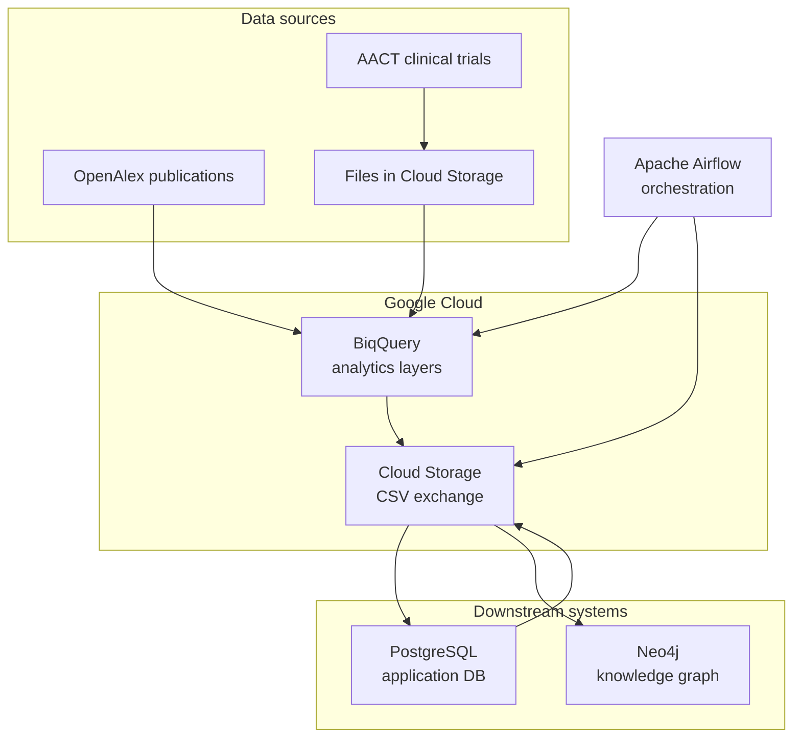
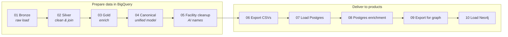
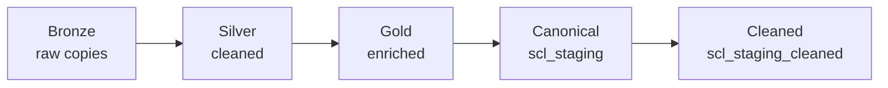

# Pipeline overview

[← Documentation home](README.md)

This page describes the **end-to-end Sites Intelligence pipeline**: where data comes from, how it is transformed, and where it lands.

---

## Purpose

The pipeline supports **clinical site intelligence** by connecting:

- **Trial sites (facilities)** and their equipment, geography, and performance signals  
- **Studies** (trials), phases, conditions, and MeSH terms  
- **Investigators** and their publications  
- **Sponsors** and competitive landscape information  

The final outputs power **PostgreSQL-backed applications** and a **Neo4j knowledge graph** for relationship queries.

---

## Systems involved

| System | Role |
|--------|------|
| **Apache Airflow** | Schedules and chains pipeline steps; retries on failure |
| **BigQuery** | Stores bronze → silver → gold → canonical layers |
| **Cloud Storage** | Holds AACT flat files and exported CSVs between steps |
| **PostgreSQL** | Operational relational database for the product |
| **Neo4j** | Graph database for connected queries (sites, studies, people, sponsors) |

---

## Ten pipeline steps (DAGs 01–10)

The pipeline is split into **ten Airflow DAGs** that run **in order**. Each DAG must finish successfully before the next starts.

| Phase | DAGs | What happens |
|-------|------|----------------|
| **Ingest** | 01 | Raw trial and publication data loaded into BigQuery “bronze” tables |
| **Transform** | 02–03 | Data cleaned (silver) and enriched (gold) |
| **Model** | 04 | Canonical `scl_staging` tables — the product-facing shape in BigQuery |
| **Quality** | 05 | Facility names copied to a cleaned dataset, scored, and refined with AI |
| **Export** | 06 | Canonical tables written as CSV files in Cloud Storage |
| **Load** | 07 | CSVs loaded into PostgreSQL |
| **Enrich** | 08 | OpenRouter populate + SQL updates link sites to regions and therapeutic areas |
| **Graph prep** | 09 | Selected Postgres tables exported again for the graph loader |
| **Graph** | 10 | Nodes and relationships loaded into Neo4j |

Step-by-step detail: [DAG reference](dags/README.md)

---

## Scheduling

| DAG | Typical schedule |
|-----|------------------|
| **DAG 01** | Weekly (`@weekly`) — pipeline entry point |
| **DAGs 02–10** | Triggered automatically when the previous DAG succeeds |

A full run duration depends on data volume, API calls (facility cleanup), and infrastructure. Bronze and silver steps are the heaviest BigQuery work; graph load (DAG 10) depends on export size.

---

## Data layer summary

BigQuery uses a **medallion** pattern:

Full dataset list: [Data layers](data-layers.md)

---

## What to read next

- [Data layers](data-layers.md) — table locations and naming  
- [Pipeline notes](pipeline-notes.md) — dependencies, AI keys, and coverage characteristics  
- [DAG 01 — Bronze](dags/01-bronze-layer.md) — start of the step-by-step guide  

[← Back to documentation home](README.md)
