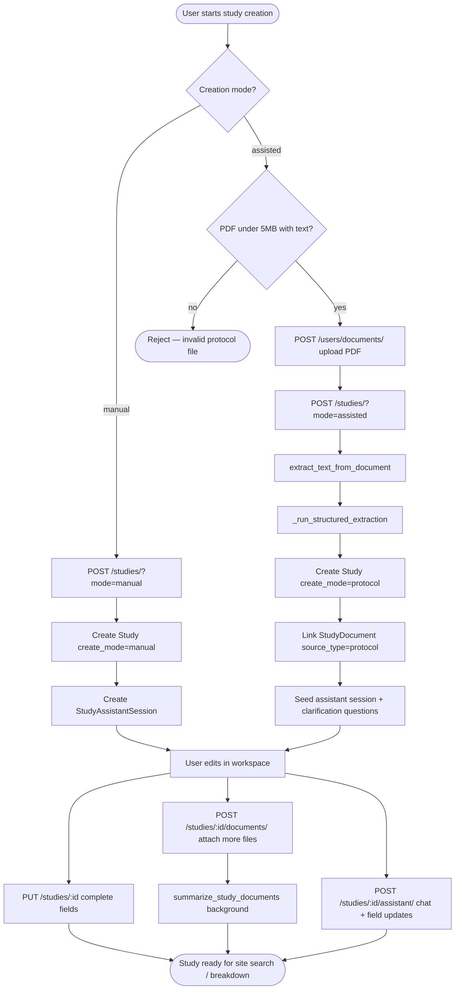

# Study Creation

Study creation is the entry point for defining a clinical trial in Sites Intelligence. Users can bootstrap a study **manually** (title + description, then complete fields in the workspace) or use **assisted** creation (upload a protocol PDF and let AI extract structured study data).

### Assisted creation — protocol file rules

| Rule | Requirement |
|------|-------------|
| **Format** | **PDF only** (`.pdf`) |
| **Max size** | **5 MB** |
| **Content** | **Text-based PDF** with a selectable text layer |

Image-only or scanned PDFs (pages saved as pictures without embedded text) are **not supported**. The system extracts text with PyMuPDF — it does **not** run OCR. If no readable text is found, assisted creation fails with **422**.

Code entry points:

| Area | Location |
|------|----------|
| Study CRUD | `studies/views.py` → `StudyViewSet` |
| Assisted extraction | `studies/services.py` → `create_study_from_document_assisted()` |
| Document text extraction | `studies/document_content.py` |
| AI assistant (post-create) | `studies/services.py` → `process_study_assistant_interaction()` |
| File upload | `users/views.py` → `DocumentUploadAPIView` |

---

## End-to-end workflow



---

## Creation modes

| Query param | `Study.create_mode` | Description |
|-------------|---------------------|-------------|
| `mode=manual` | `manual` | Minimal bootstrap; user fills all fields | 
| `mode=assisted` | `protocol` | Protocol upload + AI structured extraction |

Invalid or missing `mode` (other than `manual` / `assisted`) returns **400 Invalid mode**.

Both modes require `?project=<project_id>`.

---

## API overview

| Step | Method | Endpoint |
|------|--------|----------|
| Upload file | `POST` | `/api/v1/users/documents/` |
| Create study | `POST` | `/api/v1/studies/?project={id}&mode={manual\|assisted}` |
| Get study | `GET` | `/api/v1/studies/{id}/` |
| Complete / update study | `PUT` | `/api/v1/studies/{id}/` |
| Attach document | `POST` | `/api/v1/studies/{id}/documents/` |
| List documents | `GET` | `/api/v1/studies/{id}/documents/` |
| AI assistant | `POST` | `/api/v1/studies/{id}/assistant/` |
| Assistant sessions | `GET` | `/api/v1/studies/{id}/assistant/sessions/` |
| Session messages | `GET` | `/api/v1/studies/{id}/assistant/sessions/{session_id}/messages/` |

All study endpoints require authentication unless noted otherwise. Document upload requires authentication.

---

## Manual creation (quick reference)

### Request

```http
POST /api/v1/studies/?project=42&mode=manual
Content-Type: application/json
Authorization: Bearer <token>

{
  "title": "Phase III NSCLC Immunotherapy Trial",
  "description": "A multicenter study evaluating adjuvant immunotherapy in resected NSCLC."
}
```

### Response

```json
{
  "data": {
    "id": 101,
    "assistant_session_id": "a1b2c3d4-e5f6-7890-abcd-ef1234567890"
  },
  "code": 200,
  "message": "Study created sucessfully"
}
```

### What happens server-side

1. `StudyManualCreateSerializer` validates `title` and `description` (both required).
2. Study created with `create_mode="manual"`, default status **Not started**, `match_flexibility="strict"`.
3. `StudyAssistantSession` created (`session_type="creation"`) for the authenticated user.
4. Study log entry written.

User completes the study via `PUT /api/v1/studies/{id}/` with full field payload (see [Validation](./limitations.md#full-update-validation)).

---

## Assisted creation (quick reference)

> **Protocol requirements:** PDF only · max **5 MB** · must contain extractable text (not image/scanned pages).

### Step 1 — Upload protocol PDF

The client must validate file type and size **before** upload. Only `.pdf` files under 5 MB are accepted for assisted study creation.

```http
POST /api/v1/users/documents/
Content-Type: multipart/form-data
Authorization: Bearer <token>

file=<protocol.pdf>   # PDF only, max 5 MB, text-based content
```

```json
{
  "data": {
    "file_name": "protocol_v3.pdf",
    "file_hash": "a1b2c3d4e5f6789012345678abcdef01.pdf"
  },
  "code": 200,
  "message": "document uploaded successfully"
}
```

File is stored at `MEDIA_ROOT/{file_hash}`.

### Step 2 — Create study from protocol

```http
POST /api/v1/studies/?project=42&mode=assisted
Content-Type: application/json
Authorization: Bearer <token>

{
  "file_name": "protocol_v3.pdf",
  "file_hash": "a1b2c3d4e5f6789012345678abcdef01.pdf"
}
```

### Response

```json
{
  "data": {
    "id": 102,
    "project": 42,
    "ai_generated": true,
    "fields": {
      "title": "Phase III NSCLC Study",
      "phase": "PHASE3",
      "therapeutic_area": "Oncology",
      "target_enrollment": 120,
      "capabilities": ["MRI Scanner"],
      "mesh_terms": ["Carcinoma, Non-Small-Cell Lung"]
    },
    "pending_questions": [
      {
        "id": "q_1710000000_0",
        "question": "Which comparator arm applies?",
        "answers": [
          { "id": "q_1710000000_0_a_0", "label": "Placebo" },
          { "id": "q_1710000000_0_a_1", "label": "Active comparator" }
        ]
      }
    ],
    "assistant_session_id": "b2c3d4e5-f6a7-8901-bcde-f12345678901"
  },
  "code": 200,
  "message": "Study created sucessfully"
}
```

### Error responses (assisted)

| HTTP | Condition |
|------|-----------|
| 403 | User not authenticated or document not owned by user |
| 404 | Document not found |
| 422 | **No extractable text** (image/scanned PDF), unsupported type, AI extraction failed, or missing seed data |

See [AI Modes](./ai-modes.md) and [File Uploads](./file-uploads.md) for full detail.

---

## Post-creation flows

### Complete study (PUT)

`PUT /api/v1/studies/{id}/` uses `StudyManualCompleteSerializer`. On full update (non-partial), required fields include: `title`, `description`, `sponsor`, `study_phase`, `therapeutic_area`, `mesh_terms`, `capabilities`, `study_region`, `countries`.

### Attach additional documents

`POST /api/v1/studies/{id}/documents/` links a file to the study and triggers **background summarization** (does not block the response). See [File Summarization](./file-summarization.md).

### AI assistant (hybrid)

`POST /api/v1/studies/{id}/assistant/` supports natural-language chat, field updates, and clarification answer handling. Uses protocol document text + study context. See [AI Modes](./ai-modes.md#post-creation-assistant).

---

## Data model summary

| Model | Role |
|-------|------|
| `Study` | Core study record; `create_mode`, `custom_data`, `pending_clarification_json` |
| `users.Document` | Uploaded file metadata + `file_hash` storage key |
| `StudyDocument` | Links study ↔ document; `source_type`, `ai_summary`, `summary_status` |
| `StudyAssistantSession` | Creation assistant conversation scope |
| `StudyAssistantMessage` | Persisted user/assistant turns |

---

## Documentation

- [AI Creation Modes](./ai-modes.md)
- [File Upload Architecture](./file-uploads.md)
- [File Summarization](./file-summarization.md)
- [Limitations & Edge Cases](./limitations.md)

---

## Related documentation

- [Breakdown system](../breakdown/README.md) — uses study fields after creation
- [Documentation home](../README.md)
