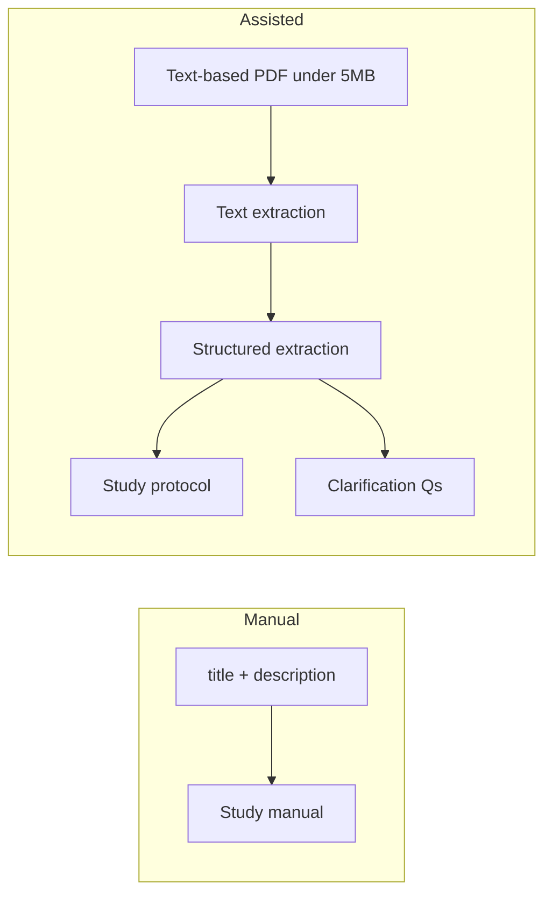
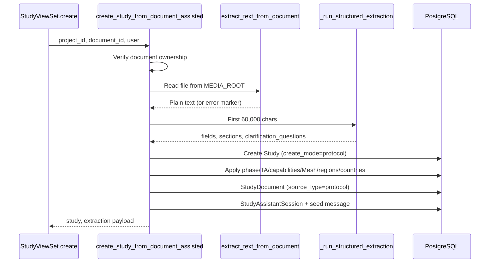

← [Back to Study Creation](./README.md)

# AI Creation Modes

Sites Intelligence supports two study creation modes via the `mode` query parameter on `POST /api/v1/studies/`. A third AI surface — the **hybrid assistant** — operates after creation for both modes.

---

## Mode comparison

| Aspect | Manual (`mode=manual`) | Assisted (`mode=assisted`) |
|--------|------------------------|------------------------------|
| **`Study.create_mode`** | `manual` | `protocol` |
| **Input required** | `title`, `description` | `file_name`, `file_hash` (file must exist on server) |
| **AI at create time** | No | Yes — structured protocol extraction |
| **Initial fields** | Title + description only | AI-extracted scalars + relations + custom sections |
| **Clarification questions** | None at create | `pending_clarification_json` populated |
| **Assistant session** | Created empty | Seeded with extraction payload |
| **Default flexibility** | `strict` | Not set explicitly (model default `balanced`) |
| **Protocol document link** | No | `StudyDocument` with `source_type=protocol` |
| **Protocol file rules** | N/A | **PDF only · max 5 MB · text-based (not scanned/image)** |



---

## Manual mode

### Purpose

Fast bootstrap when the user will enter protocol details manually in the study workspace. No document or AI extraction at creation time.

### API

```http
POST /api/v1/studies/?project={project_id}&mode=manual
```

**Body:**

```json
{
  "title": "string (required)",
  "description": "string (required, non-blank)"
}
```

### Validation (`StudyManualCreateSerializer`)

| Field | Rule |
|-------|------|
| `title` | Required (model max 100 chars enforced on later updates) |
| `description` | Required, `allow_blank=False` |

### Server actions

1. Set `project_id` from query param.
2. Set `create_mode = "manual"`.
3. Set `status` → **Not started** (first matching `StudyStatus`).
4. Set `match_flexibility = "strict"`.
5. Create `StudyAssistantSession` (`session_type="creation"`, `is_active=True`).

### Response fields

| Field | Description |
|-------|-------------|
| `id` | New study primary key |
| `assistant_session_id` | UUID for post-create assistant (null if unauthenticated) |

---

## Assisted mode

### Purpose

Upload a clinical protocol document and automatically populate study fields using AI structured extraction. Unresolved ambiguities become selectable clarification questions.

### Prerequisites

1. Protocol is a **PDF file under 5 MB** with **embedded text** (not a scanned/image-only document).
2. File uploaded via `POST /api/v1/users/documents/` (see [File Uploads](./file-uploads.md)).
3. Authenticated user owns the document (`Document.uploaded_by`).

**Image/scanned PDFs:** Upload may succeed, but `extract_text_from_document()` returns little or no text. Assisted create then fails with **422** — *Could not extract text from document*. The platform does not perform OCR; users must supply a text-based PDF (e.g. exported from Word, or a searchable PDF).

### API

```http
POST /api/v1/studies/?project={project_id}&mode=assisted
```

**Body:**

```json
{
  "file_name": "protocol.pdf",
  "file_hash": "md5hash32chars.pdf"
}
```

Validated by `StudyDocumentCreateSerializer` (both fields required strings).

### Processing pipeline



### Structured extraction (`_run_structured_extraction`)

AI provider: **OpenRouter** via `call_ai()` (fallback test flag: `USE_OPENAI_SUMMARY_FOR_TESTING`).

**Input cap:** first **60,000** characters of extracted text.

**Output shape:**

```json
{
  "fields": {
    "title": null,
    "description": null,
    "phase": null,
    "therapeutic_area": null,
    "currency": null,
    "primary_indication": null,
    "target_enrollment": null,
    "capabilities": [],
    "mesh_terms": [],
    "regions": [],
    "countries": []
  },
  "sections": [],
  "clarification_questions": []
}
```

**AI rules (enforced in prompt):**

- Use **only** facts explicitly in the protocol text — no inference from outside knowledge.
- `title` max 100 chars; `description` max 1500 chars.
- Dates must be explicit `YYYY-MM-DD` (quarter/year-only dates → `null`).
- Max **2** custom sections, **4** fields per section.
- Allowed custom field types: `text`, `long_text`, `number`, `date`, `boolean`, `select`.
- Each clarification question must have **≥ 2** answer options (otherwise dropped).

**Retry:** If JSON parse fails, AI is called again with higher token limit (6000 → 10000) and a strict JSON-only instruction.

### Fields persisted on `Study`

Scalar fields mapped directly (with coercion via `_normalize_fields_for_study`, `_to_int`, `_to_date`, etc.).

Relation fields resolved via `_resolve_relation_updates_from_field_updates()`:

| AI field | Resolution |
|----------|------------|
| `phase` | Fuzzy match against `StudyPhase` (`PHASE_MAPPING`) |
| `therapeutic_area` | Match `TherapeuticArea.name` |
| `currency` | Match `Currency.currency_code` |
| `capabilities` | Match `CapabilityEquipment.name` |
| `mesh_terms` | Match `Condition.condition` text |
| `regions` | Match `Region.name` |
| `countries` | Match `Country.name` |

Unmapped relations may generate additional clarification questions (`mapping_clarifications`).

**JSON storage:**

- `custom_data.sections` — AI custom sections
- `pending_clarification_json` — normalized clarification questions

### Response fields

| Field | Description |
|-------|-------------|
| `id` | Study ID |
| `project` | Project ID |
| `ai_generated` | Always `true` |
| `fields` | Extracted + resolved field snapshot |
| `pending_questions` | Clarification questions for UI |
| `assistant_session_id` | Seeded assistant session UUID |

### Error conditions

| Exception | HTTP | Message |
|-----------|------|---------|
| Document not found | 404 | Document not found in UserDocument table |
| Not authenticated / wrong owner | 403 | User has no access to document |
| Extraction text failure | 422 | Could not extract text from document |
| AI / seed failure | 422 | AI extraction failed |

---

## Post-creation assistant

Both modes can use the hybrid assistant after creation.

### Endpoint

```http
POST /api/v1/studies/{study_id}/assistant/
```

**Body:**

```json
{
  "assistant_session_id": "uuid",
  "user_input": "Set target enrollment to 150",
  "answers": [
    {
      "id": "q_1710000000_0",
      "question": "Which comparator arm applies?",
      "answer": "Placebo"
    }
  ]
}
```

Legacy `answers` object format (`{ "question_id": "answer text" }`) is also supported.

### Capabilities

| AI response `type` | Behavior |
|--------------------|----------|
| `CHAT` | Conversational reply only |
| Field updates | Applies validated changes to `Study` scalars and relations |
| Clarification | Updates `pending_clarification_json`; resolves answered questions |

### Context loaded for AI

- Full updatable study scalar fields (`_build_assistant_study_context`)
- Pending clarification questions + saved answers
- Recent session message history (last turns)
- Protocol document text (up to **50,000** chars aggregated from `StudyDocument` records)

### Field update safety

- Blocked fields: `id`, `project`, `status`, `create_mode`, etc. (`BLOCKED_STUDY_UPDATE_FIELDS`)
- Relation keys handled separately: `phase`, `therapeutic_area`, `currency`, `capabilities`, `mesh_terms`, `regions`, `countries`
- Each proposed update coerced via `_coerce_allowed_field_update()` — invalid values silently skipped

### Response

```json
{
  "data": {
    "type": "FIELD_UPDATE",
    "fields": { "target_enrollment": 150 },
    "pending_questions": [],
    "message": "Updated target enrollment to 150.",
    "assistant_session_id": "uuid"
  },
  "code": 200,
  "message": "Assistant response generated"
}
```

---

## Related documentation

- [← Back to Study Creation](./README.md)
- [File Uploads](./file-uploads.md)
- [File Summarization](./file-summarization.md)
- [Limitations](./limitations.md)
