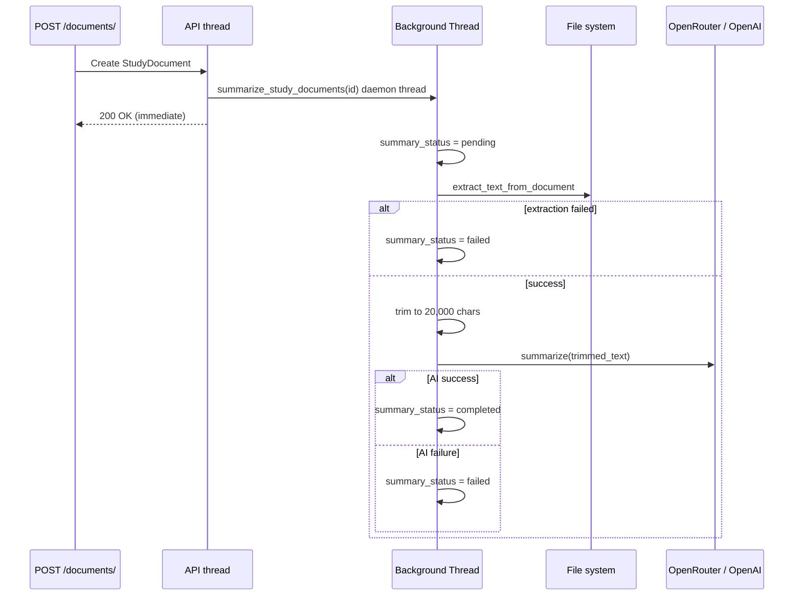
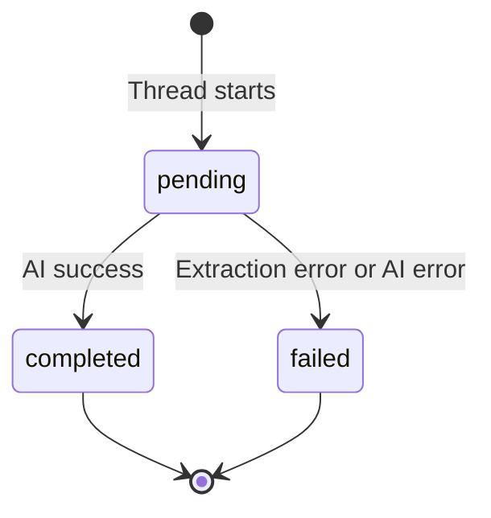

← [Back to Study Creation](./README.md)

# File Summarization

When a document is attached to an existing study, the backend generates an **AI summary** asynchronously. This powers document previews in the UI and supplements assistant/chat context — without blocking the attach API response.

> **Note:** Assisted **study creation** requires a **text-based PDF under 5 MB**. Summarization below applies to documents attached **after** the study is created. Image/scanned PDFs fail extraction for both flows.

---

## Trigger

Summarization runs on:

```http
POST /api/v1/studies/{study_id}/documents/
```

**Not** triggered during assisted study creation's initial protocol link (only the attach endpoint calls `summarize_study_documents()`).

```python
# studies/views.py — StudyDocumentsViewSet.create
summarize_study_documents(study_document)  # fire-and-forget
```

Assisted mode creates `StudyDocument` inside `create_study_from_document_assisted()` **without** calling summarization. Summaries for the protocol can be generated if the document is re-attached or TODO: consider adding summarization to assisted flow.

---

## Processing flow



---

## `StudyDocument` summary fields

| Field | Type | Description |
|-------|------|-------------|
| `ai_summary` | text | Generated summary or error diagnostic |
| `summary_status` | string | `pending` → `completed` \| `failed` |
| `summary_updated_at` | datetime | Set on completion/failure |

### Status lifecycle



---

## Summarization logic

Entry: `summarize_study_documents()` → background `_run(doc_id)` in `studies/services.py`.

### Step 1 — Mark pending

```python
study_document.summary_status = "pending"
study_document.summary_updated_at = None
```

### Step 2 — Extract text

Uses same `extract_text_from_document()` as assisted creation.

If result is empty or starts with `[` (error marker):

- `ai_summary` = diagnostic text
- `summary_status = "failed"`

### Step 3 — Trim input

```text
trimmed_text = extracted_text[:20000]
```

Summarization uses a **20,000** char cap (stricter than extraction's 80,000).

### Step 4 — AI call (`summarize()`)

**Default provider:** OpenRouter via `call_ai()`.

| Parameter | Value |
|-----------|-------|
| `temperature` | 0.2 |
| `max_tokens` | 500 |

**System prompt rules:**

- Summarize only information explicitly in the text
- No inference, calculation, or external knowledge
- Single compact paragraph
- Maximum **1,000 characters** output

**Test fallback:** When `USE_OPENAI_SUMMARY_FOR_TESTING = True`, routes to `get_chat_response()` (OpenAI direct).

### Step 5 — Persist result

| Outcome | `ai_summary` | `summary_status` |
|---------|--------------|------------------|
| Success | Stripped AI content | `completed` |
| AI failure | `Summary generation failed: {error}` | `failed` |

`summary_updated_at` set to `document.uploaded_date`.

---

## Error handling philosophy

Summarization is **fire-and-forget by design**:

- Runs in a **daemon thread** — never blocks API response
- All exceptions in the thread are **swallowed** and logged
- Failures do not roll back document attachment
- Caller cannot poll status from the create response (must re-fetch study/documents)

---

## Example states

### Completed

```json
{
  "id": "15",
  "file_name": "protocol_v3.pdf",
  "ai_summary": "This Phase III study evaluates adjuvant immunotherapy in resected NSCLC with a primary endpoint of disease-free survival and target enrollment of 120 patients across North America and Europe.",
  "summary_status": "completed"
}
```

### Failed (unsupported type uploaded)

```json
{
  "ai_summary": "[Unsupported file type: data.xlsx]",
  "summary_status": "failed"
}
```

### Pending (immediately after attach)

```json
{
  "summary_status": "pending",
  "ai_summary": null
}
```

---

## Consumption

| Consumer | Uses summary? |
|----------|---------------|
| Study documents list/detail UI | Yes — display `ai_summary` when `completed` |
| Hybrid assistant | Uses full extracted text (not summary) up to 50k chars |

---

## Related documentation

- [← Back to Study Creation](./README.md)
- [File Uploads](./file-uploads.md)
- [Limitations](./limitations.md)
