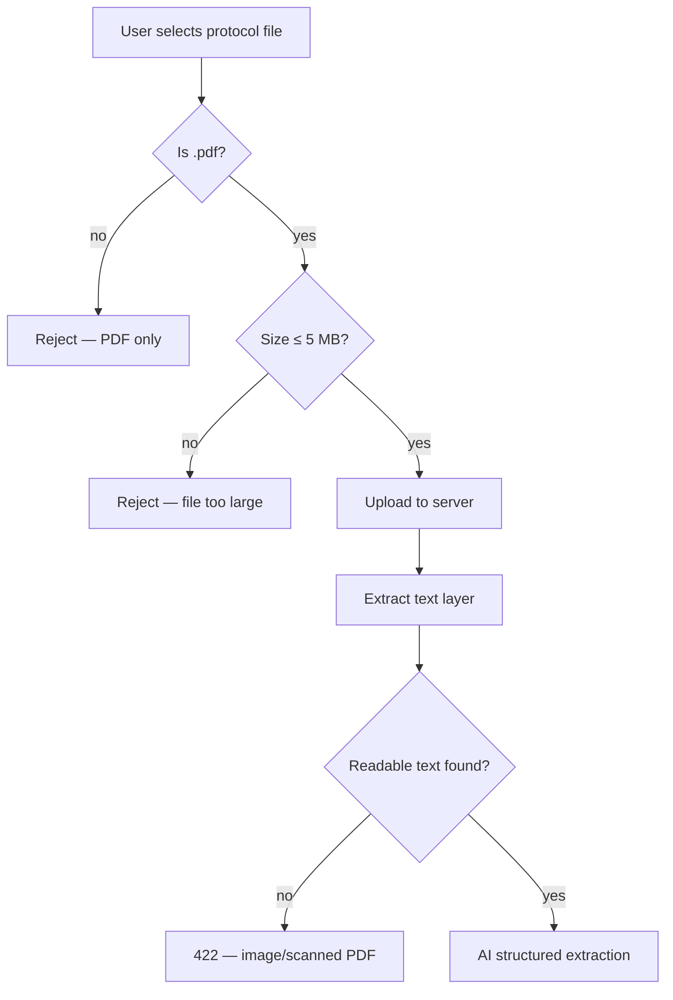
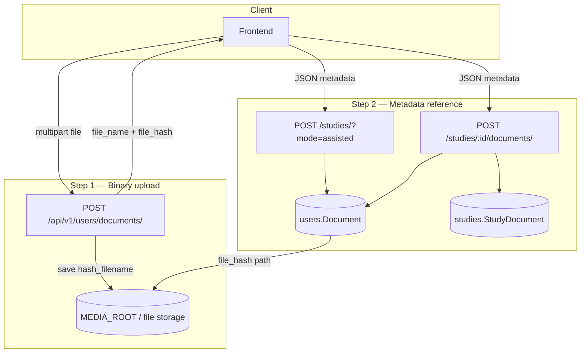

← [Back to Study Creation](./README.md)

# File Upload Architecture

Study creation and document management use a **two-step pattern**: binary files are uploaded to media storage first; metadata references (`file_name`, `file_hash`) are passed to study APIs.

---

## Assisted study creation — file requirements

These rules apply when uploading a protocol for **`mode=assisted`** study creation:

| Requirement | Detail |
|-------------|--------|
| **Allowed format** | **PDF only** (`.pdf`) |
| **Max file size** | **5 MB** |
| **Content type** | **Text-based PDF** — pages must contain embedded/selectable text |

**Not supported for study creation:**

- Word (`.docx`), plain text (`.txt`), or any non-PDF format
- PDFs larger than 5 MB
- **Scanned or image-only PDFs** — pages photographed or exported as images without a text layer

The backend uses PyMuPDF `page.get_text()` only. There is **no OCR**. A scanned protocol uploads successfully but assisted creation fails at extraction with **422** — *Could not extract text from document* — when the extracted string is empty.



---

## Architecture overview



---

## Step 1 — Binary upload

### Endpoint

```http
POST /api/v1/users/documents/
Content-Type: multipart/form-data
Authorization: Bearer <token> (required)
```

### Request

| Part | Required | Description |
|------|----------|-------------|
| `file` | Yes | Raw file bytes |

For **assisted study creation**, the client must send a **PDF under 5 MB** with extractable text. Other files may be rejected in the UI before this call.

### Processing (`DocumentUploadAPIView`)

1. Read uploaded file content.
2. Compute **MD5 hash**, take first **32 hex characters**.
3. Preserve original extension: `hash_filename = {hash}{ext}`.
4. Save to Django `default_storage` (typically `MEDIA_ROOT/{hash_filename}`).
5. Return original filename + storage key — **no `Document` DB row yet**.

### Response

```json
{
  "data": {
    "file_name": "protocol_v3.pdf",
    "file_hash": "a1b2c3d4e5f6789012345678abcdef01.pdf"
  },
  "code": 200,
  "message": "document uploaded successfully"
}
```

### Errors

| Condition | HTTP | Message |
|-----------|------|---------|
| Missing `file` field | 400 | No file provided |
| Not PDF or over 5 MB (client) | 400 | Rejected before upload (assisted create) |
| Not authenticated | 401 | — |

---

## Step 2 — Document metadata records

The study APIs create a `users.Document` row referencing the stored file.

### `users.Document` model

| Field | Description |
|-------|-------------|
| `file_name` | Original display name |
| `file_hash` | Storage filename (MD5 + extension) |
| `uploaded_by` | FK to authenticated user |
| `uploaded_date` | Auto timestamp |

### Usage A — Assisted study creation

```http
POST /api/v1/studies/?project=42&mode=assisted
```

Creates `Document` + `Study` + links via `StudyDocument(source_type="protocol")`.

**Note:** Assisted create verifies `doc.uploaded_by_id == user.id`. The upload step and create step must use the **same authenticated user**.

### Usage B — Attach document to existing study

```http
POST /api/v1/studies/{study_id}/documents/
```

**Body:**

```json
{
  "file_name": "amendment_1.pdf",
  "file_hash": "deadbeef0123456789abcdef01234567.pdf",
  "source_type": "document"
}
```

| Field | Default | Values |
|-------|---------|--------|
| `source_type` | `"document"` | `"protocol"` \| `"document"` |

Creates `Document` + `StudyDocument`, then triggers background summarization.

### Response

```json
{
  "data": {
    "id": "15",
    "file_name": "amendment_1.pdf"
  },
  "code": 200,
  "message": "document created successfully"
}
```

---

## Text extraction

When content is needed (assisted create, summarization, assistant, chat), the server reads:

```text
file_path = MEDIA_ROOT / document.file_hash
```

Implementation: `extract_text_from_document()` in `studies/document_content.py`.

### Supported file types

#### Assisted study creation (`mode=assisted`)

| Extension | Max size | Content | Supported |
|-----------|----------|---------|-----------|
| `.pdf` | **5 MB** | Text-based (selectable text layer) | **Yes** |
| `.pdf` | any | Image/scanned only (no text layer) | **No** — extraction returns empty → 422 |
| `.docx`, `.txt`, other | — | — | **No** — not accepted for study create |

#### Post-creation document attach (`POST /studies/:id/documents/`)

The extraction layer can also read `.docx` and `.txt` for documents attached after the study exists. **Assisted study creation is PDF-only.**

| Extension | Library | Extraction method |
|-----------|---------|-------------------|
| `.pdf` | PyMuPDF (`fitz`) | Embedded text per page — **not OCR** |
| `.docx` | `python-docx` | Non-empty paragraph text |
| `.txt` | Built-in | UTF-8 decode (`errors="ignore"`) |

### Unsupported types

Returns error marker string (not raised as exception):

```text
[Unsupported file type: filename.xyz]
```

Assisted creation treats any result starting with `[` as failure → **422**. Empty text from image PDFs is treated the same way.

### Size limits

| Context | Limit |
|---------|-------|
| **Assisted study creation upload** | **5 MB** (PDF only) |
| Extracted text cap (`MAX_CHARS_PER_DOC`) | **80,000** characters per document |

Oversized text is truncated with suffix:

```text
[... truncated: document too large ...]
```

### Other extraction errors

| Condition | Returned string |
|-----------|-----------------|
| File missing on disk | `[File not found: {file_hash}]` |
| Parse exception | `[Could not extract text from {file_name}: {error}]` |

---

## List and delete documents

### List

```http
GET /api/v1/studies/{study_id}/documents/?source_type=protocol
```

Optional filter: `source_type=protocol` or `document`.

**Response item shape:**

```json
{
  "id": "15",
  "file_name": "protocol_v3.pdf",
  "uploaded_by": "Jane Smith",
  "uploaded_date": "2026-06-01",
  "file_hash": "a1b2c3d4....pdf"
}
```

### Delete

```http
DELETE /api/v1/studies/{study_id}/documents/{study_document_id}/
```

Deletes both `StudyDocument` and linked `Document` row. Does not automatically remove the file from `MEDIA_ROOT`.

---

## Security model

| Rule | Enforcement |
|------|-------------|
| Upload requires auth | `DocumentUploadAPIView.permission_classes` |
| Assisted create ownership | `doc.uploaded_by_id == user.id` |
| Assistant session ownership | `session.created_by_id == user.id` |

There is **no** virus scanning or content-type verification beyond file extension at extraction time.

---

## Related documentation

- [← Back to Study Creation](./README.md)
- [File Summarization](./file-summarization.md)
- [AI Modes](./ai-modes.md)
- [Limitations](./limitations.md)
