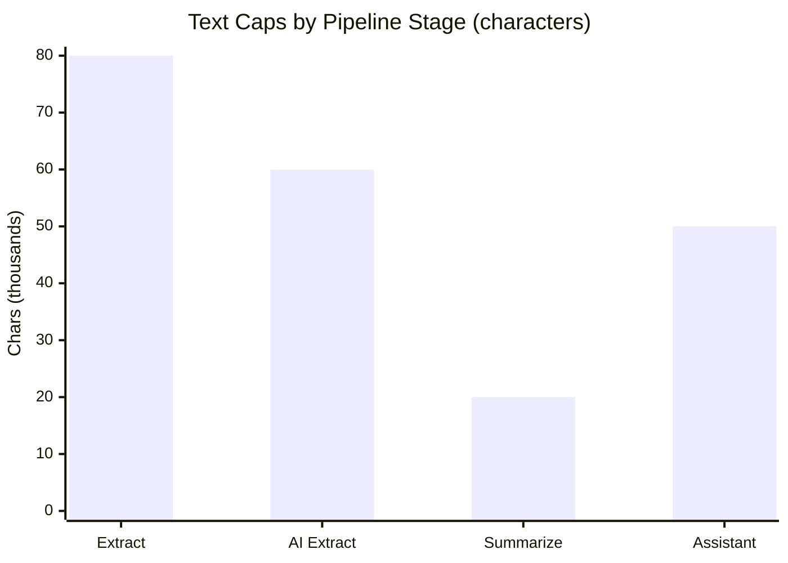

← [Back to Study Creation](./README.md)

# Limitations & Edge Cases

Known constraints, validation rules, and edge-case behavior for study creation.

---

## Supported file types — assisted study creation

Assisted creation (`mode=assisted`) accepts **only text-based PDFs under 5 MB**.

| File | Max size | Text layer required | Accepted for study create? |
|------|----------|---------------------|----------------------------|
| Text-based `.pdf` | ≤ **5 MB** | Yes | **Yes** |
| Image/scanned `.pdf` | ≤ 5 MB | No (photos/scans of pages) | **No** — empty extraction → 422 |
| `.pdf` over 5 MB | > 5 MB | — | **No** — rejected before upload |
| `.docx`, `.txt`, other | — | — | **No** — PDF only for study create |

### Why image PDFs fail

Extraction uses PyMuPDF `get_text()` on each page. Scanned protocols store pages as images — there is no text to read and **no OCR** in the pipeline:

```text
Scanned PDF → extract_text → "" (empty) → assisted create → 422
```

**User guidance:** Re-export the protocol from the source application as PDF, or run OCR externally and upload a searchable PDF.

### Post-creation documents (different rules)

After the study exists, `POST /studies/:id/documents/` can attach `.docx` and `.txt` for summarization and chat context. Those rules do **not** apply to the initial assisted study creation upload.

---

## Size and token limits

| Stage | Limit |
|-------|-------|
| **Assisted create — upload** | **5 MB**, PDF only |
| Text extraction per doc | 80,000 chars (`MAX_CHARS_PER_DOC`) |
| AI structured extraction input | 60,000 chars |
| Summarization input | 20,000 chars |
| Summarization output | 1,000 chars (prompt rule) |
| Assistant protocol context | 50,000 chars (aggregated docs) |



---

## Full update validation

`PUT /api/v1/studies/{id}/` with `StudyManualCompleteSerializer` enforces required fields on **non-partial** updates:

| Required field | Notes |
|----------------|-------|
| `title` | |
| `description` | |
| `sponsor` | Also accepts legacy typo key `sponser` in validation check |
| `study_phase` | UUID → `phase_id` |
| `therapeutic_area` | UUID |
| `mesh_terms` | UUID list → `StudyCondition` |
| `capabilities` | UUID list → `StudyCapability` |
| `study_region` | Integer ID list → `StudyRegion` |
| `countries` | UUID list → `StudyCountry` |

Missing any required key → **400** with per-field validation errors.

`PATCH` is **not supported** (`405 Method not allowed`).

---

## AI extraction constraints

| Rule | Detail |
|------|--------|
| No hallucination | Prompt forbids inference; null when unknown |
| Date strictness | Only full dates (`YYYY-MM-DD`, `DD-MM-YYYY`, etc.); `Q3 2025` → null |
| Custom sections | Max 2 sections × 4 fields |
| Clarification questions | Dropped if fewer than 2 answer options |
| JSON retry | One automatic retry with higher token limit on parse failure |
| Relation mapping | Unmatched phase/TA/Mesh names may become clarification questions |

---

## Assistant update constraints

| Constraint | Behavior |
|------------|----------|
| Blocked fields | `project`, `status`, `create_mode`, etc. cannot be AI-updated |
| Invalid coercions | Silently skipped (`INVALID_UPDATE`) |
| Session access | Must be active and owned by requesting user |
| Token limit | 6000 tokens default; retry at 10000 on truncated JSON |

---

## Edge cases

### Assisted create without prior file upload

If `file_hash` references a file not on disk, extraction returns `[File not found: ...]` → **422**.

### Duplicate file content

MD5-based naming deduplicates storage filename for identical content. Each API call still creates a **new** `Document` row with the same hash.

### Unauthenticated study create

- Manual: study created but `assistant_session_id` is `null`.
- Assisted: **403** — ownership check requires authenticated user.

### Assisted mode Document row

Assisted create creates a **new** `Document` DB record from request body even if upload already created the file on disk. The `study_document_id` parameter in code actually uses the newly created document's ID — the file must match the uploaded hash on disk.

### Protocol summarization gap

Assisted creation links protocol via `StudyDocument` but does **not** call `summarize_study_documents()`. Summary remains unset until user attaches another document or summarization is added to that path.

### Image-only or scanned PDF

Common when users photograph paper protocols or export slides as image PDFs. Upload succeeds but `get_text()` returns empty or whitespace-only content → **422** *Could not extract text from document*. Not fixable without providing a text-based PDF.

### PDF over 5 MB

Rejected at client validation for assisted study creation before the upload API is called.

### Non-PDF file for assisted create

`.docx`, `.txt`, and other formats are not accepted for assisted study creation even though the low-level extractor supports some of them for post-create attachments.

### Assistant session auto-create on GET

`GET /api/v1/studies/{id}/` auto-creates an assistant session if none exists for the user — side effect on read.

### Document delete

Deleting a study document removes DB records but **not** the physical file in `MEDIA_ROOT`.

### `create_mode` vs API `mode`

| API `mode` | DB `create_mode` |
|------------|------------------|
| `manual` | `manual` |
| `assisted` | `protocol` |

The naming differs intentionally — UI may show "Assisted" while DB stores `protocol`.

### StudyStatus seed dependency

Both modes require at least one `StudyStatus` row in the database. Missing seed data → **422**.

### OpenRouter / AI availability

AI extraction, summarization, and assistant calls fail with **422** or **503** when the provider is unavailable. Summarization failures are silent (background thread).

### Character limits on save

| Field | Max length |
|-------|------------|
| `title` | 100 |
| `description` | 1500 |
| `comparator_drug` | 255 |
| `comparator_type` | 100 |

AI-extracted values are truncated via `_to_str(value, max_len)`.

---

## Error code summary

| HTTP | Typical cause |
|------|---------------|
| 400 | Missing `project`, invalid `mode`, missing file on upload, invalid `source_type` |
| 401 | Unauthenticated upload |
| 403 | Document/session ownership |
| 404 | Document or study not found |
| 405 | PATCH study, unsupported document methods |
| 422 | Extraction/AI failure, validation errors |
| 503 | Assistant unexpected failure |

---

## Related documentation

- [← Back to Study Creation](./README.md)
- [AI Modes](./ai-modes.md)
- [File Uploads](./file-uploads.md)
- [File Summarization](./file-summarization.md)
